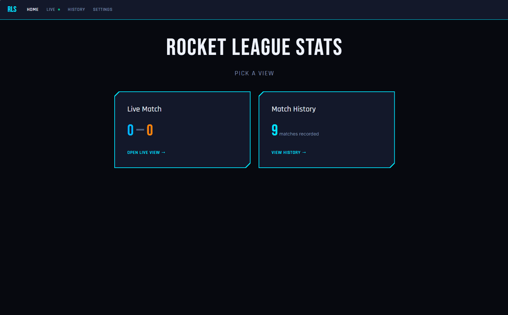

# RocketLeagueStats

A live Rocket League dashboard in your browser. Watch the scoreboard tick over as goals go in, replay every match from your history, and dig into per-player stats — all powered by the official **Rocket League Stats API** (released April 2026).

> **Status:** v2.0 — Web dashboard (primary) and a terminal-only console feed. A Discord broadcaster is on the roadmap.

After a goal you get an instant lower-third with the scorer, assist, ball speed, and team colour. After the match you get a recap page with MVP, goal timeline, time-between-goals chart, Offense/Defense splits, speed leaderboard, and cumulative game-flow chart. All of it is local — runs on your gaming PC, no account, no upload.



---

## What it does

The dashboard opens the local TCP socket Rocket League exposes for stats (port `49123` by default), parses every event the game emits, and turns it into:

- a **live scoreboard** with goal lower-thirds, demos, saves, epic-save callouts, possession bar, and a per-player action feed;
- a **match history** at `/matches` that survives restarts (events persist to a local SQLite database, `stats.db`), with filters for Online / Casual / Tournament / Private and a delete-with-confirmation control;
- a **recap page** for any completed match — final score hero with team colours and arena, MVP card, goal timeline, time-between-goals chart, Offense + Defense player cards, speed leaderboard, cumulative-score game-flow chart;
- a **settings page** at `/settings` to tell the app your in-game name (highlights your card in the live view).

It captures every event the official Stats API emits — goals, ball hits, demos, saves, the clock, replay markers, the whole match lifecycle. The dashboard binds to `0.0.0.0:5000` by default, so you can also pull it up on your phone or a second monitor at `http://<gaming-pc>:5000/` while you play.

---

## Requirements

- **Windows 10 / 11** — the Stats API only runs where Rocket League runs.
- **Rocket League** installed via Steam or Epic Games.
- **.NET 10 Desktop Runtime** — get the **ASP.NET Core Runtime 10.x (x64)** from <https://dotnet.microsoft.com/download/dotnet/10.0>. Verify with `dotnet --info` (look for `Microsoft.AspNetCore.App 10.0.x`).

You don't need Docker, a database server, an account, or any other external service. Your match history lives in a single SQLite file (`stats.db`) next to the EXE.

---

## Quick start

1. **Download** the latest dashboard zip from the [v2.0.0 release page](https://github.com/cmxl/RocketLeagueStats/releases/tag/v2.0.0):
   `RocketLeagueStats-WebApi-v2.0.0-win-x64.zip`
   (A `.sha256` sidecar is provided if you want to verify the download.)

2. **Unzip** it anywhere you like — e.g. `C:\Tools\RocketLeagueStats\`. The folder will hold `RocketLeagueStats.WebApi.exe`, an `appsettings.json`, and a `wwwroot/` with the dashboard assets.

3. **Close Rocket League** if it's running. (The app needs to write a small config file inside the game's install folder; it refuses to do this while the game is open.)

4. **Run the EXE** by double-clicking it (or from PowerShell):
   ```powershell
   .\RocketLeagueStats.WebApi.exe
   ```
   On first run it auto-detects your Rocket League install (Steam or Epic) and enables the Stats API by writing two lines into `DefaultStatsAPI.ini`. Watch for `Set [TAGame.MatchStatsExporter_TA] Port in C:\...\DefaultStatsAPI.ini` in the console.

5. **Open the dashboard**: <http://localhost:5000/> in any browser. Or from another device on the same network: `http://<your-gaming-pc>:5000/`.

6. **Start Rocket League and enter a match.** Events should start flowing into the live view within a few seconds.

To stop the EXE, press `Ctrl+C` in its console window (or close it). To uninstall, just delete the folder.

> **Already had a `DefaultStatsAPI.ini`?** The original is backed up alongside it as `DefaultStatsAPI.ini.bak.YYYYMMDD` before the first write each day, so you can restore it any time.

---

## CLI flags

The EXE supports a handful of switches if you need to override the defaults:

| Flag | Effect |
|---|---|
| `--web-port <n>` | Port the dashboard listens on (default `5000`). |
| `--port <n>` | TCP port the listener binds to for the RL Stats API (default `49123`). Match this with `Port=` in `DefaultStatsAPI.ini` if you change it. |
| `--no-config-helper` | Skip the auto-write of `DefaultStatsAPI.ini`. Use this if you want to manage the ini yourself. |
| `--no-log` | Turn off the JSONL event log entirely (event history still persists to SQLite). |
| `--trace` | Diagnostic mode — dumps every raw socket chunk (length, hex, UTF-8 preview). **Events are not parsed or published in this mode.** Only useful if you're investigating wire-format issues. |
| `--dump-snapshot` | Write the first `MatchStateSnapshot` of each match to `logs/snapshots/snapshot-<timestamp>-match<N>.json` for wire-format inspection. |

Examples:

```powershell
# Listen on a non-default web port
.\RocketLeagueStats.WebApi.exe --web-port 8080

# Localhost only — bind the dashboard to 127.0.0.1
.\RocketLeagueStats.WebApi.exe --web-port 5000
# (then edit appsettings.json: "Web": { "Url": "http://127.0.0.1:5000" })
```

---

## Where things land on disk

| What | Where (defaults) |
|---|---|
| Match history (SQLite) | `<cwd>/stats.db` |
| Event log (JSONL, optional, one event per line) | `<cwd>/logs/rl-stats-YYYY-MM-DD.jsonl` |
| Application log (rolling daily) | `<cwd>/logs/app-YYYYMMDD.log` |
| User settings (in-game name, etc.) | `%APPDATA%/RocketLeagueStats/settings.json` |
| Game-side config the app maintains | `<RocketLeague install>/TAGame/Config/DefaultStatsAPI.ini` |

The `logs/` directory is kept for 7 days by default (older files are auto-deleted). `stats.db` keeps growing — delete matches you don't want from the dashboard (`/matches`, click a row, **Delete**), or stop the EXE and delete `stats.db` to start over.

---

## Configuration

All defaults live in `appsettings.json` next to the EXE. You can override settings via:

- **Environment variables** — `ROCKETLEAGUESTATS__STATSAPI__PORT=49124` (note the double underscores)
- **CLI flags** — see the table above
- **Editing `appsettings.json` directly**

Override precedence is `appsettings.json` → environment → CLI (right-most wins).

The most useful keys:

```jsonc
{
  "StatsApi":     { "Port": 49123 },
  "Web":          { "Port": 5000, "SettingsDirectory": "" },
  "GameSetup":    {
    "AutoConfigureIni": true,    // set false to manage the ini yourself
    "PacketSendRate": 30          // 30 packets/sec is the documented default
  },
  "ConnectionStrings": {
    "Stats": "DataSource=stats.db" // SQLite file holding your match history
  },
  "EventLog": {
    "Enabled": true,
    "RetentionDays": 7,
    "MaxFileSizeBytes": 104857600  // 100 MB cap per day
  }
}
```

---

## Troubleshooting

**"No events appear after I start a match."**
Check that `DefaultStatsAPI.ini` in `<RocketLeague>\TAGame\Config\` contains `Port=49123` and `PacketSendRate=30` under `[TAGame.MatchStatsExporter_TA]`. If you've used `--port` to change the port, update the ini to match.

**"Rocket League is running; close the game and retry."**
The auto-config helper refuses to overwrite the ini while the game has the file open. Close Rocket League, run the EXE once to bootstrap the ini, then start the game.

**The app found my install in the wrong place / didn't find it at all.**
Pass `--no-config-helper` and edit `DefaultStatsAPI.ini` manually. The two lines you need are:

```ini
[TAGame.MatchStatsExporter_TA]
PacketSendRate=30
Port=49123
```

**"Can't reach `http://localhost:5000/` — page doesn't load."**
Check the EXE's console window — if it logged `Now listening on: http://0.0.0.0:5000`, the dashboard is up. Try `http://127.0.0.1:5000/`. If something else is on port 5000, change it with `--web-port <n>`.

**"My old matches don't show up in history."**
History is read from `stats.db`. If you upgraded from v1, there's no automatic migration of old JSONL logs — only new matches recorded on v2 appear in history. The app will *backfill* team metadata and per-player stats for matches that already have snapshots persisted.

**Events look garbled or I see "unknown:" lines in the log.**
Run with `--trace` and capture a few seconds of output. Open an issue with the trace attached — it usually means the wire format has shifted.

---

## Alternative: terminal-only mode

If you'd rather watch the events fly by in a terminal — no browser, no UI, just colour-coded text — there's a separate console build for you:

```text
14:02:11 Match created
14:02:14 Match initialized
14:02:17 Countdown begin
14:02:20 Round started
14:02:33 BallHit — Stinkmaster · 412 → 1981 UU/s
14:02:34 Save — Stinkmaster
14:02:41 GOAL — Hellcat (assist: Stinkmaster) · 2104 UU/s (Blue)
14:02:43 Goal replay start
14:02:48 Goal replay end
...
14:07:12 Match ended — winner: Blue
```

(Goals in yellow, demos in red, replay markers in magenta, teams in blue/orange.)

Download `RocketLeagueStats-v2.0.0-win-x64.zip` from the same [release page](https://github.com/cmxl/RocketLeagueStats/releases/tag/v2.0.0), unzip, and run `RocketLeagueStats.exe`. The console build only writes JSONL logs — no SQLite database, no dashboard.

Only one of the two EXEs can run at a time per game session — Rocket League's Stats API allows a single TCP listener.

---

## For developers

### Project layout

```
src/
  RocketLeagueStats.Core/        domain, parsing, event bus, install detection, ini writer,
                                 SQLite event store, EF Core migrations, shared hosted services
  RocketLeagueStats.Console/     terminal-only host (Microsoft.NET.Sdk, plain generic host)
  RocketLeagueStats.WebApi/      web dashboard host: SignalR hub, Minimal API, projectors,
                                 history reader, mediator handlers, wwwroot
  RocketLeagueStats.WebApp/      Angular 21 SPA (builds into WebApi/wwwroot)
tests/
  RocketLeagueStats.Core.Tests/  xUnit + NSubstitute; includes captured-session JSONL replay
  RocketLeagueStats.WebApi.Tests/ integration tests for API endpoints, hub, EF Core, projectors
  RocketLeagueStats.WebApp.E2E/  Playwright smoke specs (require running EXE on :5000)
tools/
  Build-WebApp.ps1               Build Angular -> deploy to WebApi/wwwroot
  Build-Release.ps1              Console release pipeline: tests -> publish -> zip
  Build-Release-WebApi.ps1       Web Dashboard release pipeline: tests -> Angular -> publish -> zip
  Migrate-StatsDb.ps1            Add a new EF Core migration to Core/Persistence/Migrations
  docker-compose.yml             SQL Server 2022, reserved for future aggregation
```

### Build and test

```powershell
dotnet build                       # warnings-as-errors
dotnet test                        # ~198 .NET tests across Core + WebApi.Tests
cd src/RocketLeagueStats.WebApp
npm test                           # Vitest specs for pipes, components, store smoke
```

### Active development

```powershell
# Backend on :5000, Angular dev server on :4200 with HMR
# Terminal 1
dotnet run --project src/RocketLeagueStats.WebApi -- --no-config-helper --no-log

# Terminal 2 — proxies /api/* and /hub/* through to :5000
cd src/RocketLeagueStats.WebApp
npm start
# Open http://localhost:4200/
```

For a production-like local run (Angular built and embedded in `wwwroot`):

```powershell
pwsh ./tools/Build-WebApp.ps1
dotnet run --project src/RocketLeagueStats.WebApi -- --no-config-helper
# Open http://localhost:5000/
```

### Release builds

```powershell
# Small EXE (~5 MB zip) — requires .NET 10 runtime installed on the target
pwsh ./tools/Build-Release-WebApi.ps1 -Version 2.0.0

# Self-contained EXE (~80 MB zip) — runs on any Windows machine, no prereqs
pwsh ./tools/Build-Release-WebApi.ps1 -Version 2.0.0 -SelfContained

# Console-only release
pwsh ./tools/Build-Release.ps1 -Version 2.0.0
```

Each script runs the full test suite (skip with `-SkipTests`), builds the Angular bundle (for WebApi), publishes, zips, and writes a SHA256 sidecar. Artifacts land in `artifacts/`.

### Tech notes

- **Console** uses `Host.CreateApplicationBuilder` (generic host); **WebApi** uses `WebApplication.CreateBuilder` (web host). Both register the same shared hosted services from Core: ini bootstrap, TCP listener, JSONL logger.
- Console adds `ConsoleRendererService` (Spectre terminal markup); WebApi adds `LiveMatchProjector` (snapshot-driven scoreboard, possession bar, action feed) and `SqliteEventStoreService` (batched persistence into `stats.db` via EF Core).
- Match history reads come from the SQLite database (no in-memory `MatchHistoryIndex`). A backfill service fills in team metadata and per-player stats for older matches that have a `MatchStateSnapshot` recorded.
- Event bus is `RocketLeagueStats.Core.Bus.StatsEventBus` — a `Channel<StatsEvent>` with multi-subscriber fan-out. Single producer (the listener), N consumers.
- WebApi's REST + SignalR JSON uses `System.Text.Json` with `JsonNamingPolicy.CamelCase` for both property names and enum values. TypeScript client types match exactly.
- Logging is Serilog (console + rolling daily file).

### Captured events

The app captures all 19 events documented in the official Stats API plus three undocumented replay markers seen on the wire:

| Category | Events |
|---|---|
| Discrete game events | `BallHit`, `CrossbarHit`, `GoalScored`, `StatfeedEvent` (saves, demos, epic saves, etc.) |
| Match lifecycle | `MatchCreated`, `MatchInitialized`, `MatchEnded`, `MatchPaused`, `MatchUnpaused`, `MatchDestroyed` |
| Round / clock | `CountdownBegin`, `RoundStarted`, `ClockUpdatedSeconds` |
| Replay | `GoalReplayStart`, `GoalReplayWillEnd`, `GoalReplayEnd`, `ReplayCreated`, `ReplayPlaybackStart`, `ReplayWillEnd`, `ReplayPlaybackEnd` |
| Podium | `PodiumStart` |

### Tech stack

- Backend: .NET 10 + ASP.NET Core, SignalR, EF Core (SQLite), `martinothamar/Mediator`, Serilog
- Frontend: Angular 21 (zoneless, signals), NgRx SignalStore, Tailwind v4, Apache ECharts, `@microsoft/signalr`
- Tests: xUnit + NSubstitute (.NET), Vitest (Angular), Playwright (E2E)

Roadmap items kept out of v2 deliberately: Discord broadcasting has its own spec.

---

## License

[MIT](LICENSE) — © 2026 cmxl
