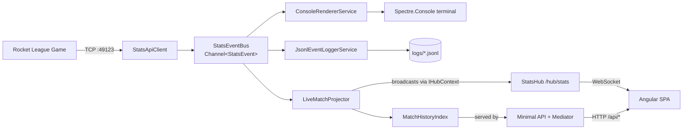

# RocketLeagueStats — Architecture

The dashboard subscribes to the existing in-process event bus as a peer consumer alongside the console renderer and JSONL logger. The console EXE remains the single deployable; the web tier lives inside it.

The bus is the architectural seam: every consumer is a peer. Adding a future Discord broadcaster is a matter of creating one more `IHostedService` that subscribes via `bus.Subscribe()` — no changes to existing consumers.

## Live event flow

| Event source | Broadcast surface | Cadence |
|---|---|---|
| `GoalScoredEvent` | `OnGoal(GoalDto)` | Bursty, ~1-10/min |
| `StatfeedEvent` | `OnStatfeed(StatfeedDto)` | Bursty, up to ~1/sec |
| `MatchInitializedEvent` | `OnMatchInitialized(MatchHeaderDto)` + `OnPhaseChanged(Live)` | Once per match |
| `MatchEndedEvent` | `OnMatchEnded(MatchSummaryDto)` + `OnPhaseChanged(Idle)` | Once per match |
| `ClockUpdatedSecondsEvent` | `OnClockTick(int)` | 1 Hz max (only on integer-seconds change) |
| Goals/Statfeeds (derived) | `OnPlayerStatsTick(PlayerStatsRowDto[])` | On change only |
| TCP listener up/down | `OnConnectionState(ConnectionStateDto)` | On change |

## Cold-load flow (browser opens dashboard)

1. SPA boots, `LiveMatchStore` constructor (NgRx SignalStore `withHooks.onInit`) runs
2. Hub connects at `/hub/stats` (auto-reconnect: 0/2/10/30s)
3. In parallel, `GET /api/state` seeds initial signals
4. Subsequent updates flow only through the hub
5. On hub reconnect, store re-fetches `/api/state` to recover any missed events
