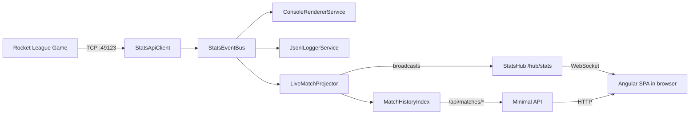

# Angular Web Dashboard v1 Implementation Plan

> **For agentic workers:** REQUIRED SUB-SKILL: Use superpowers:subagent-driven-development (recommended) or superpowers:executing-plans to implement this plan task-by-task. Steps use checkbox (`- [ ]`) syntax for tracking.

**Goal:** Add a web dashboard to RocketLeagueStats — a `RocketLeagueStats.Web` ASP.NET Core project (SignalR hub + Minimal API) and a sibling `RocketLeagueStats.WebApp` Angular 20+ workspace — all served from the existing console EXE on port 5000, bind 0.0.0.0.

**Architecture:** Web tier subscribes to the existing `StatsEventBus` as a peer consumer alongside the console renderer and JSONL logger. Discrete events broadcast as-is via SignalR; clock updates via `OnClockTick` at 1 Hz; player tallies broadcast on change. JSONL is the source of truth for history (replayed at startup). No DB. Single EXE preserved.

**Tech Stack:** .NET 10, ASP.NET Core (Kestrel + SignalR + Minimal API + Mediator), `martinothamar/Mediator`, Serilog, xUnit + NSubstitute, `Microsoft.AspNetCore.Mvc.Testing`. Angular 20+ (standalone, signals, zoneless), NgRx SignalStore, Tailwind v4, ECharts via ngx-echarts, `@microsoft/signalr`, Vitest, Playwright.

**Spec reference:** [`docs/superpowers/specs/2026-05-01-angular-frontend-design.md`](../specs/2026-05-01-angular-frontend-design.md). Read it first.

---

## Existing context (read once before starting)

- **.NET 10**, all package versions in `Directory.Packages.props` (CPM enabled).
- Strict build: `TreatWarningsAsErrors=true`, `EnforceCodeStyleInBuild=true`, `Nullable=enable`, `ImplicitUsings=enable`. **Every new file must be analyzer-clean.**
- Solution file is `RocketLeagueStats.sln` (not `.slnx`).
- Existing event types in `src/RocketLeagueStats.Core/Events/`:
  - Discrete: `GoalScoredEvent`, `StatfeedEvent`, `BallHitEvent`, `CrossbarHitEvent`
  - Lifecycle: `MatchLifecycleEvents.cs` (initialized/created/ended)
  - Periodic: `MatchStateSnapshot`, `ClockUpdatedSecondsEvent` ← **clock comes from this event, not derived from snapshots**
  - Value records: `PlayerRef`, `Vec3`, `BallLastTouchInfo`
- Existing bus: `RocketLeagueStats.Core.Bus.StatsEventBus` (multi-subscriber, `Channel<StatsEvent>`).
- Existing DI extension: `services.AddRocketLeagueStatsCore(configuration)` (in `Core/DependencyInjection/ServiceCollectionExtensions.cs`).
- Existing hosted services in Console: `IniBootstrapHostedService`, `StatsApiListenerService`, `ConsoleRendererService`, `JsonlEventLoggerService`.

## Phase outline

| Phase | Scope | Outcome |
|---|---|---|
| **0** | .NET Web project scaffolding | New project compiles; solution + tests reference it |
| **1** | DTO contracts + enums | All wire types defined; ready to be consumed |
| **2** | SignalR hub (typed) | Hub exists; can be invoked from a test |
| **3** | Server services (Settings, MatchTypeClassifier, MatchHistoryIndex, LiveMatchProjector) | Each service tested in isolation; bus subscription works |
| **4** | Mediator queries + Minimal API endpoints | All REST endpoints respond to integration tests |
| **5** | Web DI composition + Console integration | `dotnet run` from Console boots the API on `:5000` |
| **6** | Web project integration tests + .http samples | End-to-end through API + hub verified |
| **7** | Angular workspace bootstrap | `ng build` produces a hello-world bundle |
| **8** | Angular core (models, ApiClient, StatsHubClient) | API client typed end-to-end |
| **9** | Angular SignalStores (Live, History, Recap, Settings, Toast) | Vitest-tested |
| **10** | Angular shared components + pipes | Reusable building blocks ready |
| **11** | Landing page | First user-visible UI; lands on `/` |
| **12** | Live view | Live-data UI working against running API |
| **13** | History view | Match list with filtering |
| **14** | Recap view (charts deferred) | Full recap UI |
| **15** | Settings page | Player name persisted |
| **16** | App shell + routing wiring | All routes navigable |
| **17** | Build pipeline (Build-WebApp.ps1, MSBuild guard) | One-command production build |
| **18** | E2E tests (Playwright) | Cold-load + key flows verified in browser |
| **19** | Documentation | README + architecture + api-contract docs |

---

# Phase 0 — .NET project scaffolding

### Task 0.1: Create RocketLeagueStats.Web project

**Files:**
- Create: `src/RocketLeagueStats.Web/RocketLeagueStats.Web.csproj`
- Create: `src/RocketLeagueStats.Web/AssemblyInfo.cs`
- Modify: `Directory.Packages.props`
- Modify: `RocketLeagueStats.sln`

- [ ] **Step 1:** Add the new package versions to `Directory.Packages.props` (insert after the existing `Microsoft.Extensions.*` block):

```xml
<!-- Web hosting -->
<PackageVersion Include="Microsoft.AspNetCore.OpenApi" Version="10.0.7" />
<PackageVersion Include="Microsoft.AspNetCore.SignalR" Version="1.2.0" />
<!-- SignalR is included with ASP.NET Core; no separate package needed for the server.
     Pin only client-side packages here if/when used. -->
<PackageVersion Include="Microsoft.Extensions.Http" Version="10.0.7" />
<!-- Mediator (per CLAUDE.md, not MediatR) -->
<PackageVersion Include="Mediator.SourceGenerator" Version="3.0.0" />
<PackageVersion Include="Mediator.Abstractions" Version="3.0.0" />
```

Run `dotnet restore` after the next task adds `<PackageReference>` items.

- [ ] **Step 2:** Create `src/RocketLeagueStats.Web/RocketLeagueStats.Web.csproj`:

```xml
<Project Sdk="Microsoft.NET.Sdk.Web">

  <PropertyGroup>
    <RootNamespace>RocketLeagueStats.Web</RootNamespace>
    <AssemblyName>RocketLeagueStats.Web</AssemblyName>
    <GenerateDocumentationFile>true</GenerateDocumentationFile>
    <NoWarn>$(NoWarn);CS1591</NoWarn>
    <!-- The web bundle is generated by Build-WebApp.ps1; mark it gitignored
         and don't fail the build if absent in dev (a guard in Phase 17 handles release). -->
  </PropertyGroup>

  <ItemGroup>
    <PackageReference Include="Microsoft.AspNetCore.OpenApi" />
    <PackageReference Include="Microsoft.Extensions.Http" />
    <PackageReference Include="Mediator.SourceGenerator">
      <IncludeAssets>runtime; build; native; contentfiles; analyzers; buildtransitive</IncludeAssets>
      <PrivateAssets>all</PrivateAssets>
    </PackageReference>
    <PackageReference Include="Mediator.Abstractions" />
    <PackageReference Include="Serilog" />
  </ItemGroup>

  <ItemGroup>
    <ProjectReference Include="..\RocketLeagueStats.Core\RocketLeagueStats.Core.csproj" />
  </ItemGroup>

  <ItemGroup>
    <!-- wwwroot is generated by Build-WebApp.ps1 — keep it out of the project file's globbing -->
    <Content Remove="wwwroot\**" />
  </ItemGroup>

</Project>
```

- [ ] **Step 3:** Create `src/RocketLeagueStats.Web/AssemblyInfo.cs`:

```csharp
using System.Runtime.CompilerServices;

[assembly: InternalsVisibleTo("RocketLeagueStats.Web.Tests")]
```

- [ ] **Step 4:** Create the empty `wwwroot` directory and add a placeholder `.gitkeep`:

```
src/RocketLeagueStats.Web/wwwroot/.gitkeep
```

Add `wwwroot/*` (excluding `.gitkeep`) to repo `.gitignore` (or a project-local `.gitignore`):

```
# Generated by Build-WebApp.ps1
src/RocketLeagueStats.Web/wwwroot/*
!src/RocketLeagueStats.Web/wwwroot/.gitkeep
```

- [ ] **Step 5:** Add the project to the solution.

Run: `dotnet sln RocketLeagueStats.sln add src/RocketLeagueStats.Web/RocketLeagueStats.Web.csproj`

Expected: solution file gains the project entry.

- [ ] **Step 6:** Verify it builds.

Run: `dotnet build src/RocketLeagueStats.Web/RocketLeagueStats.Web.csproj -c Debug`
Expected: build succeeds, 0 warnings.

- [ ] **Step 7:** Commit.

```bash
git add Directory.Packages.props RocketLeagueStats.sln src/RocketLeagueStats.Web/ .gitignore
git commit -m "feat | scaffold RocketLeagueStats.Web project"
```

---

### Task 0.2: Create RocketLeagueStats.Web.Tests project

**Files:**
- Create: `tests/RocketLeagueStats.Web.Tests/RocketLeagueStats.Web.Tests.csproj`
- Modify: `Directory.Packages.props`
- Modify: `RocketLeagueStats.sln`

- [ ] **Step 1:** Add `Microsoft.AspNetCore.Mvc.Testing` to `Directory.Packages.props`:

```xml
<PackageVersion Include="Microsoft.AspNetCore.Mvc.Testing" Version="10.0.7" />
<PackageVersion Include="Microsoft.AspNetCore.SignalR.Client" Version="10.0.7" />
```

- [ ] **Step 2:** Create `tests/RocketLeagueStats.Web.Tests/RocketLeagueStats.Web.Tests.csproj`:

```xml
<Project Sdk="Microsoft.NET.Sdk">

  <PropertyGroup>
    <IsPackable>false</IsPackable>
    <IsTestProject>true</IsTestProject>
    <GenerateDocumentationFile>true</GenerateDocumentationFile>
    <NoWarn>$(NoWarn);CS1591;CA1707;IDE0065</NoWarn>
  </PropertyGroup>

  <ItemGroup>
    <PackageReference Include="Microsoft.NET.Test.Sdk" />
    <PackageReference Include="xunit" />
    <PackageReference Include="xunit.runner.visualstudio">
      <PrivateAssets>all</PrivateAssets>
      <IncludeAssets>runtime; build; native; contentfiles; analyzers; buildtransitive</IncludeAssets>
    </PackageReference>
    <PackageReference Include="NSubstitute" />
    <PackageReference Include="NSubstitute.Analyzers.CSharp" />
    <PackageReference Include="Microsoft.AspNetCore.Mvc.Testing" />
    <PackageReference Include="Microsoft.AspNetCore.SignalR.Client" />
    <PackageReference Include="coverlet.collector">
      <PrivateAssets>all</PrivateAssets>
      <IncludeAssets>runtime; build; native; contentfiles; analyzers; buildtransitive</IncludeAssets>
    </PackageReference>
  </ItemGroup>

  <ItemGroup>
    <ProjectReference Include="..\..\src\RocketLeagueStats.Core\RocketLeagueStats.Core.csproj" />
    <ProjectReference Include="..\..\src\RocketLeagueStats.Web\RocketLeagueStats.Web.csproj" />
  </ItemGroup>

  <ItemGroup>
    <None Update="_Fixtures\**\*.*">
      <CopyToOutputDirectory>PreserveNewest</CopyToOutputDirectory>
    </None>
  </ItemGroup>

</Project>
```

- [ ] **Step 3:** Add to the solution:

Run: `dotnet sln RocketLeagueStats.sln add tests/RocketLeagueStats.Web.Tests/RocketLeagueStats.Web.Tests.csproj`

- [ ] **Step 4:** Add a smoke test to verify wiring.

Create `tests/RocketLeagueStats.Web.Tests/SmokeTests.cs`:

```csharp
namespace RocketLeagueStats.Web.Tests;

public sealed class SmokeTests
{
    [Fact]
    public void TestProjectIsWired() => Assert.True(true);
}
```

- [ ] **Step 5:** Verify build + tests run.

Run: `dotnet test tests/RocketLeagueStats.Web.Tests/RocketLeagueStats.Web.Tests.csproj`
Expected: 1 passed, 0 failed.

- [ ] **Step 6:** Commit.

```bash
git add Directory.Packages.props RocketLeagueStats.sln tests/RocketLeagueStats.Web.Tests/
git commit -m "test | scaffold RocketLeagueStats.Web.Tests project"
```

---

### Task 0.3: Update Console Program.cs to use WebApplication.CreateBuilder

**Files:**
- Modify: `src/RocketLeagueStats.Console/Program.cs`
- Modify: `src/RocketLeagueStats.Console/RocketLeagueStats.Console.csproj`

- [ ] **Step 1:** Change the Console project SDK to allow web hosting:

In `src/RocketLeagueStats.Console/RocketLeagueStats.Console.csproj`, change `<Project Sdk="Microsoft.NET.Sdk">` to `<Project Sdk="Microsoft.NET.Sdk.Web">` and add `<UseAppHost>true</UseAppHost>` if not already present (the `Sdk.Web` defaults give us Kestrel; we don't need static-files setup until Phase 17). Also ensure `<OutputType>Exe</OutputType>` stays.

```xml
<Project Sdk="Microsoft.NET.Sdk.Web">

  <PropertyGroup>
    <OutputType>Exe</OutputType>
    <UseAppHost>true</UseAppHost>
    <RootNamespace>RocketLeagueStats.Console</RootNamespace>
    <AssemblyName>RocketLeagueStats</AssemblyName>
    <GenerateDocumentationFile>true</GenerateDocumentationFile>
    <NoWarn>$(NoWarn);CS1591</NoWarn>
    <ApplicationIcon>../../assets/RocketLeagueStats.ico</ApplicationIcon>
  </PropertyGroup>
  <!-- existing ItemGroups unchanged -->
</Project>
```

- [ ] **Step 2:** Replace `src/RocketLeagueStats.Console/Program.cs` to use `WebApplication.CreateBuilder`:

```csharp
using Microsoft.AspNetCore.Builder;
using Microsoft.Extensions.Configuration;
using Microsoft.Extensions.DependencyInjection;
using Microsoft.Extensions.Hosting;
using RocketLeagueStats.Console.HostedServices;
using RocketLeagueStats.Core.DependencyInjection;
using Serilog;

var builder = WebApplication.CreateBuilder(args);

// Valued CLI flags via switch mappings
builder.Configuration.AddCommandLine(args, switchMappings: new Dictionary<string, string>(StringComparer.Ordinal)
{
    ["--port"] = "StatsApi:Port",
    ["--web-port"] = "Web:Port",
});

if (args.Contains("--raw", StringComparer.Ordinal))
    builder.Configuration["Console:RawMode"] = "true";
if (args.Contains("--no-log", StringComparer.Ordinal))
    builder.Configuration["EventLog:Enabled"] = "false";
if (args.Contains("--no-config-helper", StringComparer.Ordinal))
    builder.Configuration["GameSetup:AutoConfigureIni"] = "false";
if (args.Contains("--trace", StringComparer.Ordinal))
    builder.Configuration["StatsApi:TraceMode"] = "true";
if (args.Contains("--no-web", StringComparer.Ordinal))
    builder.Configuration["Web:Enabled"] = "false";

builder.Services.AddSerilog((sp, lc) =>
    lc.ReadFrom.Configuration(builder.Configuration).Enrich.FromLogContext());

builder.Services.Configure<HostOptions>(o =>
    o.BackgroundServiceExceptionBehavior = BackgroundServiceExceptionBehavior.StopHost);

builder.Services.AddRocketLeagueStatsCore(builder.Configuration);
// AddRocketLeagueStatsWeb is added in Phase 5 (Task 5.1)

builder.Services.AddHostedService<IniBootstrapHostedService>();
builder.Services.AddHostedService<StatsApiListenerService>();
builder.Services.AddHostedService<ConsoleRendererService>();
builder.Services.AddHostedService<JsonlEventLoggerService>();

var app = builder.Build();
// Web pipeline (UseStaticFiles, MapHub, MapEndpoints, MapFallbackToFile) is added in Phase 5

await app.RunAsync();
```

- [ ] **Step 3:** Verify the existing console behavior still works.

Run: `dotnet build src/RocketLeagueStats.Console/RocketLeagueStats.Console.csproj`
Expected: build succeeds, 0 warnings.

- [ ] **Step 4:** Run existing Core tests to confirm nothing regressed.

Run: `dotnet test tests/RocketLeagueStats.Core.Tests/RocketLeagueStats.Core.Tests.csproj`
Expected: 26 tests pass.

- [ ] **Step 5:** Commit.

```bash
git add src/RocketLeagueStats.Console/RocketLeagueStats.Console.csproj src/RocketLeagueStats.Console/Program.cs
git commit -m "refactor | switch Console to WebApplication.CreateBuilder host"
```

---

# Phase 1 — DTO contracts + enums

All DTOs live in `src/RocketLeagueStats.Web/Contracts/`. JSON serialization uses default `JsonNamingPolicy.CamelCase` (configured later in Phase 5). DTOs are `record` types with `init`-only properties for immutability.

### Task 1.1: Create enum types and PlayerRefDto + Vec3Dto

**Files:**
- Create: `src/RocketLeagueStats.Web/Contracts/MatchPhase.cs`
- Create: `src/RocketLeagueStats.Web/Contracts/MatchType.cs`
- Create: `src/RocketLeagueStats.Web/Contracts/StatfeedType.cs`
- Create: `src/RocketLeagueStats.Web/Contracts/PlayerRefDto.cs`
- Create: `src/RocketLeagueStats.Web/Contracts/Vec3Dto.cs`

- [ ] **Step 1:** Create `Contracts/MatchPhase.cs`:

```csharp
namespace RocketLeagueStats.Web.Contracts;

/// <summary>Whether a match is currently in progress or the dashboard is idle.</summary>
public enum MatchPhase
{
    Idle,
    Live,
}
```

- [ ] **Step 2:** Create `Contracts/MatchType.cs`:

```csharp
namespace RocketLeagueStats.Web.Contracts;

/// <summary>Game-mode classification derived from MatchStateSnapshot.RawData playlist field.</summary>
public enum MatchType
{
    Unknown = 0,
    Ranked1v1,
    Ranked2v2,
    Ranked3v3,
    Casual,
    Tournament,
    Private,
    FreePlay,
    Training,
}
```

- [ ] **Step 3:** Create `Contracts/StatfeedType.cs`:

```csharp
namespace RocketLeagueStats.Web.Contracts;

/// <summary>Statfeed event categories (saves, demos, epic saves, hattricks, etc.).</summary>
public enum StatfeedType
{
    Other = 0,
    Save,
    EpicSave,
    Demolish,
    Hattrick,
    MvpHattrick,
}
```

- [ ] **Step 4:** Create `Contracts/PlayerRefDto.cs`:

```csharp
namespace RocketLeagueStats.Web.Contracts;

/// <summary>A reference to a player within a match, mapped from RL's internal PlayerRef.</summary>
/// <param name="Name">Display name.</param>
/// <param name="Shortcut">RL's stable per-match player int identifier; disambiguates same-name players.</param>
/// <param name="Team">"blue" or "orange".</param>
public sealed record PlayerRefDto(string Name, int Shortcut, string Team);
```

- [ ] **Step 5:** Create `Contracts/Vec3Dto.cs`:

```csharp
namespace RocketLeagueStats.Web.Contracts;

/// <summary>3-dimensional vector in Rocket League's coordinate system (Unreal Units).</summary>
public sealed record Vec3Dto(double X, double Y, double Z);
```

- [ ] **Step 6:** Verify build.

Run: `dotnet build src/RocketLeagueStats.Web/RocketLeagueStats.Web.csproj`
Expected: build succeeds, 0 warnings (including IDE0005, CA1707, etc. — the project has strict analyzers).

- [ ] **Step 7:** Commit.

```bash
git add src/RocketLeagueStats.Web/Contracts/
git commit -m "feat | add core DTO enums and PlayerRefDto/Vec3Dto"
```

---

### Task 1.2: Create event DTOs (Goal, Statfeed, MatchHeader, MatchSummary)

**Files:**
- Create: `src/RocketLeagueStats.Web/Contracts/GoalDto.cs`
- Create: `src/RocketLeagueStats.Web/Contracts/StatfeedDto.cs`
- Create: `src/RocketLeagueStats.Web/Contracts/MatchHeaderDto.cs`
- Create: `src/RocketLeagueStats.Web/Contracts/MatchSummaryDto.cs`

- [ ] **Step 1:** Create `Contracts/GoalDto.cs`:

```csharp
namespace RocketLeagueStats.Web.Contracts;

/// <summary>A single goal scored in a match.</summary>
public sealed record GoalDto(
    string Id,
    DateTime Timestamp,
    int MatchClockSeconds,
    PlayerRefDto Scorer,
    PlayerRefDto? Assister,
    double GoalSpeedUuPerSec,
    Vec3Dto ImpactLocation,
    int BlueScoreAfter,
    int OrangeScoreAfter,
    int? SecondsSinceLastGoal);
```

- [ ] **Step 2:** Create `Contracts/StatfeedDto.cs`:

```csharp
namespace RocketLeagueStats.Web.Contracts;

/// <summary>A statfeed event — saves, demolitions, epic saves, hattricks, etc.</summary>
public sealed record StatfeedDto(
    DateTime Timestamp,
    int MatchClockSeconds,
    StatfeedType Type,
    PlayerRefDto MainTarget,
    PlayerRefDto? SecondaryTarget);
```

- [ ] **Step 3:** Create `Contracts/MatchHeaderDto.cs`:

```csharp
namespace RocketLeagueStats.Web.Contracts;

/// <summary>Header data for a match — identity, type, players.</summary>
public sealed record MatchHeaderDto(
    string MatchId,
    DateTime StartedAt,
    MatchType Type,
    string PlaylistRaw,
    PlayerRefDto[] BluePlayers,
    PlayerRefDto[] OrangePlayers,
    string? ArenaName);
```

- [ ] **Step 4:** Create `Contracts/MatchSummaryDto.cs`:

```csharp
namespace RocketLeagueStats.Web.Contracts;

/// <summary>Summary of a completed match — used in history list and as the OnMatchEnded payload.</summary>
public sealed record MatchSummaryDto(
    string MatchId,
    DateTime StartedAt,
    DateTime EndedAt,
    int DurationSeconds,
    MatchType Type,
    int BlueScore,
    int OrangeScore,
    PlayerRefDto[] AllPlayers,
    PlayerRefDto? Mvp,
    int TotalGoals,
    GoalDto? FastestGoal);
```

- [ ] **Step 5:** Verify build.

Run: `dotnet build src/RocketLeagueStats.Web/RocketLeagueStats.Web.csproj`
Expected: build succeeds.

- [ ] **Step 6:** Commit.

```bash
git add src/RocketLeagueStats.Web/Contracts/GoalDto.cs src/RocketLeagueStats.Web/Contracts/StatfeedDto.cs src/RocketLeagueStats.Web/Contracts/MatchHeaderDto.cs src/RocketLeagueStats.Web/Contracts/MatchSummaryDto.cs
git commit -m "feat | add event DTOs (goal/statfeed/match header/summary)"
```

---

### Task 1.3: Create stats and recap DTOs (PlayerStatsRow, GameFlow, MatchRecap, LiveState, ConnectionState, Settings, ServerInfo)

**Files:**
- Create: `src/RocketLeagueStats.Web/Contracts/PlayerStatsRowDto.cs`
- Create: `src/RocketLeagueStats.Web/Contracts/GameFlowDto.cs`
- Create: `src/RocketLeagueStats.Web/Contracts/MatchRecapDto.cs`
- Create: `src/RocketLeagueStats.Web/Contracts/LiveStateDto.cs`
- Create: `src/RocketLeagueStats.Web/Contracts/ConnectionStateDto.cs`
- Create: `src/RocketLeagueStats.Web/Contracts/SettingsDto.cs`
- Create: `src/RocketLeagueStats.Web/Contracts/ServerInfoDto.cs`

- [ ] **Step 1:** Create `Contracts/PlayerStatsRowDto.cs`:

```csharp
namespace RocketLeagueStats.Web.Contracts;

/// <summary>Per-player aggregated stats in a match.</summary>
public sealed record PlayerStatsRowDto(
    PlayerRefDto Player,
    int Goals,
    int Assists,
    int Saves,
    int EpicSaves,
    int Shots,
    int DemosInflicted,
    int DemosTaken,
    int CrossbarHits,
    double FastestGoalSpeedUuPerSec,
    double MvpScore,
    bool IsMvp);
```

- [ ] **Step 2:** Create `Contracts/GameFlowDto.cs`:

```csharp
namespace RocketLeagueStats.Web.Contracts;

/// <summary>Cumulative-score timeline for the recap game-flow chart.</summary>
public sealed record GameFlowDto(
    int[] TimestampSeconds,
    int[] BlueScoreAtStep,
    int[] OrangeScoreAtStep);
```

- [ ] **Step 3:** Create `Contracts/MatchRecapDto.cs`:

```csharp
namespace RocketLeagueStats.Web.Contracts;

/// <summary>Full recap data for a completed match.</summary>
public sealed record MatchRecapDto(
    MatchSummaryDto Summary,
    GoalDto[] Goals,
    StatfeedDto[] Statfeeds,
    PlayerStatsRowDto[] PlayerStats,
    int[] TimeBetweenGoalsSeconds,
    GameFlowDto Flow);
```

- [ ] **Step 4:** Create `Contracts/ConnectionStateDto.cs`:

```csharp
namespace RocketLeagueStats.Web.Contracts;

/// <summary>State of the API's connection to Rocket League's TCP Stats API.</summary>
public sealed record ConnectionStateDto(
    bool ConnectedToGame,
    DateTime? LastEventReceivedAt);
```

- [ ] **Step 5:** Create `Contracts/LiveStateDto.cs`:

```csharp
namespace RocketLeagueStats.Web.Contracts;

/// <summary>The complete live state — used to bootstrap a freshly-connected client.</summary>
public sealed record LiveStateDto(
    MatchPhase Phase,
    MatchHeaderDto? CurrentMatch,
    int? CurrentMatchClockSeconds,
    int BlueScore,
    int OrangeScore,
    PlayerStatsRowDto[] PlayerStats,
    GoalDto[] RecentGoals,
    StatfeedDto[] RecentStatfeeds,
    DateTime? LastGoalAt,
    ConnectionStateDto Connection);
```

- [ ] **Step 6:** Create `Contracts/SettingsDto.cs`:

```csharp
namespace RocketLeagueStats.Web.Contracts;

/// <summary>User-configurable settings (player name, friend list, history filter default).</summary>
public sealed record SettingsDto(
    string? PlayerName,
    string[] FriendNames,
    bool ShowTrainingInHistory);
```

- [ ] **Step 7:** Create `Contracts/ServerInfoDto.cs`:

```csharp
namespace RocketLeagueStats.Web.Contracts;

/// <summary>Server build/version metadata exposed via /api/info.</summary>
public sealed record ServerInfoDto(
    string Version,
    DateTime BuildDate,
    string[] EnabledFeatures);
```

- [ ] **Step 8:** Verify build.

Run: `dotnet build src/RocketLeagueStats.Web/RocketLeagueStats.Web.csproj`
Expected: build succeeds, 0 warnings.

- [ ] **Step 9:** Commit.

```bash
git add src/RocketLeagueStats.Web/Contracts/
git commit -m "feat | add recap, live-state, settings, and info DTOs"
```

---

# Phase 2 — SignalR hub (typed)

### Task 2.1: Define IStatsHubClient interface

**Files:**
- Create: `src/RocketLeagueStats.Web/Hubs/IStatsHubClient.cs`

- [ ] **Step 1:** Create `Hubs/IStatsHubClient.cs`:

```csharp
using RocketLeagueStats.Web.Contracts;

namespace RocketLeagueStats.Web.Hubs;

/// <summary>
/// Strongly-typed SignalR client contract — the methods the server pushes to browser clients.
/// Implemented by SignalR's runtime via the typed Hub&lt;T&gt; pattern.
/// </summary>
public interface IStatsHubClient
{
    /// <summary>A goal was scored.</summary>
    Task OnGoal(GoalDto goal);

    /// <summary>A statfeed event (save, demo, epic save, etc.) occurred.</summary>
    Task OnStatfeed(StatfeedDto statfeed);

    /// <summary>A new match started — fired on MatchInitialized.</summary>
    Task OnMatchInitialized(MatchHeaderDto header);

    /// <summary>A match ended — fired on MatchEnded.</summary>
    Task OnMatchEnded(MatchSummaryDto summary);

    /// <summary>Match clock tick — at most 1 Hz, only fired when integer-seconds value changes.</summary>
    Task OnClockTick(int matchClockSeconds);

    /// <summary>Per-player running tallies — broadcast only when at least one row changes.</summary>
    Task OnPlayerStatsTick(PlayerStatsRowDto[] rows);

    /// <summary>Connection state to RL's TCP API changed.</summary>
    Task OnConnectionState(ConnectionStateDto state);

    /// <summary>Match phase changed (idle ↔ live).</summary>
    Task OnPhaseChanged(MatchPhase phase);
}
```

- [ ] **Step 2:** Verify build.

Run: `dotnet build src/RocketLeagueStats.Web/RocketLeagueStats.Web.csproj`
Expected: build succeeds.

- [ ] **Step 3:** Commit.

```bash
git add src/RocketLeagueStats.Web/Hubs/IStatsHubClient.cs
git commit -m "feat | define IStatsHubClient typed SignalR contract"
```

---

### Task 2.2: Implement StatsHub

**Files:**
- Create: `src/RocketLeagueStats.Web/Hubs/StatsHub.cs`

- [ ] **Step 1:** Create `Hubs/StatsHub.cs`:

```csharp
using Microsoft.AspNetCore.SignalR;

namespace RocketLeagueStats.Web.Hubs;

/// <summary>
/// SignalR hub for live stats. Broadcast-only — no client→server methods in v1.
/// Clients bootstrap their state via HTTP GET /api/state, then listen for incremental updates here.
/// </summary>
public sealed class StatsHub : Hub<IStatsHubClient>
{
    // Intentionally empty: the hub exists purely to expose the IStatsHubClient broadcast surface.
    // Server-side broadcasts happen via IHubContext<StatsHub, IStatsHubClient>, injected into LiveMatchProjector.
}
```

- [ ] **Step 2:** Verify build.

Run: `dotnet build src/RocketLeagueStats.Web/RocketLeagueStats.Web.csproj`
Expected: build succeeds.

- [ ] **Step 3:** Commit.

```bash
git add src/RocketLeagueStats.Web/Hubs/StatsHub.cs
git commit -m "feat | add StatsHub (broadcast-only typed hub)"
```

---

# Phase 3 — Server services

> **Important domain notes (read before starting Phase 3):**
> - `Core.Events.PlayerRef` is `readonly record struct (Name, Shortcut, TeamNum)`. Conversion to `PlayerRefDto` requires `TeamNum: 0 → "blue"`, `1 → "orange"`, anything else → throw or `"unknown"` (decide via test in Task 3.3).
> - `GoalScoredEvent` does NOT carry the running score — per the comment in `Core/Events/GoalScoredEvent.cs`, scores live in `MatchStateSnapshot.RawData.Game.Teams[].Score`. **For v1 we derive scores by counting goals per team from `GoalScoredEvent.Scorer.TeamNum`** — simpler than parsing snapshot JSON, and authoritative because every goal fires an event.
> - The match clock comes from `ClockUpdatedSecondsEvent` (already in Core), not from snapshots.
> - Bus subscribers are background workers that `bus.Subscribe()` once at startup and loop on `await foreach (var evt in reader.ReadAllAsync(ct))`.

### Task 3.1: PlayerRef → PlayerRefDto mapper (TDD)

**Files:**
- Create: `tests/RocketLeagueStats.Web.Tests/Mapping/PlayerRefMapperTests.cs`
- Create: `src/RocketLeagueStats.Web/Mapping/PlayerRefMapper.cs`

- [ ] **Step 1:** Write the failing test.

```csharp
namespace RocketLeagueStats.Web.Tests.Mapping;

using RocketLeagueStats.Core.Events;
using RocketLeagueStats.Web.Mapping;

public sealed class PlayerRefMapperTests
{
    [Fact]
    public void Maps_team0_to_blue()
    {
        var src = new PlayerRef("Hellcat", 1, 0);
        var dto = PlayerRefMapper.ToDto(src);
        Assert.Equal("Hellcat", dto.Name);
        Assert.Equal(1, dto.Shortcut);
        Assert.Equal("blue", dto.Team);
    }

    [Fact]
    public void Maps_team1_to_orange()
    {
        var src = new PlayerRef("Stinkmaster", 2, 1);
        var dto = PlayerRefMapper.ToDto(src);
        Assert.Equal("orange", dto.Team);
    }

    [Fact]
    public void Maps_unknown_team_to_string_unknown()
    {
        var src = new PlayerRef("Glitch", 3, 7);
        var dto = PlayerRefMapper.ToDto(src);
        Assert.Equal("unknown", dto.Team);
    }
}
```

- [ ] **Step 2:** Run, confirm fail.

Run: `dotnet test tests/RocketLeagueStats.Web.Tests/RocketLeagueStats.Web.Tests.csproj --filter PlayerRefMapperTests`
Expected: compile error (`PlayerRefMapper` not defined).

- [ ] **Step 3:** Implement.

Create `src/RocketLeagueStats.Web/Mapping/PlayerRefMapper.cs`:

```csharp
using RocketLeagueStats.Core.Events;
using RocketLeagueStats.Web.Contracts;

namespace RocketLeagueStats.Web.Mapping;

internal static class PlayerRefMapper
{
    public static PlayerRefDto ToDto(PlayerRef src) => new(
        Name: src.Name,
        Shortcut: src.Shortcut,
        Team: src.TeamNum switch
        {
            0 => "blue",
            1 => "orange",
            _ => "unknown",
        });
}
```

- [ ] **Step 4:** Run, confirm pass.

Run: `dotnet test tests/RocketLeagueStats.Web.Tests/RocketLeagueStats.Web.Tests.csproj --filter PlayerRefMapperTests`
Expected: 3 passed.

- [ ] **Step 5:** Commit.

```bash
git add src/RocketLeagueStats.Web/Mapping/ tests/RocketLeagueStats.Web.Tests/Mapping/
git commit -m "feat | add PlayerRef → PlayerRefDto mapper"
```

---

### Task 3.2: MatchTypeClassifier (TDD)

**Files:**
- Create: `tests/RocketLeagueStats.Web.Tests/Services/MatchTypeClassifierTests.cs`
- Create: `src/RocketLeagueStats.Web/Services/MatchTypeClassifier.cs`

The classifier accepts the raw `playlist` string from `MatchStateSnapshot.RawData` and returns a `MatchType` enum. Real playlist strings observed in practice include: `"Ranked3v3"`, `"Casual2v2"`, `"FreePlay"`, `"Tournament"`, `"PrivateMatch"`, `"Training"`, etc.

- [ ] **Step 1:** Write tests.

```csharp
namespace RocketLeagueStats.Web.Tests.Services;

using RocketLeagueStats.Web.Contracts;
using RocketLeagueStats.Web.Services;

public sealed class MatchTypeClassifierTests
{
    [Theory]
    [InlineData("Ranked1v1", MatchType.Ranked1v1)]
    [InlineData("Ranked2v2", MatchType.Ranked2v2)]
    [InlineData("Ranked3v3", MatchType.Ranked3v3)]
    [InlineData("Casual1v1", MatchType.Casual)]
    [InlineData("Casual2v2", MatchType.Casual)]
    [InlineData("Casual3v3", MatchType.Casual)]
    [InlineData("Tournament", MatchType.Tournament)]
    [InlineData("Private", MatchType.Private)]
    [InlineData("PrivateMatch", MatchType.Private)]
    [InlineData("FreePlay", MatchType.FreePlay)]
    [InlineData("Training", MatchType.Training)]
    [InlineData("CustomTraining", MatchType.Training)]
    public void Classifies_known_playlist_strings(string playlist, MatchType expected)
    {
        Assert.Equal(expected, MatchTypeClassifier.FromPlaylist(playlist));
    }

    [Theory]
    [InlineData("")]
    [InlineData("SomethingWeird")]
    [InlineData(null)]
    public void Returns_Unknown_for_unrecognized_or_null_playlists(string? playlist)
    {
        Assert.Equal(MatchType.Unknown, MatchTypeClassifier.FromPlaylist(playlist));
    }

    [Fact]
    public void Is_case_insensitive()
    {
        Assert.Equal(MatchType.Ranked3v3, MatchTypeClassifier.FromPlaylist("ranked3v3"));
        Assert.Equal(MatchType.FreePlay, MatchTypeClassifier.FromPlaylist("FREEPLAY"));
    }
}
```

- [ ] **Step 2:** Run, confirm fail.

Run: `dotnet test tests/RocketLeagueStats.Web.Tests/RocketLeagueStats.Web.Tests.csproj --filter MatchTypeClassifierTests`
Expected: compile error.

- [ ] **Step 3:** Implement.

Create `src/RocketLeagueStats.Web/Services/MatchTypeClassifier.cs`:

```csharp
using RocketLeagueStats.Web.Contracts;

namespace RocketLeagueStats.Web.Services;

/// <summary>Maps the raw <c>playlist</c> string from MatchStateSnapshot to a MatchType enum.</summary>
internal static class MatchTypeClassifier
{
    public static MatchType FromPlaylist(string? playlist)
    {
        if (string.IsNullOrWhiteSpace(playlist))
            return MatchType.Unknown;

        var p = playlist.Trim();

        if (p.Equals("Ranked1v1", StringComparison.OrdinalIgnoreCase)) return MatchType.Ranked1v1;
        if (p.Equals("Ranked2v2", StringComparison.OrdinalIgnoreCase)) return MatchType.Ranked2v2;
        if (p.Equals("Ranked3v3", StringComparison.OrdinalIgnoreCase)) return MatchType.Ranked3v3;
        if (p.StartsWith("Casual", StringComparison.OrdinalIgnoreCase)) return MatchType.Casual;
        if (p.Equals("Tournament", StringComparison.OrdinalIgnoreCase)) return MatchType.Tournament;
        if (p.Contains("Private", StringComparison.OrdinalIgnoreCase)) return MatchType.Private;
        if (p.Equals("FreePlay", StringComparison.OrdinalIgnoreCase)) return MatchType.FreePlay;
        if (p.Contains("Training", StringComparison.OrdinalIgnoreCase)) return MatchType.Training;

        return MatchType.Unknown;
    }
}
```

- [ ] **Step 4:** Run, confirm pass.

Run: `dotnet test tests/RocketLeagueStats.Web.Tests/RocketLeagueStats.Web.Tests.csproj --filter MatchTypeClassifierTests`
Expected: all tests pass.

- [ ] **Step 5:** Commit.

```bash
git add src/RocketLeagueStats.Web/Services/MatchTypeClassifier.cs tests/RocketLeagueStats.Web.Tests/Services/MatchTypeClassifierTests.cs
git commit -m "feat | add MatchTypeClassifier"
```

---

### Task 3.3: SettingsStore (TDD)

**Files:**
- Create: `tests/RocketLeagueStats.Web.Tests/Services/SettingsStoreTests.cs`
- Create: `src/RocketLeagueStats.Web/Services/ISettingsStore.cs`
- Create: `src/RocketLeagueStats.Web/Services/SettingsStore.cs`

The store reads/writes a JSON file at `%APPDATA%/RocketLeagueStats/settings.json`. Tests use a temp directory injected via constructor.

- [ ] **Step 1:** Write tests.

```csharp
namespace RocketLeagueStats.Web.Tests.Services;

using RocketLeagueStats.Web.Contracts;
using RocketLeagueStats.Web.Services;

public sealed class SettingsStoreTests : IDisposable
{
    private readonly string tempDir;

    public SettingsStoreTests()
    {
        this.tempDir = Path.Combine(Path.GetTempPath(), $"rls-test-{Guid.NewGuid()}");
        Directory.CreateDirectory(this.tempDir);
    }

    public void Dispose() => Directory.Delete(this.tempDir, recursive: true);

    [Fact]
    public async Task Returns_defaults_when_file_missing()
    {
        var store = new SettingsStore(this.tempDir);
        var settings = await store.GetAsync(CancellationToken.None);
        Assert.Null(settings.PlayerName);
        Assert.Empty(settings.FriendNames);
        Assert.False(settings.ShowTrainingInHistory);
    }

    [Fact]
    public async Task Round_trips_settings_via_save_then_get()
    {
        var store = new SettingsStore(this.tempDir);
        var dto = new SettingsDto("Hellcat", new[] { "Stinkmaster" }, ShowTrainingInHistory: true);
        await store.SaveAsync(dto, CancellationToken.None);

        var loaded = await store.GetAsync(CancellationToken.None);
        Assert.Equal("Hellcat", loaded.PlayerName);
        Assert.Equal(new[] { "Stinkmaster" }, loaded.FriendNames);
        Assert.True(loaded.ShowTrainingInHistory);
    }

    [Fact]
    public async Task Returns_defaults_and_backs_up_corrupted_file()
    {
        var path = Path.Combine(this.tempDir, "settings.json");
        await File.WriteAllTextAsync(path, "this is not valid json {{{");

        var store = new SettingsStore(this.tempDir);
        var settings = await store.GetAsync(CancellationToken.None);
        Assert.Null(settings.PlayerName);

        // backup file should exist
        var backups = Directory.GetFiles(this.tempDir, "settings.json.bad-*");
        Assert.Single(backups);
    }

    [Fact]
    public async Task Save_creates_directory_if_missing()
    {
        var nested = Path.Combine(this.tempDir, "nested", "dir");
        var store = new SettingsStore(nested);
        await store.SaveAsync(new SettingsDto("Test", Array.Empty<string>(), false), CancellationToken.None);
        Assert.True(File.Exists(Path.Combine(nested, "settings.json")));
    }
}
```

- [ ] **Step 2:** Run, confirm fail.

Run: `dotnet test --filter SettingsStoreTests`
Expected: compile error.

- [ ] **Step 3:** Create the interface.

`src/RocketLeagueStats.Web/Services/ISettingsStore.cs`:

```csharp
using RocketLeagueStats.Web.Contracts;

namespace RocketLeagueStats.Web.Services;

/// <summary>Persists user settings to %APPDATA%/RocketLeagueStats/settings.json (or a configurable directory).</summary>
public interface ISettingsStore
{
    Task<SettingsDto> GetAsync(CancellationToken ct);
    Task SaveAsync(SettingsDto settings, CancellationToken ct);
}
```

- [ ] **Step 4:** Implement the store.

`src/RocketLeagueStats.Web/Services/SettingsStore.cs`:

```csharp
using System.Text.Json;
using RocketLeagueStats.Web.Contracts;

namespace RocketLeagueStats.Web.Services;

internal sealed class SettingsStore : ISettingsStore
{
    private static readonly SettingsDto Defaults = new(
        PlayerName: null,
        FriendNames: Array.Empty<string>(),
        ShowTrainingInHistory: false);

    private static readonly JsonSerializerOptions JsonOptions = new()
    {
        PropertyNamingPolicy = JsonNamingPolicy.CamelCase,
        WriteIndented = true,
    };

    private readonly string filePath;
    private readonly string directoryPath;

    public SettingsStore(string directoryPath)
    {
        this.directoryPath = directoryPath;
        this.filePath = Path.Combine(directoryPath, "settings.json");
    }

    public async Task<SettingsDto> GetAsync(CancellationToken ct)
    {
        if (!File.Exists(this.filePath))
            return Defaults;

        try
        {
            await using var fs = File.OpenRead(this.filePath);
            var dto = await JsonSerializer.DeserializeAsync<SettingsDto>(fs, JsonOptions, ct);
            return dto ?? Defaults;
        }
        catch (JsonException)
        {
            BackupCorruptedFile();
            return Defaults;
        }
    }

    public async Task SaveAsync(SettingsDto settings, CancellationToken ct)
    {
        Directory.CreateDirectory(this.directoryPath);
        await using var fs = File.Create(this.filePath);
        await JsonSerializer.SerializeAsync(fs, settings, JsonOptions, ct);
    }

    private void BackupCorruptedFile()
    {
        var backupName = $"settings.json.bad-{DateTime.UtcNow:yyyyMMddHHmmss}";
        var backupPath = Path.Combine(this.directoryPath, backupName);
        File.Move(this.filePath, backupPath);
    }
}
```

- [ ] **Step 5:** Run, confirm pass.

Run: `dotnet test --filter SettingsStoreTests`
Expected: 4 passed.

- [ ] **Step 6:** Commit.

```bash
git add src/RocketLeagueStats.Web/Services/ISettingsStore.cs src/RocketLeagueStats.Web/Services/SettingsStore.cs tests/RocketLeagueStats.Web.Tests/Services/SettingsStoreTests.cs
git commit -m "feat | add SettingsStore for %APPDATA%/RocketLeagueStats/settings.json"
```

---

### Task 3.4: MatchHistoryIndex (skeleton + state-mutation TDD)

The full JSONL replay logic at startup is in Task 3.5. This task builds the in-memory index that is mutated by `LiveMatchProjector` during normal operation.

**Files:**
- Create: `tests/RocketLeagueStats.Web.Tests/Services/MatchHistoryIndexTests.cs`
- Create: `src/RocketLeagueStats.Web/Services/IMatchHistoryIndex.cs`
- Create: `src/RocketLeagueStats.Web/Services/MatchHistoryIndex.cs`
- Create: `src/RocketLeagueStats.Web/Services/MatchRecord.cs` (internal aggregate root)
- Create: `src/RocketLeagueStats.Web/Services/HistoryFilter.cs`

- [ ] **Step 1:** Write the test file.

```csharp
namespace RocketLeagueStats.Web.Tests.Services;

using RocketLeagueStats.Web.Contracts;
using RocketLeagueStats.Web.Services;

public sealed class MatchHistoryIndexTests
{
    private static MatchHeaderDto SampleHeader(string id = "match-1") => new(
        MatchId: id,
        StartedAt: DateTime.UtcNow,
        Type: MatchType.Casual,
        PlaylistRaw: "Casual2v2",
        BluePlayers: new[] { new PlayerRefDto("Hellcat", 1, "blue") },
        OrangePlayers: new[] { new PlayerRefDto("Stinkmaster", 2, "orange") },
        ArenaName: "Mannfield");

    [Fact]
    public void New_index_is_empty()
    {
        var index = new MatchHistoryIndex();
        Assert.Empty(index.GetMatches(HistoryFilter.Default));
    }

    [Fact]
    public void BeginMatch_adds_in_progress_match_but_GetMatches_excludes_it()
    {
        var index = new MatchHistoryIndex();
        index.BeginMatch(SampleHeader());
        Assert.Empty(index.GetMatches(HistoryFilter.Default)); // only completed matches show up
    }

    [Fact]
    public void CompleteMatch_makes_match_visible_in_history()
    {
        var index = new MatchHistoryIndex();
        var header = SampleHeader();
        index.BeginMatch(header);
        index.CompleteMatch(header.MatchId, BuildSummary(header));
        Assert.Single(index.GetMatches(HistoryFilter.Default));
    }

    [Fact]
    public void Default_filter_excludes_training_matches()
    {
        var index = new MatchHistoryIndex();
        var trainingHeader = SampleHeader("training-1") with { Type = MatchType.Training };
        index.BeginMatch(trainingHeader);
        index.CompleteMatch(trainingHeader.MatchId, BuildSummary(trainingHeader));

        var casualHeader = SampleHeader("casual-1");
        index.BeginMatch(casualHeader);
        index.CompleteMatch(casualHeader.MatchId, BuildSummary(casualHeader));

        var matches = index.GetMatches(HistoryFilter.Default);
        Assert.Single(matches);
        Assert.Equal("casual-1", matches[0].MatchId);
    }

    [Fact]
    public void Filter_can_include_training_matches()
    {
        var index = new MatchHistoryIndex();
        var trainingHeader = SampleHeader("training-1") with { Type = MatchType.Training };
        index.BeginMatch(trainingHeader);
        index.CompleteMatch(trainingHeader.MatchId, BuildSummary(trainingHeader));

        var matches = index.GetMatches(HistoryFilter.Default with { IncludeTraining = true });
        Assert.Single(matches);
    }

    [Fact]
    public void GetRecap_returns_null_for_unknown_match_id()
    {
        var index = new MatchHistoryIndex();
        Assert.Null(index.GetRecap("does-not-exist"));
    }

    [Fact]
    public void GetRecap_returns_recap_for_completed_match()
    {
        var index = new MatchHistoryIndex();
        var header = SampleHeader();
        index.BeginMatch(header);
        var summary = BuildSummary(header);
        index.CompleteMatch(header.MatchId, summary);

        var recap = index.GetRecap(header.MatchId);
        Assert.NotNull(recap);
        Assert.Equal(header.MatchId, recap!.Summary.MatchId);
    }

    private static MatchSummaryDto BuildSummary(MatchHeaderDto header) => new(
        MatchId: header.MatchId,
        StartedAt: header.StartedAt,
        EndedAt: header.StartedAt.AddMinutes(5),
        DurationSeconds: 300,
        Type: header.Type,
        BlueScore: 0,
        OrangeScore: 0,
        AllPlayers: new[] { header.BluePlayers[0], header.OrangePlayers[0] },
        Mvp: null,
        TotalGoals: 0,
        FastestGoal: null);
}
```

- [ ] **Step 2:** Run, confirm fail.

Run: `dotnet test --filter MatchHistoryIndexTests`
Expected: compile error.

- [ ] **Step 3:** Create `Services/HistoryFilter.cs`:

```csharp
using RocketLeagueStats.Web.Contracts;

namespace RocketLeagueStats.Web.Services;

/// <summary>Filter applied at history-list query time.</summary>
public sealed record HistoryFilter(
    bool IncludeTraining,
    bool IncludeFreePlay,
    DateTime? From,
    DateTime? To,
    HistorySort Sort)
{
    public static HistoryFilter Default { get; } = new(
        IncludeTraining: false,
        IncludeFreePlay: false,
        From: null,
        To: null,
        Sort: HistorySort.MostRecent);
}

public enum HistorySort
{
    MostRecent,
    HighestScoring,
}
```

- [ ] **Step 4:** Create `Services/MatchRecord.cs` (internal aggregate state):

```csharp
using RocketLeagueStats.Web.Contracts;

namespace RocketLeagueStats.Web.Services;

/// <summary>Internal in-memory representation of a match — header, all events, optional summary.</summary>
internal sealed class MatchRecord
{
    public required MatchHeaderDto Header { get; init; }
    public List<GoalDto> Goals { get; } = new();
    public List<StatfeedDto> Statfeeds { get; } = new();
    public MatchSummaryDto? Summary { get; set; }
    public bool IsCompleted => this.Summary is not null;
}
```

- [ ] **Step 5:** Create `Services/IMatchHistoryIndex.cs`:

```csharp
using RocketLeagueStats.Web.Contracts;

namespace RocketLeagueStats.Web.Services;

public interface IMatchHistoryIndex
{
    void BeginMatch(MatchHeaderDto header);
    void AppendGoal(string matchId, GoalDto goal);
    void AppendStatfeed(string matchId, StatfeedDto statfeed);
    void CompleteMatch(string matchId, MatchSummaryDto summary);

    IReadOnlyList<MatchSummaryDto> GetMatches(HistoryFilter filter);
    MatchRecapDto? GetRecap(string matchId);
}
```

- [ ] **Step 6:** Implement `Services/MatchHistoryIndex.cs`:

```csharp
using System.Collections.Concurrent;
using RocketLeagueStats.Web.Contracts;
using RocketLeagueStats.Web.Services.Recap;

namespace RocketLeagueStats.Web.Services;

internal sealed class MatchHistoryIndex : IMatchHistoryIndex
{
    private readonly ConcurrentDictionary<string, MatchRecord> records = new();

    public void BeginMatch(MatchHeaderDto header) =>
        this.records[header.MatchId] = new MatchRecord { Header = header };

    public void AppendGoal(string matchId, GoalDto goal)
    {
        if (this.records.TryGetValue(matchId, out var record))
            record.Goals.Add(goal);
    }

    public void AppendStatfeed(string matchId, StatfeedDto statfeed)
    {
        if (this.records.TryGetValue(matchId, out var record))
            record.Statfeeds.Add(statfeed);
    }

    public void CompleteMatch(string matchId, MatchSummaryDto summary)
    {
        if (this.records.TryGetValue(matchId, out var record))
            record.Summary = summary;
    }

    public IReadOnlyList<MatchSummaryDto> GetMatches(HistoryFilter filter)
    {
        var query = this.records.Values
            .Where(r => r.IsCompleted)
            .Select(r => r.Summary!)
            .Where(s => filter.IncludeTraining || s.Type != MatchType.Training)
            .Where(s => filter.IncludeFreePlay || s.Type != MatchType.FreePlay)
            .Where(s => filter.From is null || s.StartedAt >= filter.From)
            .Where(s => filter.To is null || s.EndedAt <= filter.To);

        query = filter.Sort switch
        {
            HistorySort.MostRecent => query.OrderByDescending(s => s.EndedAt),
            HistorySort.HighestScoring => query.OrderByDescending(s => s.TotalGoals),
            _ => query,
        };

        return query.ToList();
    }

    public MatchRecapDto? GetRecap(string matchId)
    {
        if (!this.records.TryGetValue(matchId, out var record) || !record.IsCompleted)
            return null;

        return RecapBuilder.Build(record);
    }
}
```

- [ ] **Step 7:** Stub the recap builder (full implementation in Task 3.5):

`src/RocketLeagueStats.Web/Services/Recap/RecapBuilder.cs`:

```csharp
using RocketLeagueStats.Web.Contracts;

namespace RocketLeagueStats.Web.Services.Recap;

internal static class RecapBuilder
{
    public static MatchRecapDto Build(MatchRecord record) => new(
        Summary: record.Summary!,
        Goals: record.Goals.ToArray(),
        Statfeeds: record.Statfeeds.ToArray(),
        PlayerStats: Array.Empty<PlayerStatsRowDto>(),     // computed in Task 3.5
        TimeBetweenGoalsSeconds: ComputeTimeBetweenGoals(record.Goals),
        Flow: BuildFlow(record));

    private static int[] ComputeTimeBetweenGoals(List<GoalDto> goals)
    {
        if (goals.Count == 0) return Array.Empty<int>();
        var sorted = goals.OrderBy(g => g.MatchClockSeconds).ToList();
        var result = new int[sorted.Count];
        result[0] = sorted[0].MatchClockSeconds;
        for (var i = 1; i < sorted.Count; i++)
            result[i] = sorted[i].MatchClockSeconds - sorted[i - 1].MatchClockSeconds;
        return result;
    }

    private static GameFlowDto BuildFlow(MatchRecord record)
    {
        if (record.Goals.Count == 0)
            return new GameFlowDto(
                TimestampSeconds: new[] { 0, record.Summary!.DurationSeconds },
                BlueScoreAtStep: new[] { 0, record.Summary.BlueScore },
                OrangeScoreAtStep: new[] { 0, record.Summary.OrangeScore });

        var sorted = record.Goals.OrderBy(g => g.MatchClockSeconds).ToList();
        var times = new List<int> { 0 };
        var blue = new List<int> { 0 };
        var orange = new List<int> { 0 };
        var b = 0;
        var o = 0;
        foreach (var g in sorted)
        {
            if (g.Scorer.Team == "blue") b++;
            else if (g.Scorer.Team == "orange") o++;
            times.Add(g.MatchClockSeconds);
            blue.Add(b);
            orange.Add(o);
        }

        times.Add(record.Summary!.DurationSeconds);
        blue.Add(b);
        orange.Add(o);

        return new GameFlowDto(times.ToArray(), blue.ToArray(), orange.ToArray());
    }
}
```

- [ ] **Step 8:** Run, confirm pass.

Run: `dotnet test --filter MatchHistoryIndexTests`
Expected: 7 passed.

- [ ] **Step 9:** Commit.

```bash
git add src/RocketLeagueStats.Web/Services/ tests/RocketLeagueStats.Web.Tests/Services/MatchHistoryIndexTests.cs
git commit -m "feat | add MatchHistoryIndex with filter + recap builder"
```

---

### Task 3.5: Per-player tally aggregator + RecapBuilder.PlayerStats (TDD)

**Files:**
- Create: `tests/RocketLeagueStats.Web.Tests/Services/PlayerTallyAggregatorTests.cs`
- Create: `src/RocketLeagueStats.Web/Services/Recap/PlayerTallyAggregator.cs`
- Modify: `src/RocketLeagueStats.Web/Services/Recap/RecapBuilder.cs`

The aggregator computes `PlayerStatsRowDto[]` from goals + statfeeds + player roster. Used by both the live projector (running tally) and the recap builder (final tally + MVP marking).

- [ ] **Step 1:** Write tests.

```csharp
namespace RocketLeagueStats.Web.Tests.Services;

using RocketLeagueStats.Web.Contracts;
using RocketLeagueStats.Web.Services.Recap;

public sealed class PlayerTallyAggregatorTests
{
    private static readonly PlayerRefDto Hellcat = new("Hellcat", 1, "blue");
    private static readonly PlayerRefDto Sub = new("Sub", 2, "blue");
    private static readonly PlayerRefDto Stink = new("Stink", 3, "orange");

    [Fact]
    public void Empty_when_no_events()
    {
        var rows = PlayerTallyAggregator.Aggregate(
            players: new[] { Hellcat, Stink },
            goals: Array.Empty<GoalDto>(),
            statfeeds: Array.Empty<StatfeedDto>(),
            markMvp: true);

        Assert.Equal(2, rows.Length);
        Assert.All(rows, r =>
        {
            Assert.Equal(0, r.Goals);
            Assert.Equal(0, r.Saves);
            Assert.False(r.IsMvp); // no goals = no MVP
        });
    }

    [Fact]
    public void Counts_goals_assists_and_speeds()
    {
        var goal = SampleGoal(scorer: Hellcat, assister: Sub, speedUu: 2104);
        var rows = PlayerTallyAggregator.Aggregate(
            players: new[] { Hellcat, Sub, Stink },
            goals: new[] { goal },
            statfeeds: Array.Empty<StatfeedDto>(),
            markMvp: false);

        var hell = rows.Single(r => r.Player.Shortcut == 1);
        var sub = rows.Single(r => r.Player.Shortcut == 2);
        Assert.Equal(1, hell.Goals);
        Assert.Equal(0, hell.Assists);
        Assert.Equal(2104, hell.FastestGoalSpeedUuPerSec);
        Assert.Equal(0, sub.Goals);
        Assert.Equal(1, sub.Assists);
    }

    [Fact]
    public void Counts_saves_demos_and_epic_saves()
    {
        var statfeeds = new[]
        {
            SampleStatfeed(StatfeedType.Save, main: Hellcat, secondary: null),
            SampleStatfeed(StatfeedType.EpicSave, main: Hellcat, secondary: null),
            SampleStatfeed(StatfeedType.Demolish, main: Hellcat, secondary: Stink),
        };

        var rows = PlayerTallyAggregator.Aggregate(
            players: new[] { Hellcat, Stink },
            goals: Array.Empty<GoalDto>(),
            statfeeds: statfeeds,
            markMvp: false);

        var hell = rows.Single(r => r.Player.Shortcut == 1);
        var stink = rows.Single(r => r.Player.Shortcut == 3);
        Assert.Equal(1, hell.Saves);
        Assert.Equal(1, hell.EpicSaves);
        Assert.Equal(1, hell.DemosInflicted);
        Assert.Equal(0, hell.DemosTaken);
        Assert.Equal(1, stink.DemosTaken);
    }

    [Fact]
    public void Computes_MvpScore_per_formula()
    {
        // Formula: goals*3 + assists*2 + saves*1.5 + shots*0.5 + epicSaves*2 - demosTaken*0.5
        var goals = new[]
        {
            SampleGoal(scorer: Hellcat, assister: null, speedUu: 1000),
            SampleGoal(scorer: Hellcat, assister: null, speedUu: 1500),
        };
        var statfeeds = new[]
        {
            SampleStatfeed(StatfeedType.Save, main: Hellcat, secondary: null),
            SampleStatfeed(StatfeedType.EpicSave, main: Hellcat, secondary: null),
        };
        var rows = PlayerTallyAggregator.Aggregate(
            new[] { Hellcat },
            goals,
            statfeeds,
            markMvp: false);

        var hell = rows.Single();
        // 2*3 + 0*2 + 1*1.5 + 0*0.5 + 1*2 - 0*0.5 = 6 + 1.5 + 2 = 9.5
        Assert.Equal(9.5, hell.MvpScore, precision: 2);
    }

    [Fact]
    public void Marks_highest_scorer_as_MVP_when_markMvp_true()
    {
        var goals = new[]
        {
            SampleGoal(scorer: Hellcat, assister: null, speedUu: 1000),
            SampleGoal(scorer: Hellcat, assister: null, speedUu: 1500),
            SampleGoal(scorer: Stink, assister: null, speedUu: 800),
        };
        var rows = PlayerTallyAggregator.Aggregate(
            new[] { Hellcat, Stink },
            goals,
            Array.Empty<StatfeedDto>(),
            markMvp: true);

        var hell = rows.Single(r => r.Player.Shortcut == 1);
        var stink = rows.Single(r => r.Player.Shortcut == 3);
        Assert.True(hell.IsMvp);
        Assert.False(stink.IsMvp);
    }

    private static GoalDto SampleGoal(PlayerRefDto scorer, PlayerRefDto? assister, double speedUu) => new(
        Id: Guid.NewGuid().ToString(),
        Timestamp: DateTime.UtcNow,
        MatchClockSeconds: 60,
        Scorer: scorer,
        Assister: assister,
        GoalSpeedUuPerSec: speedUu,
        ImpactLocation: new Vec3Dto(0, 0, 0),
        BlueScoreAfter: 0,
        OrangeScoreAfter: 0,
        SecondsSinceLastGoal: null);

    private static StatfeedDto SampleStatfeed(StatfeedType type, PlayerRefDto main, PlayerRefDto? secondary) => new(
        Timestamp: DateTime.UtcNow,
        MatchClockSeconds: 60,
        Type: type,
        MainTarget: main,
        SecondaryTarget: secondary);
}
```

- [ ] **Step 2:** Run, confirm fail.

Run: `dotnet test --filter PlayerTallyAggregatorTests`
Expected: compile error.

- [ ] **Step 3:** Implement.

`src/RocketLeagueStats.Web/Services/Recap/PlayerTallyAggregator.cs`:

```csharp
using RocketLeagueStats.Web.Contracts;

namespace RocketLeagueStats.Web.Services.Recap;

internal static class PlayerTallyAggregator
{
    /// <summary>
    /// Aggregate player stats from goals + statfeeds.
    /// </summary>
    /// <param name="players">All players in the match.</param>
    /// <param name="goals">Goals scored.</param>
    /// <param name="statfeeds">Statfeed events (saves, demos, etc.).</param>
    /// <param name="markMvp">When true, marks the player with the highest MvpScore as IsMvp=true.</param>
    public static PlayerStatsRowDto[] Aggregate(
        IReadOnlyCollection<PlayerRefDto> players,
        IReadOnlyCollection<GoalDto> goals,
        IReadOnlyCollection<StatfeedDto> statfeeds,
        bool markMvp)
    {
        var rows = new Dictionary<int, MutableRow>(players.Count);
        foreach (var p in players)
            rows[p.Shortcut] = new MutableRow(p);

        foreach (var g in goals)
        {
            if (rows.TryGetValue(g.Scorer.Shortcut, out var scorerRow))
            {
                scorerRow.Goals++;
                scorerRow.Shots++;
                if (g.GoalSpeedUuPerSec > scorerRow.FastestGoalSpeed)
                    scorerRow.FastestGoalSpeed = g.GoalSpeedUuPerSec;
            }

            if (g.Assister is not null && rows.TryGetValue(g.Assister.Shortcut, out var assistRow))
                assistRow.Assists++;
        }

        foreach (var s in statfeeds)
        {
            if (rows.TryGetValue(s.MainTarget.Shortcut, out var main))
            {
                switch (s.Type)
                {
                    case StatfeedType.Save: main.Saves++; break;
                    case StatfeedType.EpicSave: main.EpicSaves++; break;
                    case StatfeedType.Demolish: main.DemosInflicted++; break;
                }
            }

            if (s.Type == StatfeedType.Demolish && s.SecondaryTarget is not null
                && rows.TryGetValue(s.SecondaryTarget.Shortcut, out var victim))
                victim.DemosTaken++;
        }

        var output = rows.Values.Select(r => r.ToDto(isMvp: false)).ToArray();

        if (markMvp && output.Length > 0)
        {
            var maxScore = output.Max(r => r.MvpScore);
            if (maxScore > 0)
            {
                for (var i = 0; i < output.Length; i++)
                    if (Math.Abs(output[i].MvpScore - maxScore) < 0.001 && !output.Any(r => r.IsMvp))
                        output[i] = output[i] with { IsMvp = true };
            }
        }

        return output
            .OrderByDescending(r => r.IsMvp)
            .ThenByDescending(r => r.MvpScore)
            .ToArray();
    }

    private sealed class MutableRow
    {
        public PlayerRefDto Player { get; }
        public int Goals { get; set; }
        public int Assists { get; set; }
        public int Saves { get; set; }
        public int EpicSaves { get; set; }
        public int Shots { get; set; }
        public int DemosInflicted { get; set; }
        public int DemosTaken { get; set; }
        public int CrossbarHits { get; set; }
        public double FastestGoalSpeed { get; set; }

        public MutableRow(PlayerRefDto player) => this.Player = player;

        public PlayerStatsRowDto ToDto(bool isMvp) => new(
            Player: this.Player,
            Goals: this.Goals,
            Assists: this.Assists,
            Saves: this.Saves,
            EpicSaves: this.EpicSaves,
            Shots: this.Shots,
            DemosInflicted: this.DemosInflicted,
            DemosTaken: this.DemosTaken,
            CrossbarHits: this.CrossbarHits,
            FastestGoalSpeedUuPerSec: this.FastestGoalSpeed,
            MvpScore: ComputeMvpScore(),
            IsMvp: isMvp);

        private double ComputeMvpScore() =>
            (this.Goals * 3.0) + (this.Assists * 2.0) + (this.Saves * 1.5) +
            (this.Shots * 0.5) + (this.EpicSaves * 2.0) - (this.DemosTaken * 0.5);
    }
}
```

- [ ] **Step 4:** Update `Services/Recap/RecapBuilder.cs` to use the aggregator:

```csharp
public static MatchRecapDto Build(MatchRecord record)
{
    var allPlayers = record.Header.BluePlayers.Concat(record.Header.OrangePlayers).ToArray();
    var playerStats = PlayerTallyAggregator.Aggregate(
        allPlayers,
        record.Goals,
        record.Statfeeds,
        markMvp: true);

    return new MatchRecapDto(
        Summary: record.Summary!,
        Goals: record.Goals.ToArray(),
        Statfeeds: record.Statfeeds.ToArray(),
        PlayerStats: playerStats,
        TimeBetweenGoalsSeconds: ComputeTimeBetweenGoals(record.Goals),
        Flow: BuildFlow(record));
}
```

(keep the rest of `RecapBuilder.cs` unchanged)

- [ ] **Step 5:** Run, confirm pass (both new tests and `MatchHistoryIndexTests` should still pass).

Run: `dotnet test`
Expected: all .NET tests pass.

- [ ] **Step 6:** Commit.

```bash
git add src/RocketLeagueStats.Web/Services/Recap/ tests/RocketLeagueStats.Web.Tests/Services/PlayerTallyAggregatorTests.cs
git commit -m "feat | add PlayerTallyAggregator and wire into RecapBuilder"
```

---

### Task 3.6: LiveMatchProjector — running state + bus subscription

**Files:**
- Create: `tests/RocketLeagueStats.Web.Tests/Services/LiveMatchStateTests.cs`
- Create: `src/RocketLeagueStats.Web/Services/LiveMatchState.cs` (in-memory running state, isolated for testability)
- Create: `src/RocketLeagueStats.Web/Services/LiveMatchProjector.cs` (the IHostedService)

The state class is plain logic that's easy to unit-test. The projector is the IHostedService that subscribes to the bus, dispatches events to the state, and broadcasts via SignalR.

- [ ] **Step 1:** Write tests for the state class.

```csharp
namespace RocketLeagueStats.Web.Tests.Services;

using RocketLeagueStats.Web.Contracts;
using RocketLeagueStats.Web.Services;

public sealed class LiveMatchStateTests
{
    [Fact]
    public void Idle_initially()
    {
        var state = new LiveMatchState();
        Assert.Equal(MatchPhase.Idle, state.Phase);
        Assert.Null(state.CurrentMatch);
    }

    [Fact]
    public void BeginMatch_transitions_to_live()
    {
        var state = new LiveMatchState();
        var header = SampleHeader();
        state.BeginMatch(header);
        Assert.Equal(MatchPhase.Live, state.Phase);
        Assert.Equal(header.MatchId, state.CurrentMatch!.MatchId);
        Assert.Equal(0, state.BlueScore);
        Assert.Equal(0, state.OrangeScore);
    }

    [Fact]
    public void Goal_increments_team_score_and_appends_to_recent()
    {
        var state = new LiveMatchState();
        state.BeginMatch(SampleHeader());
        var goal = SampleGoal("blue");
        state.AppendGoal(goal);
        Assert.Equal(1, state.BlueScore);
        Assert.Equal(0, state.OrangeScore);
        Assert.Single(state.RecentGoals);
        Assert.Equal(goal.Id, state.RecentGoals[0].Id);
    }

    [Fact]
    public void RecentGoals_caps_at_8_newest_first()
    {
        var state = new LiveMatchState();
        state.BeginMatch(SampleHeader());
        for (var i = 0; i < 10; i++)
            state.AppendGoal(SampleGoal("blue"));
        Assert.Equal(8, state.RecentGoals.Count);
    }

    [Fact]
    public void EndMatch_returns_to_idle_with_summary()
    {
        var state = new LiveMatchState();
        state.BeginMatch(SampleHeader());
        state.AppendGoal(SampleGoal("blue"));
        var summary = state.EndMatch();
        Assert.NotNull(summary);
        Assert.Equal(1, summary!.BlueScore);
        Assert.Equal(MatchPhase.Idle, state.Phase);
        Assert.Null(state.CurrentMatch);
    }

    [Fact]
    public void Snapshot_returns_current_LiveStateDto()
    {
        var state = new LiveMatchState();
        state.BeginMatch(SampleHeader());
        state.AppendGoal(SampleGoal("orange"));

        var dto = state.ToLiveStateDto();
        Assert.Equal(MatchPhase.Live, dto.Phase);
        Assert.Equal(0, dto.BlueScore);
        Assert.Equal(1, dto.OrangeScore);
    }

    private static MatchHeaderDto SampleHeader() => new(
        MatchId: "m1",
        StartedAt: DateTime.UtcNow,
        Type: MatchType.Casual,
        PlaylistRaw: "Casual2v2",
        BluePlayers: new[] { new PlayerRefDto("Blue1", 1, "blue") },
        OrangePlayers: new[] { new PlayerRefDto("Orange1", 2, "orange") },
        ArenaName: null);

    private static GoalDto SampleGoal(string team)
    {
        var scorer = team == "blue"
            ? new PlayerRefDto("Blue1", 1, "blue")
            : new PlayerRefDto("Orange1", 2, "orange");
        return new GoalDto(
            Id: Guid.NewGuid().ToString(),
            Timestamp: DateTime.UtcNow,
            MatchClockSeconds: 60,
            Scorer: scorer,
            Assister: null,
            GoalSpeedUuPerSec: 1500,
            ImpactLocation: new Vec3Dto(0, 0, 0),
            BlueScoreAfter: 0,
            OrangeScoreAfter: 0,
            SecondsSinceLastGoal: null);
    }
}
```

- [ ] **Step 2:** Run, confirm fail.

Run: `dotnet test --filter LiveMatchStateTests`
Expected: compile error.

- [ ] **Step 3:** Implement `LiveMatchState`.

`src/RocketLeagueStats.Web/Services/LiveMatchState.cs`:

```csharp
using RocketLeagueStats.Web.Contracts;
using RocketLeagueStats.Web.Services.Recap;

namespace RocketLeagueStats.Web.Services;

internal sealed class LiveMatchState
{
    private readonly object gate = new();
    private MatchHeaderDto? current;
    private int blueScore;
    private int orangeScore;
    private int? clockSeconds;
    private DateTime? lastGoalAt;
    private bool gameConnected = true;
    private DateTime? lastEventReceivedAt;
    private readonly List<GoalDto> recentGoals = new(capacity: 16);
    private readonly List<StatfeedDto> recentStatfeeds = new(capacity: 16);
    private readonly List<GoalDto> goalsThisMatch = new();
    private readonly List<StatfeedDto> statfeedsThisMatch = new();

    public MatchPhase Phase => this.current is null ? MatchPhase.Idle : MatchPhase.Live;
    public MatchHeaderDto? CurrentMatch => this.current;
    public int BlueScore => this.blueScore;
    public int OrangeScore => this.orangeScore;
    public IReadOnlyList<GoalDto> RecentGoals => this.recentGoals;
    public IReadOnlyList<StatfeedDto> RecentStatfeeds => this.recentStatfeeds;

    public PlayerStatsRowDto[] CurrentPlayerStats()
    {
        if (this.current is null) return Array.Empty<PlayerStatsRowDto>();
        var allPlayers = this.current.BluePlayers.Concat(this.current.OrangePlayers).ToArray();
        return PlayerTallyAggregator.Aggregate(allPlayers, this.goalsThisMatch, this.statfeedsThisMatch, markMvp: false);
    }

    public void BeginMatch(MatchHeaderDto header)
    {
        lock (this.gate)
        {
            this.current = header;
            this.blueScore = 0;
            this.orangeScore = 0;
            this.clockSeconds = null;
            this.lastGoalAt = null;
            this.recentGoals.Clear();
            this.recentStatfeeds.Clear();
            this.goalsThisMatch.Clear();
            this.statfeedsThisMatch.Clear();
        }
    }

    public void AppendGoal(GoalDto goal)
    {
        lock (this.gate)
        {
            if (goal.Scorer.Team == "blue") this.blueScore++;
            else if (goal.Scorer.Team == "orange") this.orangeScore++;
            this.lastGoalAt = goal.Timestamp;
            this.lastEventReceivedAt = DateTime.UtcNow;

            // Update goal with computed scores so the DTO is authoritative
            var withScores = goal with { BlueScoreAfter = this.blueScore, OrangeScoreAfter = this.orangeScore };
            this.recentGoals.Insert(0, withScores);
            if (this.recentGoals.Count > 8) this.recentGoals.RemoveAt(this.recentGoals.Count - 1);
            this.goalsThisMatch.Add(withScores);
        }
    }

    public void AppendStatfeed(StatfeedDto statfeed)
    {
        lock (this.gate)
        {
            this.lastEventReceivedAt = DateTime.UtcNow;
            this.recentStatfeeds.Insert(0, statfeed);
            if (this.recentStatfeeds.Count > 8) this.recentStatfeeds.RemoveAt(this.recentStatfeeds.Count - 1);
            this.statfeedsThisMatch.Add(statfeed);
        }
    }

    public void UpdateClock(int seconds)
    {
        lock (this.gate) { this.clockSeconds = seconds; }
    }

    public void SetGameConnected(bool connected)
    {
        lock (this.gate) { this.gameConnected = connected; }
    }

    public MatchSummaryDto? EndMatch()
    {
        lock (this.gate)
        {
            if (this.current is null) return null;

            var allPlayers = this.current.BluePlayers.Concat(this.current.OrangePlayers).ToArray();
            var stats = PlayerTallyAggregator.Aggregate(allPlayers, this.goalsThisMatch, this.statfeedsThisMatch, markMvp: true);
            var mvp = stats.FirstOrDefault(r => r.IsMvp)?.Player;
            var fastestGoal = this.goalsThisMatch
                .OrderByDescending(g => g.GoalSpeedUuPerSec)
                .FirstOrDefault();

            var summary = new MatchSummaryDto(
                MatchId: this.current.MatchId,
                StartedAt: this.current.StartedAt,
                EndedAt: DateTime.UtcNow,
                DurationSeconds: this.clockSeconds ?? 0,
                Type: this.current.Type,
                BlueScore: this.blueScore,
                OrangeScore: this.orangeScore,
                AllPlayers: allPlayers,
                Mvp: mvp,
                TotalGoals: this.goalsThisMatch.Count,
                FastestGoal: fastestGoal);

            this.current = null;
            this.clockSeconds = null;
            return summary;
        }
    }

    public LiveStateDto ToLiveStateDto()
    {
        lock (this.gate)
        {
            return new LiveStateDto(
                Phase: this.Phase,
                CurrentMatch: this.current,
                CurrentMatchClockSeconds: this.clockSeconds,
                BlueScore: this.blueScore,
                OrangeScore: this.orangeScore,
                PlayerStats: this.CurrentPlayerStats(),
                RecentGoals: this.recentGoals.ToArray(),
                RecentStatfeeds: this.recentStatfeeds.ToArray(),
                LastGoalAt: this.lastGoalAt,
                Connection: new ConnectionStateDto(this.gameConnected, this.lastEventReceivedAt));
        }
    }
}
```

- [ ] **Step 4:** Run, confirm pass.

Run: `dotnet test --filter LiveMatchStateTests`
Expected: 6 passed.

- [ ] **Step 5:** Commit.

```bash
git add src/RocketLeagueStats.Web/Services/LiveMatchState.cs tests/RocketLeagueStats.Web.Tests/Services/LiveMatchStateTests.cs
git commit -m "feat | add LiveMatchState (live running state, broadcast-ready)"
```

---

### Task 3.7: LiveMatchProjector (IHostedService) wiring state + hub broadcasts

**Files:**
- Create: `src/RocketLeagueStats.Web/Services/LiveMatchProjector.cs`
- Create: `src/RocketLeagueStats.Web/Mapping/EventMapper.cs`

The projector subscribes to `StatsEventBus`, dispatches events into `LiveMatchState`, and broadcasts changes to `IStatsHubClient` via `IHubContext<StatsHub, IStatsHubClient>`. It also feeds `IMatchHistoryIndex` for the history tier.

- [ ] **Step 1:** Create `Mapping/EventMapper.cs` to convert Core events → DTOs.

```csharp
using RocketLeagueStats.Core.Events;
using RocketLeagueStats.Web.Contracts;

namespace RocketLeagueStats.Web.Mapping;

internal static class EventMapper
{
    public static GoalDto ToDto(GoalScoredEvent evt, string matchId, int matchClockSeconds, int? secondsSinceLastGoal) => new(
        Id: Guid.NewGuid().ToString(),
        Timestamp: DateTime.UtcNow,
        MatchClockSeconds: matchClockSeconds,
        Scorer: PlayerRefMapper.ToDto(evt.Scorer),
        Assister: evt.Assister is { } a ? PlayerRefMapper.ToDto(a) : null,
        GoalSpeedUuPerSec: evt.GoalSpeed,
        ImpactLocation: new Vec3Dto(evt.ImpactLocation.X, evt.ImpactLocation.Y, evt.ImpactLocation.Z),
        BlueScoreAfter: 0,    // computed by LiveMatchState.AppendGoal
        OrangeScoreAfter: 0,
        SecondsSinceLastGoal: secondsSinceLastGoal);

    public static StatfeedDto ToDto(StatfeedEvent evt, int matchClockSeconds) => new(
        Timestamp: DateTime.UtcNow,
        MatchClockSeconds: matchClockSeconds,
        Type: ClassifyStatName(evt.StatName),
        MainTarget: PlayerRefMapper.ToDto(evt.MainTarget),
        SecondaryTarget: evt.SecondaryTarget is { } s ? PlayerRefMapper.ToDto(s) : null);

    private static StatfeedType ClassifyStatName(string statName) => statName switch
    {
        "Demolish" or "Demolition" => StatfeedType.Demolish,
        "Save" => StatfeedType.Save,
        "EpicSave" => StatfeedType.EpicSave,
        "Hattrick" => StatfeedType.Hattrick,
        "MVPHattrick" or "MvpHattrick" => StatfeedType.MvpHattrick,
        _ => StatfeedType.Other,
    };
}
```

- [ ] **Step 2:** Create the projector hosted service.

`src/RocketLeagueStats.Web/Services/LiveMatchProjector.cs`:

```csharp
using Microsoft.AspNetCore.SignalR;
using Microsoft.Extensions.Hosting;
using Microsoft.Extensions.Logging;
using RocketLeagueStats.Core.Bus;
using RocketLeagueStats.Core.Events;
using RocketLeagueStats.Web.Contracts;
using RocketLeagueStats.Web.Hubs;
using RocketLeagueStats.Web.Mapping;

namespace RocketLeagueStats.Web.Services;

/// <summary>
/// Subscribes to the StatsEventBus and projects engine events into:
///   1. LiveMatchState (the running read model for /api/state)
///   2. SignalR broadcasts via IStatsHubClient
///   3. MatchHistoryIndex (for completed matches)
/// </summary>
internal sealed class LiveMatchProjector : BackgroundService
{
    private readonly StatsEventBus bus;
    private readonly IHubContext<StatsHub, IStatsHubClient> hub;
    private readonly LiveMatchState state;
    private readonly IMatchHistoryIndex history;
    private readonly ILogger<LiveMatchProjector> logger;

    private string? currentMatchId;
    private int currentClockSeconds;
    private int lastBroadcastClockSeconds = -1;
    private DateTime? lastGoalTimestamp;
    private PlayerStatsRowDto[] lastBroadcastPlayerStats = Array.Empty<PlayerStatsRowDto>();

    public LiveMatchProjector(
        StatsEventBus bus,
        IHubContext<StatsHub, IStatsHubClient> hub,
        LiveMatchState state,
        IMatchHistoryIndex history,
        ILogger<LiveMatchProjector> logger)
    {
        this.bus = bus;
        this.hub = hub;
        this.state = state;
        this.history = history;
        this.logger = logger;
    }

    protected override async Task ExecuteAsync(CancellationToken ct)
    {
        var reader = this.bus.Subscribe();
        try
        {
            await foreach (var evt in reader.ReadAllAsync(ct))
            {
                try { await this.DispatchAsync(evt, ct); }
                catch (Exception ex) when (ex is not OperationCanceledException)
                {
                    this.logger.LogError(ex, "Failed to dispatch event of type {EventType}", evt.GetType().Name);
                }
            }
        }
        catch (OperationCanceledException) { }
    }

    private async Task DispatchAsync(StatsEvent evt, CancellationToken ct)
    {
        switch (evt)
        {
            case MatchInitializedEvent init:
                await this.HandleMatchInitializedAsync(init, ct);
                break;
            case MatchEndedEvent ended:
                await this.HandleMatchEndedAsync(ended, ct);
                break;
            case GoalScoredEvent goal:
                await this.HandleGoalAsync(goal, ct);
                break;
            case StatfeedEvent statfeed:
                await this.HandleStatfeedAsync(statfeed, ct);
                break;
            case ClockUpdatedSecondsEvent clock:
                await this.HandleClockAsync(clock, ct);
                break;
            // MatchStateSnapshot, BallHitEvent, CrossbarHitEvent, replay markers ignored in v1
        }
    }

    private async Task HandleMatchInitializedAsync(MatchInitializedEvent evt, CancellationToken ct)
    {
        var matchId = Guid.NewGuid().ToString();
        this.currentMatchId = matchId;
        this.currentClockSeconds = 0;
        this.lastGoalTimestamp = null;

        // The header's player roster will be filled lazily as players appear in events.
        // For v1 we accept an empty roster on init and rely on snapshot-driven projection later.
        var header = new MatchHeaderDto(
            MatchId: matchId,
            StartedAt: DateTime.UtcNow,
            Type: MatchType.Unknown,           // updated when first MatchStateSnapshot is observed (out of v1 scope)
            PlaylistRaw: string.Empty,
            BluePlayers: Array.Empty<PlayerRefDto>(),
            OrangePlayers: Array.Empty<PlayerRefDto>(),
            ArenaName: null);

        this.state.BeginMatch(header);
        this.history.BeginMatch(header);
        this.lastBroadcastPlayerStats = Array.Empty<PlayerStatsRowDto>();

        await this.hub.Clients.All.OnMatchInitialized(header);
        await this.hub.Clients.All.OnPhaseChanged(MatchPhase.Live);
    }

    private async Task HandleMatchEndedAsync(MatchEndedEvent evt, CancellationToken ct)
    {
        var summary = this.state.EndMatch();
        if (summary is null) return;

        this.history.CompleteMatch(summary.MatchId, summary);
        this.currentMatchId = null;

        await this.hub.Clients.All.OnMatchEnded(summary);
        await this.hub.Clients.All.OnPhaseChanged(MatchPhase.Idle);
    }

    private async Task HandleGoalAsync(GoalScoredEvent evt, CancellationToken ct)
    {
        if (this.currentMatchId is null) return;

        int? secondsSinceLastGoal = this.lastGoalTimestamp is { } prev
            ? (int)(DateTime.UtcNow - prev).TotalSeconds
            : this.currentClockSeconds;

        var dto = EventMapper.ToDto(evt, this.currentMatchId, this.currentClockSeconds, secondsSinceLastGoal);
        this.state.AppendGoal(dto);
        // pull back the score-stamped DTO for history + broadcast
        var stamped = this.state.RecentGoals[0];
        this.history.AppendGoal(this.currentMatchId, stamped);
        this.lastGoalTimestamp = stamped.Timestamp;

        await this.hub.Clients.All.OnGoal(stamped);
        await this.MaybeBroadcastPlayerStatsAsync(ct);
    }

    private async Task HandleStatfeedAsync(StatfeedEvent evt, CancellationToken ct)
    {
        if (this.currentMatchId is null) return;
        var dto = EventMapper.ToDto(evt, this.currentClockSeconds);
        this.state.AppendStatfeed(dto);
        this.history.AppendStatfeed(this.currentMatchId, dto);

        await this.hub.Clients.All.OnStatfeed(dto);
        await this.MaybeBroadcastPlayerStatsAsync(ct);
    }

    private async Task HandleClockAsync(ClockUpdatedSecondsEvent evt, CancellationToken ct)
    {
        // ClockUpdatedSecondsEvent: read seconds from the event's known field (verify field name in Core).
        // For v1, treat the event's payload as a monotonically-changing integer-seconds counter.
        var seconds = ExtractSeconds(evt);
        this.currentClockSeconds = seconds;
        this.state.UpdateClock(seconds);
        if (seconds != this.lastBroadcastClockSeconds)
        {
            this.lastBroadcastClockSeconds = seconds;
            await this.hub.Clients.All.OnClockTick(seconds);
        }
    }

    private async Task MaybeBroadcastPlayerStatsAsync(CancellationToken ct)
    {
        var rows = this.state.CurrentPlayerStats();
        if (PlayerStatsEqual(rows, this.lastBroadcastPlayerStats)) return;
        this.lastBroadcastPlayerStats = rows;
        await this.hub.Clients.All.OnPlayerStatsTick(rows);
    }

    private static bool PlayerStatsEqual(PlayerStatsRowDto[] a, PlayerStatsRowDto[] b)
    {
        if (a.Length != b.Length) return false;
        for (var i = 0; i < a.Length; i++)
            if (!a[i].Equals(b[i])) return false;
        return true;
    }

    private static int ExtractSeconds(ClockUpdatedSecondsEvent evt)
    {
        // Core's ClockUpdatedSecondsEvent shape — verify field name with the actual file.
        // Fallback to reflection if needed; for compile-time safety, this should be replaced
        // with the real property reference once the type is confirmed.
        var prop = evt.GetType().GetProperty("Seconds")
                   ?? evt.GetType().GetProperty("ClockSeconds")
                   ?? evt.GetType().GetProperty("Time");
        return prop is null ? 0 : (int)Convert.ChangeType(prop.GetValue(evt) ?? 0, typeof(int));
    }
}
```

> **Note for implementer:** the `ExtractSeconds` reflection fallback is a defensive placeholder — when starting Task 3.7, **first read** `src/RocketLeagueStats.Core/Events/ClockUpdatedSecondsEvent.cs` to learn the actual property name, then replace `ExtractSeconds` with a direct property access. Reflection here is a code smell we want gone before we ship.

- [ ] **Step 3:** Verify build.

Run: `dotnet build src/RocketLeagueStats.Web/`
Expected: build succeeds.

- [ ] **Step 4:** Commit.

```bash
git add src/RocketLeagueStats.Web/Services/LiveMatchProjector.cs src/RocketLeagueStats.Web/Mapping/EventMapper.cs
git commit -m "feat | add LiveMatchProjector hosted service (bus → state → broadcasts)"
```

---

# Phase 4 — Mediator queries + Minimal API endpoints

> **Mediator setup notes:** `martinothamar/Mediator` uses a source generator. Add `[assembly: MediatorOptions]` (or via `services.AddMediator`) — the generator emits handler registration code at build time. Each query/command is a `record` implementing `IQuery<TResponse>` or `ICommand<TResponse>`; each handler implements `IQueryHandler<TQuery, TResponse>` or `ICommandHandler<TCommand, TResponse>`.

### Task 4.1: Wire up Mediator + a smoke handler

**Files:**
- Create: `src/RocketLeagueStats.Web/Mediator/MediatorAssemblyMarker.cs`
- Modify: `src/RocketLeagueStats.Web/RocketLeagueStats.Web.csproj` (already has Mediator packages from Task 0.1)

- [ ] **Step 1:** Add the assembly marker for the Mediator source generator:

```csharp
using Mediator;

namespace RocketLeagueStats.Web.Mediator;

[MediatorOptions(ServiceLifetime = ServiceLifetime.Singleton, Namespace = "RocketLeagueStats.Web.Mediator.Generated")]
internal static class MediatorAssemblyMarker;
```

- [ ] **Step 2:** Verify build (Mediator generator should produce code with no errors).

Run: `dotnet build src/RocketLeagueStats.Web/`
Expected: build succeeds.

- [ ] **Step 3:** Commit.

```bash
git add src/RocketLeagueStats.Web/Mediator/MediatorAssemblyMarker.cs
git commit -m "feat | enable Mediator source generator in Web project"
```

---

### Task 4.2: GetLiveStateQuery + handler + endpoint

**Files:**
- Create: `tests/RocketLeagueStats.Web.Tests/Mediator/GetLiveStateHandlerTests.cs`
- Create: `src/RocketLeagueStats.Web/Mediator/Queries/GetLiveStateQuery.cs`
- Create: `src/RocketLeagueStats.Web/Mediator/Handlers/GetLiveStateHandler.cs`
- Create: `src/RocketLeagueStats.Web/Endpoints/StateEndpoints.cs`

- [ ] **Step 1:** Test:

```csharp
namespace RocketLeagueStats.Web.Tests.Mediator;

using NSubstitute;
using RocketLeagueStats.Web.Contracts;
using RocketLeagueStats.Web.Mediator.Handlers;
using RocketLeagueStats.Web.Mediator.Queries;
using RocketLeagueStats.Web.Services;

public sealed class GetLiveStateHandlerTests
{
    [Fact]
    public async Task Returns_state_from_LiveMatchState()
    {
        var state = new LiveMatchState();
        var handler = new GetLiveStateHandler(state);
        var result = await handler.Handle(new GetLiveStateQuery(), CancellationToken.None);
        Assert.Equal(MatchPhase.Idle, result.Phase);
    }
}
```

- [ ] **Step 2:** Define query:

```csharp
using Mediator;
using RocketLeagueStats.Web.Contracts;

namespace RocketLeagueStats.Web.Mediator.Queries;

public sealed record GetLiveStateQuery : IQuery<LiveStateDto>;
```

- [ ] **Step 3:** Implement handler:

```csharp
using Mediator;
using RocketLeagueStats.Web.Contracts;
using RocketLeagueStats.Web.Mediator.Queries;
using RocketLeagueStats.Web.Services;

namespace RocketLeagueStats.Web.Mediator.Handlers;

internal sealed class GetLiveStateHandler : IQueryHandler<GetLiveStateQuery, LiveStateDto>
{
    private readonly LiveMatchState state;
    public GetLiveStateHandler(LiveMatchState state) => this.state = state;

    public ValueTask<LiveStateDto> Handle(GetLiveStateQuery query, CancellationToken ct) =>
        ValueTask.FromResult(this.state.ToLiveStateDto());
}
```

- [ ] **Step 4:** Define endpoint:

```csharp
using Mediator;
using RocketLeagueStats.Web.Mediator.Queries;

namespace RocketLeagueStats.Web.Endpoints;

internal static class StateEndpoints
{
    public static IEndpointRouteBuilder MapStateEndpoints(this IEndpointRouteBuilder app)
    {
        app.MapGet("/api/state", async (IMediator mediator, CancellationToken ct) =>
            Results.Ok(await mediator.Send(new GetLiveStateQuery(), ct)))
            .WithName("GetLiveState")
            .WithOpenApi();

        return app;
    }
}
```

- [ ] **Step 5:** Run tests, confirm pass.

Run: `dotnet test --filter GetLiveStateHandlerTests`
Expected: 1 passed.

- [ ] **Step 6:** Commit.

```bash
git add src/RocketLeagueStats.Web/Mediator/ src/RocketLeagueStats.Web/Endpoints/StateEndpoints.cs tests/RocketLeagueStats.Web.Tests/Mediator/GetLiveStateHandlerTests.cs
git commit -m "feat | add GET /api/state via mediated GetLiveStateQuery"
```

---

### Task 4.3: GetMatchHistoryQuery + handler + endpoint

**Files:**
- Create: `tests/RocketLeagueStats.Web.Tests/Mediator/GetMatchHistoryHandlerTests.cs`
- Create: `src/RocketLeagueStats.Web/Mediator/Queries/GetMatchHistoryQuery.cs`
- Create: `src/RocketLeagueStats.Web/Mediator/Handlers/GetMatchHistoryHandler.cs`
- Create: `src/RocketLeagueStats.Web/Endpoints/MatchesEndpoints.cs`

- [ ] **Step 1:** Test:

```csharp
namespace RocketLeagueStats.Web.Tests.Mediator;

using RocketLeagueStats.Web.Contracts;
using RocketLeagueStats.Web.Mediator.Handlers;
using RocketLeagueStats.Web.Mediator.Queries;
using RocketLeagueStats.Web.Services;

public sealed class GetMatchHistoryHandlerTests
{
    [Fact]
    public async Task Returns_filtered_match_summaries()
    {
        var index = new MatchHistoryIndex();
        var handler = new GetMatchHistoryHandler(index);
        var result = await handler.Handle(
            new GetMatchHistoryQuery(IncludeTraining: false, IncludeFreePlay: false, From: null, To: null, Sort: HistorySort.MostRecent),
            CancellationToken.None);
        Assert.Empty(result);
    }
}
```

- [ ] **Step 2:** Query + handler:

`Mediator/Queries/GetMatchHistoryQuery.cs`:

```csharp
using Mediator;
using RocketLeagueStats.Web.Contracts;
using RocketLeagueStats.Web.Services;

namespace RocketLeagueStats.Web.Mediator.Queries;

public sealed record GetMatchHistoryQuery(
    bool IncludeTraining,
    bool IncludeFreePlay,
    DateTime? From,
    DateTime? To,
    HistorySort Sort) : IQuery<MatchSummaryDto[]>;
```

`Mediator/Handlers/GetMatchHistoryHandler.cs`:

```csharp
using Mediator;
using RocketLeagueStats.Web.Contracts;
using RocketLeagueStats.Web.Mediator.Queries;
using RocketLeagueStats.Web.Services;

namespace RocketLeagueStats.Web.Mediator.Handlers;

internal sealed class GetMatchHistoryHandler : IQueryHandler<GetMatchHistoryQuery, MatchSummaryDto[]>
{
    private readonly IMatchHistoryIndex index;
    public GetMatchHistoryHandler(IMatchHistoryIndex index) => this.index = index;

    public ValueTask<MatchSummaryDto[]> Handle(GetMatchHistoryQuery query, CancellationToken ct)
    {
        var filter = new HistoryFilter(query.IncludeTraining, query.IncludeFreePlay, query.From, query.To, query.Sort);
        return ValueTask.FromResult(this.index.GetMatches(filter).ToArray());
    }
}
```

- [ ] **Step 3:** Endpoint:

`Endpoints/MatchesEndpoints.cs`:

```csharp
using Mediator;
using RocketLeagueStats.Web.Mediator.Queries;
using RocketLeagueStats.Web.Services;

namespace RocketLeagueStats.Web.Endpoints;

internal static class MatchesEndpoints
{
    public static IEndpointRouteBuilder MapMatchesEndpoints(this IEndpointRouteBuilder app)
    {
        app.MapGet("/api/matches", async (
                IMediator mediator,
                bool? includeTraining,
                bool? includeFreePlay,
                DateTime? from,
                DateTime? to,
                string? sort,
                CancellationToken ct) =>
            {
                var sortMode = sort?.ToLowerInvariant() switch
                {
                    "highscoring" or "highest-scoring" => HistorySort.HighestScoring,
                    _ => HistorySort.MostRecent,
                };
                var query = new GetMatchHistoryQuery(
                    IncludeTraining: includeTraining ?? false,
                    IncludeFreePlay: includeFreePlay ?? false,
                    From: from,
                    To: to,
                    Sort: sortMode);
                return Results.Ok(await mediator.Send(query, ct));
            })
            .WithName("GetMatchHistory")
            .WithOpenApi();

        app.MapGet("/api/matches/{id}", async (string id, IMediator mediator, CancellationToken ct) =>
            {
                var recap = await mediator.Send(new GetMatchRecapQuery(id), ct);
                return recap is null ? Results.NotFound() : Results.Ok(recap);
            })
            .WithName("GetMatchRecap")
            .WithOpenApi();

        return app;
    }
}
```

- [ ] **Step 4:** Run tests, confirm pass.

Run: `dotnet test --filter GetMatchHistoryHandlerTests`
Expected: 1 passed.

- [ ] **Step 5:** Commit.

```bash
git add src/RocketLeagueStats.Web/Mediator/Queries/GetMatchHistoryQuery.cs src/RocketLeagueStats.Web/Mediator/Handlers/GetMatchHistoryHandler.cs src/RocketLeagueStats.Web/Endpoints/MatchesEndpoints.cs tests/RocketLeagueStats.Web.Tests/Mediator/GetMatchHistoryHandlerTests.cs
git commit -m "feat | add GET /api/matches with filter + sort"
```

---

### Task 4.4: GetMatchRecapQuery + handler

**Files:**
- Create: `src/RocketLeagueStats.Web/Mediator/Queries/GetMatchRecapQuery.cs`
- Create: `src/RocketLeagueStats.Web/Mediator/Handlers/GetMatchRecapHandler.cs`

(Endpoint already added in Task 4.3.)

- [ ] **Step 1:** Query:

```csharp
using Mediator;
using RocketLeagueStats.Web.Contracts;

namespace RocketLeagueStats.Web.Mediator.Queries;

public sealed record GetMatchRecapQuery(string MatchId) : IQuery<MatchRecapDto?>;
```

- [ ] **Step 2:** Handler:

```csharp
using Mediator;
using RocketLeagueStats.Web.Contracts;
using RocketLeagueStats.Web.Mediator.Queries;
using RocketLeagueStats.Web.Services;

namespace RocketLeagueStats.Web.Mediator.Handlers;

internal sealed class GetMatchRecapHandler : IQueryHandler<GetMatchRecapQuery, MatchRecapDto?>
{
    private readonly IMatchHistoryIndex index;
    public GetMatchRecapHandler(IMatchHistoryIndex index) => this.index = index;

    public ValueTask<MatchRecapDto?> Handle(GetMatchRecapQuery query, CancellationToken ct) =>
        ValueTask.FromResult(this.index.GetRecap(query.MatchId));
}
```

- [ ] **Step 3:** Verify build.

Run: `dotnet build`
Expected: succeeds.

- [ ] **Step 4:** Commit.

```bash
git add src/RocketLeagueStats.Web/Mediator/Queries/GetMatchRecapQuery.cs src/RocketLeagueStats.Web/Mediator/Handlers/GetMatchRecapHandler.cs
git commit -m "feat | add GetMatchRecapQuery + handler"
```

---

### Task 4.5: Settings endpoints (GET + PUT)

**Files:**
- Create: `src/RocketLeagueStats.Web/Mediator/Queries/GetSettingsQuery.cs`
- Create: `src/RocketLeagueStats.Web/Mediator/Queries/UpdateSettingsCommand.cs`
- Create: `src/RocketLeagueStats.Web/Mediator/Handlers/GetSettingsHandler.cs`
- Create: `src/RocketLeagueStats.Web/Mediator/Handlers/UpdateSettingsHandler.cs`
- Create: `src/RocketLeagueStats.Web/Endpoints/SettingsEndpoints.cs`

- [ ] **Step 1:** Query + command + handlers:

```csharp
// Mediator/Queries/GetSettingsQuery.cs
using Mediator;
using RocketLeagueStats.Web.Contracts;

namespace RocketLeagueStats.Web.Mediator.Queries;
public sealed record GetSettingsQuery : IQuery<SettingsDto>;
```

```csharp
// Mediator/Queries/UpdateSettingsCommand.cs
using Mediator;
using RocketLeagueStats.Web.Contracts;

namespace RocketLeagueStats.Web.Mediator.Queries;
public sealed record UpdateSettingsCommand(SettingsDto Settings) : ICommand<SettingsDto>;
```

```csharp
// Mediator/Handlers/GetSettingsHandler.cs
using Mediator;
using RocketLeagueStats.Web.Contracts;
using RocketLeagueStats.Web.Mediator.Queries;
using RocketLeagueStats.Web.Services;

namespace RocketLeagueStats.Web.Mediator.Handlers;
internal sealed class GetSettingsHandler : IQueryHandler<GetSettingsQuery, SettingsDto>
{
    private readonly ISettingsStore store;
    public GetSettingsHandler(ISettingsStore store) => this.store = store;
    public async ValueTask<SettingsDto> Handle(GetSettingsQuery query, CancellationToken ct) =>
        await this.store.GetAsync(ct);
}
```

```csharp
// Mediator/Handlers/UpdateSettingsHandler.cs
using Mediator;
using RocketLeagueStats.Web.Contracts;
using RocketLeagueStats.Web.Mediator.Queries;
using RocketLeagueStats.Web.Services;

namespace RocketLeagueStats.Web.Mediator.Handlers;
internal sealed class UpdateSettingsHandler : ICommandHandler<UpdateSettingsCommand, SettingsDto>
{
    private readonly ISettingsStore store;
    public UpdateSettingsHandler(ISettingsStore store) => this.store = store;
    public async ValueTask<SettingsDto> Handle(UpdateSettingsCommand cmd, CancellationToken ct)
    {
        await this.store.SaveAsync(cmd.Settings, ct);
        return cmd.Settings;
    }
}
```

- [ ] **Step 2:** Endpoint:

```csharp
// Endpoints/SettingsEndpoints.cs
using Mediator;
using RocketLeagueStats.Web.Contracts;
using RocketLeagueStats.Web.Mediator.Queries;

namespace RocketLeagueStats.Web.Endpoints;

internal static class SettingsEndpoints
{
    public static IEndpointRouteBuilder MapSettingsEndpoints(this IEndpointRouteBuilder app)
    {
        app.MapGet("/api/settings", async (IMediator mediator, CancellationToken ct) =>
                Results.Ok(await mediator.Send(new GetSettingsQuery(), ct)))
            .WithName("GetSettings").WithOpenApi();

        app.MapPut("/api/settings", async (SettingsDto settings, IMediator mediator, CancellationToken ct) =>
                Results.Ok(await mediator.Send(new UpdateSettingsCommand(settings), ct)))
            .WithName("UpdateSettings").WithOpenApi();

        return app;
    }
}
```

- [ ] **Step 3:** Verify build.

Run: `dotnet build`
Expected: succeeds.

- [ ] **Step 4:** Commit.

```bash
git add src/RocketLeagueStats.Web/Mediator/ src/RocketLeagueStats.Web/Endpoints/SettingsEndpoints.cs
git commit -m "feat | add GET/PUT /api/settings"
```

---

### Task 4.6: Info endpoint

**Files:**
- Create: `src/RocketLeagueStats.Web/Mediator/Queries/GetInfoQuery.cs`
- Create: `src/RocketLeagueStats.Web/Mediator/Handlers/GetInfoHandler.cs`
- Create: `src/RocketLeagueStats.Web/Endpoints/InfoEndpoints.cs`

- [ ] **Step 1:** Query + handler:

```csharp
// Mediator/Queries/GetInfoQuery.cs
using Mediator;
using RocketLeagueStats.Web.Contracts;

namespace RocketLeagueStats.Web.Mediator.Queries;
public sealed record GetInfoQuery : IQuery<ServerInfoDto>;
```

```csharp
// Mediator/Handlers/GetInfoHandler.cs
using System.Reflection;
using Mediator;
using RocketLeagueStats.Web.Contracts;
using RocketLeagueStats.Web.Mediator.Queries;

namespace RocketLeagueStats.Web.Mediator.Handlers;
internal sealed class GetInfoHandler : IQueryHandler<GetInfoQuery, ServerInfoDto>
{
    public ValueTask<ServerInfoDto> Handle(GetInfoQuery query, CancellationToken ct)
    {
        var asm = typeof(GetInfoHandler).Assembly;
        var version = asm.GetName().Version?.ToString() ?? "0.0.0";
        var buildDate = File.GetLastWriteTimeUtc(asm.Location);
        return ValueTask.FromResult(new ServerInfoDto(
            Version: version,
            BuildDate: buildDate,
            EnabledFeatures: new[] { "live", "history", "recap", "settings" }));
    }
}
```

- [ ] **Step 2:** Endpoint:

```csharp
// Endpoints/InfoEndpoints.cs
using Mediator;
using RocketLeagueStats.Web.Mediator.Queries;

namespace RocketLeagueStats.Web.Endpoints;
internal static class InfoEndpoints
{
    public static IEndpointRouteBuilder MapInfoEndpoints(this IEndpointRouteBuilder app)
    {
        app.MapGet("/api/info", async (IMediator mediator, CancellationToken ct) =>
                Results.Ok(await mediator.Send(new GetInfoQuery(), ct)))
            .WithName("GetInfo").WithOpenApi();
        return app;
    }
}
```

- [ ] **Step 3:** Build and commit.

Run: `dotnet build` → succeeds.

```bash
git add src/RocketLeagueStats.Web/Mediator/Queries/GetInfoQuery.cs src/RocketLeagueStats.Web/Mediator/Handlers/GetInfoHandler.cs src/RocketLeagueStats.Web/Endpoints/InfoEndpoints.cs
git commit -m "feat | add GET /api/info"
```

---

### Task 4.7: HTTP samples (.http files)

**Files:**
- Create: `samples/http/State.http`
- Create: `samples/http/Matches.http`
- Create: `samples/http/Settings.http`

- [ ] **Step 1:** Create `samples/http/State.http`:

```http
@host = http://localhost:5000

### Get current live state (cold load)
GET {{host}}/api/state
Accept: application/json
```

- [ ] **Step 2:** Create `samples/http/Matches.http`:

```http
@host = http://localhost:5000

### Get history (default: online only, most recent first)
GET {{host}}/api/matches
Accept: application/json

### Include training matches
GET {{host}}/api/matches?includeTraining=true
Accept: application/json

### Sort by highest-scoring
GET {{host}}/api/matches?sort=highestScoring
Accept: application/json

### Get a specific recap (200)
GET {{host}}/api/matches/00000000-0000-0000-0000-000000000001
Accept: application/json

### Get a non-existent recap (404)
GET {{host}}/api/matches/no-such-match
Accept: application/json
```

- [ ] **Step 3:** Create `samples/http/Settings.http`:

```http
@host = http://localhost:5000

### Get settings (defaults if none saved)
GET {{host}}/api/settings
Accept: application/json

### Save player name + friend list
PUT {{host}}/api/settings
Content-Type: application/json

{
  "playerName": "Hellcat",
  "friendNames": ["Stinkmaster", "Sub"],
  "showTrainingInHistory": false
}
```

- [ ] **Step 4:** Commit.

```bash
git add samples/http/
git commit -m "docs | add HTTP samples for /api/state, /api/matches, /api/settings"
```

---

# Phase 5 — Web DI composition + Console integration

### Task 5.1: AddRocketLeagueStatsWeb extension

**Files:**
- Create: `src/RocketLeagueStats.Web/DependencyInjection/WebServiceCollectionExtensions.cs`
- Create: `src/RocketLeagueStats.Web/DependencyInjection/WebApplicationExtensions.cs`

- [ ] **Step 1:** DI registrations:

```csharp
// DependencyInjection/WebServiceCollectionExtensions.cs
using Microsoft.AspNetCore.Builder;
using Microsoft.Extensions.Configuration;
using Microsoft.Extensions.DependencyInjection;
using RocketLeagueStats.Web.Services;

namespace RocketLeagueStats.Web.DependencyInjection;

public static class WebServiceCollectionExtensions
{
    public static IServiceCollection AddRocketLeagueStatsWeb(
        this IServiceCollection services,
        IConfiguration configuration)
    {
        // Mediator (source-generated registrations)
        services.AddMediator();   // Mediator.SourceGenerator emits this method

        // SignalR
        services.AddSignalR()
            .AddJsonProtocol(opts =>
            {
                opts.PayloadSerializerOptions.PropertyNamingPolicy = System.Text.Json.JsonNamingPolicy.CamelCase;
            });

        // Health checks
        services.AddHealthChecks();

        // OpenAPI / Swagger
        services.AddEndpointsApiExplorer();
        services.AddOpenApi();

        // Domain singletons
        services.AddSingleton<LiveMatchState>();
        services.AddSingleton<IMatchHistoryIndex, MatchHistoryIndex>();

        // Settings store — directory configurable via Web:SettingsDirectory; defaults to %APPDATA%/RocketLeagueStats
        var settingsDir = configuration["Web:SettingsDirectory"]
            ?? Path.Combine(Environment.GetFolderPath(Environment.SpecialFolder.ApplicationData), "RocketLeagueStats");
        services.AddSingleton<ISettingsStore>(_ => new SettingsStore(settingsDir));

        // Hosted services that subscribe to the bus
        services.AddHostedService<LiveMatchProjector>();

        // CORS for dev: only allow ng-serve at :4200 in Development
        services.AddCors(opts =>
        {
            opts.AddPolicy("ng-serve-dev", policy =>
                policy.WithOrigins("http://localhost:4200")
                      .AllowAnyHeader()
                      .AllowAnyMethod()
                      .AllowCredentials());
        });

        return services;
    }
}
```

- [ ] **Step 2:** Pipeline composition:

```csharp
// DependencyInjection/WebApplicationExtensions.cs
using Microsoft.AspNetCore.Builder;
using RocketLeagueStats.Web.Endpoints;
using RocketLeagueStats.Web.Hubs;

namespace RocketLeagueStats.Web.DependencyInjection;

public static class WebApplicationExtensions
{
    public static WebApplication UseRocketLeagueStatsWeb(this WebApplication app)
    {
        if (app.Environment.IsDevelopment())
        {
            app.UseCors("ng-serve-dev");
            app.MapOpenApi();
        }

        app.UseDefaultFiles();
        app.UseStaticFiles();

        app.MapHealthChecks("/health");
        app.MapHub<StatsHub>("/hub/stats");

        app.MapStateEndpoints();
        app.MapMatchesEndpoints();
        app.MapSettingsEndpoints();
        app.MapInfoEndpoints();

        // SPA fallback — any unmatched non-API route serves index.html so deep links work
        app.MapFallbackToFile("index.html");

        return app;
    }
}
```

- [ ] **Step 3:** Build, confirm clean.

Run: `dotnet build`
Expected: succeeds.

- [ ] **Step 4:** Commit.

```bash
git add src/RocketLeagueStats.Web/DependencyInjection/
git commit -m "feat | add AddRocketLeagueStatsWeb + UseRocketLeagueStatsWeb"
```

---

### Task 5.2: Wire Web into Console Program.cs

**Files:**
- Modify: `src/RocketLeagueStats.Console/Program.cs`
- Modify: `src/RocketLeagueStats.Console/RocketLeagueStats.Console.csproj`

- [ ] **Step 1:** Add project reference to Web in `RocketLeagueStats.Console.csproj`:

```xml
<ItemGroup>
  <ProjectReference Include="..\RocketLeagueStats.Core\RocketLeagueStats.Core.csproj" />
  <ProjectReference Include="..\RocketLeagueStats.Web\RocketLeagueStats.Web.csproj" />
</ItemGroup>
```

- [ ] **Step 2:** Update `Program.cs` to register Web services and pipeline:

```csharp
using Microsoft.AspNetCore.Builder;
using Microsoft.Extensions.Configuration;
using Microsoft.Extensions.DependencyInjection;
using Microsoft.Extensions.Hosting;
using RocketLeagueStats.Console.HostedServices;
using RocketLeagueStats.Core.DependencyInjection;
using RocketLeagueStats.Web.DependencyInjection;
using Serilog;

var builder = WebApplication.CreateBuilder(args);

builder.Configuration.AddCommandLine(args, switchMappings: new Dictionary<string, string>(StringComparer.Ordinal)
{
    ["--port"] = "StatsApi:Port",
    ["--web-port"] = "Web:Port",
});

// (existing flag overrides preserved — see Phase 0 Task 0.3)

builder.Services.AddSerilog((sp, lc) =>
    lc.ReadFrom.Configuration(builder.Configuration).Enrich.FromLogContext());

builder.Services.Configure<HostOptions>(o =>
    o.BackgroundServiceExceptionBehavior = BackgroundServiceExceptionBehavior.StopHost);

builder.Services.AddRocketLeagueStatsCore(builder.Configuration);

var webEnabled = !args.Contains("--no-web", StringComparer.Ordinal)
    && (builder.Configuration["Web:Enabled"] ?? "true").Equals("true", StringComparison.OrdinalIgnoreCase);
if (webEnabled)
    builder.Services.AddRocketLeagueStatsWeb(builder.Configuration);

builder.Services.AddHostedService<IniBootstrapHostedService>();
builder.Services.AddHostedService<StatsApiListenerService>();
builder.Services.AddHostedService<ConsoleRendererService>();
builder.Services.AddHostedService<JsonlEventLoggerService>();

// Configure Kestrel binding from Web:Port (default 5000) and bind 0.0.0.0
var webPort = int.TryParse(builder.Configuration["Web:Port"], out var p) ? p : 5000;
builder.WebHost.UseUrls($"http://0.0.0.0:{webPort}");

var app = builder.Build();

if (webEnabled) app.UseRocketLeagueStatsWeb();

await app.RunAsync();
```

- [ ] **Step 3:** Verify build.

Run: `dotnet build`
Expected: succeeds.

- [ ] **Step 4:** Smoke test by running the console for a few seconds and `curl`-ing `/api/info`.

Run (in one terminal): `dotnet run --project src/RocketLeagueStats.Console -- --no-config-helper --no-log`
Expected: starts up, binds to 0.0.0.0:5000.

Run (in another terminal): `curl http://localhost:5000/api/info`
Expected: JSON response with `version`, `buildDate`, `enabledFeatures`.

Stop the console with Ctrl+C.

- [ ] **Step 5:** Commit.

```bash
git add src/RocketLeagueStats.Console/Program.cs src/RocketLeagueStats.Console/RocketLeagueStats.Console.csproj
git commit -m "feat | wire RocketLeagueStats.Web into Console host"
```

---

# Phase 6 — Integration tests

### Task 6.1: WebApplicationFactory fixture

**Files:**
- Create: `tests/RocketLeagueStats.Web.Tests/Integration/WebHostFixture.cs`

The fixture spins up the Web pipeline in-process. The TCP listener (`StatsApiListenerService`) is replaced with a no-op so tests don't try to connect to RL.

- [ ] **Step 1:** Create the fixture:

```csharp
namespace RocketLeagueStats.Web.Tests.Integration;

using Microsoft.AspNetCore.Hosting;
using Microsoft.AspNetCore.Mvc.Testing;
using Microsoft.Extensions.DependencyInjection;
using Microsoft.Extensions.Hosting;
using RocketLeagueStats.Core.Bus;

/// <summary>
/// Spins up the Web project's pipeline in-process for integration tests.
/// Replaces real hosted services (TCP listener, console renderer) with no-ops so the
/// host doesn't try to connect to Rocket League. The bus is real, so tests can
/// publish synthetic events and observe broadcasts.
/// </summary>
public sealed class WebHostFixture : WebApplicationFactory<Program>
{
    protected override IHost CreateHost(IHostBuilder builder)
    {
        builder.ConfigureServices(services =>
        {
            // Remove the real listener and console hosted services — they need RL/terminal
            services.RemoveAll<IHostedService>();
            // Add only the LiveMatchProjector back, which is what tests need
            services.AddHostedService<RocketLeagueStats.Web.Services.LiveMatchProjector>();
        });
        return base.CreateHost(builder);
    }

    public StatsEventBus GetBus() => this.Services.GetRequiredService<StatsEventBus>();
}
```

> **Note:** `WebApplicationFactory<Program>` requires the Console project's `Program.cs` to be discoverable as a public entry. Add `[assembly: InternalsVisibleTo("RocketLeagueStats.Web.Tests")]` to `src/RocketLeagueStats.Console/AssemblyInfo.cs` (create if missing).

- [ ] **Step 2:** Add `RemoveAll` extension import (already in `Microsoft.Extensions.DependencyInjection`).

- [ ] **Step 3:** Smoke test the fixture:

`tests/RocketLeagueStats.Web.Tests/Integration/FixtureSmokeTests.cs`:

```csharp
namespace RocketLeagueStats.Web.Tests.Integration;

public sealed class FixtureSmokeTests : IClassFixture<WebHostFixture>
{
    private readonly WebHostFixture fixture;
    public FixtureSmokeTests(WebHostFixture fixture) => this.fixture = fixture;

    [Fact]
    public async Task Info_endpoint_responds()
    {
        var client = this.fixture.CreateClient();
        var response = await client.GetAsync("/api/info");
        response.EnsureSuccessStatusCode();
    }
}
```

- [ ] **Step 4:** Run, expect pass.

Run: `dotnet test --filter FixtureSmokeTests`
Expected: 1 passed.

- [ ] **Step 5:** Commit.

```bash
git add tests/RocketLeagueStats.Web.Tests/Integration/ src/RocketLeagueStats.Console/AssemblyInfo.cs
git commit -m "test | add WebHostFixture for integration tests"
```

---

### Task 6.2: Hub broadcast end-to-end test

**Files:**
- Create: `tests/RocketLeagueStats.Web.Tests/Integration/HubBroadcastTests.cs`

- [ ] **Step 1:** Test:

```csharp
namespace RocketLeagueStats.Web.Tests.Integration;

using Microsoft.AspNetCore.SignalR.Client;
using RocketLeagueStats.Core.Events;
using RocketLeagueStats.Web.Contracts;

public sealed class HubBroadcastTests : IClassFixture<WebHostFixture>
{
    private readonly WebHostFixture fixture;
    public HubBroadcastTests(WebHostFixture fixture) => this.fixture = fixture;

    [Fact]
    public async Task MatchInitialized_event_broadcasts_OnPhaseChanged_to_clients()
    {
        var bus = this.fixture.GetBus();
        var client = this.fixture.CreateClient();
        var url = client.BaseAddress! + "hub/stats";

        var hub = new HubConnectionBuilder()
            .WithUrl(url, opts => opts.HttpMessageHandlerFactory = _ => this.fixture.Server.CreateHandler())
            .Build();

        var phaseChanges = new List<MatchPhase>();
        hub.On<MatchPhase>("OnPhaseChanged", phase => phaseChanges.Add(phase));

        await hub.StartAsync();

        bus.Publish(new MatchInitializedEvent());
        await Task.Delay(200); // let the projector dispatch

        Assert.Contains(MatchPhase.Live, phaseChanges);

        await hub.DisposeAsync();
    }
}
```

- [ ] **Step 2:** Run, expect pass.

Run: `dotnet test --filter HubBroadcastTests`
Expected: 1 passed.

- [ ] **Step 3:** Commit.

```bash
git add tests/RocketLeagueStats.Web.Tests/Integration/HubBroadcastTests.cs
git commit -m "test | add hub broadcast integration test (MatchInitialized → OnPhaseChanged)"
```

---

### Task 6.3: REST endpoint integration tests

**Files:**
- Create: `tests/RocketLeagueStats.Web.Tests/Integration/RestEndpointsTests.cs`

- [ ] **Step 1:** Test:

```csharp
namespace RocketLeagueStats.Web.Tests.Integration;

using System.Net;
using System.Net.Http.Json;
using RocketLeagueStats.Web.Contracts;

public sealed class RestEndpointsTests : IClassFixture<WebHostFixture>
{
    private readonly WebHostFixture fixture;
    public RestEndpointsTests(WebHostFixture fixture) => this.fixture = fixture;

    [Fact]
    public async Task GET_state_returns_idle_phase_initially()
    {
        var client = this.fixture.CreateClient();
        var dto = await client.GetFromJsonAsync<LiveStateDto>("/api/state");
        Assert.NotNull(dto);
        Assert.Equal(MatchPhase.Idle, dto!.Phase);
    }

    [Fact]
    public async Task GET_matches_returns_empty_array_initially()
    {
        var client = this.fixture.CreateClient();
        var dtos = await client.GetFromJsonAsync<MatchSummaryDto[]>("/api/matches");
        Assert.NotNull(dtos);
        Assert.Empty(dtos!);
    }

    [Fact]
    public async Task GET_match_recap_for_unknown_id_returns_404()
    {
        var client = this.fixture.CreateClient();
        var response = await client.GetAsync("/api/matches/no-such");
        Assert.Equal(HttpStatusCode.NotFound, response.StatusCode);
    }

    [Fact]
    public async Task PUT_settings_then_GET_round_trips()
    {
        var client = this.fixture.CreateClient();
        var input = new SettingsDto("Hellcat", new[] { "Stinkmaster" }, ShowTrainingInHistory: true);
        var put = await client.PutAsJsonAsync("/api/settings", input);
        put.EnsureSuccessStatusCode();

        var loaded = await client.GetFromJsonAsync<SettingsDto>("/api/settings");
        Assert.Equal("Hellcat", loaded!.PlayerName);
        Assert.True(loaded.ShowTrainingInHistory);
    }

    [Fact]
    public async Task GET_health_returns_healthy()
    {
        var client = this.fixture.CreateClient();
        var response = await client.GetAsync("/health");
        response.EnsureSuccessStatusCode();
    }
}
```

> **Note:** the settings round-trip test uses the default `%APPDATA%/RocketLeagueStats` path. To avoid polluting the developer's profile, override `Web:SettingsDirectory` in the fixture to a temp path. Do that by adding a `ConfigureAppConfiguration` call to `WebHostFixture.CreateHost`.

- [ ] **Step 2:** Update `WebHostFixture` to use a temp settings dir:

```csharp
// In CreateHost, before ConfigureServices:
builder.ConfigureAppConfiguration((ctx, config) =>
{
    var temp = Path.Combine(Path.GetTempPath(), $"rls-test-settings-{Guid.NewGuid()}");
    Directory.CreateDirectory(temp);
    config.AddInMemoryCollection(new Dictionary<string, string?>
    {
        ["Web:SettingsDirectory"] = temp,
    });
});
```

- [ ] **Step 3:** Run, expect pass.

Run: `dotnet test --filter RestEndpointsTests`
Expected: 5 passed.

- [ ] **Step 4:** Commit.

```bash
git add tests/RocketLeagueStats.Web.Tests/Integration/
git commit -m "test | add REST endpoint integration tests (state/matches/settings/health)"
```

---

# Phase 7 — Angular workspace bootstrap

### Task 7.1: Generate Angular workspace

**Files:**
- Create: entire `src/RocketLeagueStats.WebApp/` workspace

- [ ] **Step 1:** Generate the workspace.

```bash
cd src
npx --yes @angular/cli@latest new RocketLeagueStats.WebApp \
    --standalone \
    --routing \
    --style=css \
    --strict \
    --skip-git \
    --skip-install \
    --package-manager=npm
cd RocketLeagueStats.WebApp
```

(If `--standalone` is no longer a flag in the latest CLI — it's the default in Angular 18+ — drop it.)

- [ ] **Step 2:** Install all required packages:

```bash
npm install --save \
    @ngrx/signals@latest \
    @microsoft/signalr@latest \
    echarts@latest \
    ngx-echarts@latest

npm install --save-dev \
    tailwindcss@latest \
    @tailwindcss/postcss@latest \
    postcss@latest \
    @testing-library/angular@latest \
    @testing-library/jest-dom@latest \
    vitest@latest \
    @analogjs/vitest-angular@latest \
    eslint@latest \
    angular-eslint@latest \
    typescript-eslint@latest \
    prettier@latest \
    eslint-config-prettier@latest \
    @playwright/test@latest
```

> **Compatibility check** (per D17): after `npm install`, run `npm ls` and skim for peer-dep warnings. Fix any peer issues by either upgrading the package or pinning the dependent. Do NOT proceed with red peer-dep warnings.

- [ ] **Step 3:** Add `RocketLeagueStats.WebApp/.gitignore` entries (in addition to what `ng new` generates):

```
# WebApp build output is consumed by .NET — gitignored
/dist
/.angular
/coverage
/playwright-report
/playwright/.cache
```

- [ ] **Step 4:** Commit the freshly-generated workspace.

```bash
cd ../..
git add src/RocketLeagueStats.WebApp/
git commit -m "feat | scaffold RocketLeagueStats.WebApp Angular workspace"
```

---

### Task 7.2: Configure Tailwind v4

**Files:**
- Create: `src/RocketLeagueStats.WebApp/postcss.config.js`
- Modify: `src/RocketLeagueStats.WebApp/src/styles.css`
- Create: `src/RocketLeagueStats.WebApp/src/styles/tokens.css`
- Create: `src/RocketLeagueStats.WebApp/src/styles/animations.css`

- [ ] **Step 1:** PostCSS config (Tailwind v4 uses `@tailwindcss/postcss`):

```js
// postcss.config.js
module.exports = { plugins: { '@tailwindcss/postcss': {} } };
```

- [ ] **Step 2:** Replace `src/styles.css` with the Tailwind v4 entry + token imports:

```css
@import "tailwindcss";
@import "./styles/tokens.css";
@import "./styles/animations.css";

html, body {
  background: var(--bg-base);
  color: var(--text-primary);
  font-family: var(--font-body);
  margin: 0;
  min-height: 100vh;
}
```

- [ ] **Step 3:** Create `src/styles/tokens.css` (the spec's palette + typography from §8.1, §8.2):

```css
:root {
  /* Surfaces */
  --bg-base:        #07090F;
  --bg-elevated:    #13182A;
  --bg-overlay:     #0A0E1Acc;

  /* Team identities */
  --team-blue:      #00B7FF;
  --team-blue-deep: #003D55;
  --team-blue-glow: rgba(0, 183, 255, 0.45);
  --team-orange:      #FF8500;
  --team-orange-deep: #5A2E00;
  --team-orange-glow: rgba(255, 133, 0, 0.45);

  /* Accents */
  --accent-mvp:      #FFC107;
  --accent-mvp-glow: rgba(255, 193, 7, 0.55);
  --accent-success:  #00E676;
  --accent-danger:   #FF3D5A;
  --accent-cyan:     #00E5FF;

  /* Text */
  --text-primary:   #F0F4FF;
  --text-secondary: #7A8AA8;
  --text-muted:     #4A5A78;

  /* Effects */
  --shadow-panel:       0 4px 24px rgba(0, 0, 0, 0.6);
  --shadow-glow-blue:   0 0 32px var(--team-blue-glow);
  --shadow-glow-orange: 0 0 32px var(--team-orange-glow);
  --shadow-glow-mvp:    0 0 32px var(--accent-mvp-glow);

  /* Type scale */
  --font-display: 'Bebas Neue', system-ui, sans-serif;
  --font-header:  'Rajdhani', system-ui, sans-serif;
  --font-body:    'Inter', system-ui, sans-serif;

  --text-xs: 0.75rem;  --text-sm: 0.875rem; --text-base: 1rem;
  --text-lg: 1.25rem;  --text-xl: 1.5rem;   --text-2xl: 2rem;
  --text-3xl: 3rem;    --text-display-md: 4.5rem;  --text-display-lg: 7rem;
}
```

- [ ] **Step 4:** Create `src/styles/animations.css` (placeholder; populated in Phase 12):

```css
/* Reactive transitions */
@keyframes rls-fade-in { from { opacity: 0; } to { opacity: 1; } }
@keyframes rls-slide-down { from { transform: translateY(-32px); } to { transform: translateY(0); } }

/* Cinematic */
@keyframes rls-goal-in {
  from { opacity: 0; transform: translateY(40px) scale(0.96); }
  to   { opacity: 1; transform: translateY(0)    scale(1.00); }
}
@keyframes rls-goal-out {
  from { opacity: 1; transform: translateY(0); }
  to   { opacity: 0; transform: translateY(20px); }
}

@media (prefers-reduced-motion: reduce) {
  * { animation-duration: 100ms !important; transition-duration: 100ms !important; }
}
```

- [ ] **Step 5:** Add Google Fonts to `index.html`:

```html
<!-- src/RocketLeagueStats.WebApp/src/index.html, in <head> -->
<link rel="preconnect" href="https://fonts.googleapis.com">
<link rel="preconnect" href="https://fonts.gstatic.com" crossorigin>
<link href="https://fonts.googleapis.com/css2?family=Bebas+Neue&family=Rajdhani:wght@500;600;700&family=Inter:wght@400;500;600&display=swap" rel="stylesheet">
```

- [ ] **Step 6:** Verify `ng build` still works.

Run: `cd src/RocketLeagueStats.WebApp && npx ng build`
Expected: build succeeds; bundle output in `dist/`.

- [ ] **Step 7:** Commit.

```bash
git add src/RocketLeagueStats.WebApp/
git commit -m "feat | configure Tailwind v4 + design tokens + Google Fonts"
```

---

### Task 7.3: Configure Vitest

**Files:**
- Create: `src/RocketLeagueStats.WebApp/vitest.config.ts`
- Create: `src/RocketLeagueStats.WebApp/src/test-setup.ts`
- Modify: `src/RocketLeagueStats.WebApp/package.json` (test script)

- [ ] **Step 1:** Vitest config:

```ts
// vitest.config.ts
import angular from '@analogjs/vitest-angular/plugin';
import { defineConfig } from 'vitest/config';

export default defineConfig({
  plugins: [angular()],
  test: {
    globals: true,
    environment: 'jsdom',
    setupFiles: ['src/test-setup.ts'],
    include: ['src/**/*.spec.ts'],
  },
});
```

- [ ] **Step 2:** Test setup:

```ts
// src/test-setup.ts
import '@analogjs/vitest-angular/setup-zoneless';
import '@testing-library/jest-dom/vitest';
```

- [ ] **Step 3:** Update `package.json` scripts:

```json
{
  "scripts": {
    "start": "ng serve --proxy-config proxy.conf.json",
    "build": "ng build",
    "test": "vitest run",
    "test:watch": "vitest",
    "lint": "ng lint",
    "format": "prettier --write \"src/**/*.{ts,html,css}\""
  }
}
```

- [ ] **Step 4:** Add a smoke test.

`src/app/app.component.spec.ts`:

```ts
import { TestBed } from '@angular/core/testing';
import { AppComponent } from './app.component';

describe('AppComponent', () => {
  it('creates', async () => {
    await TestBed.configureTestingModule({ imports: [AppComponent] }).compileComponents();
    const fixture = TestBed.createComponent(AppComponent);
    expect(fixture.componentInstance).toBeTruthy();
  });
});
```

- [ ] **Step 5:** Run.

Run: `cd src/RocketLeagueStats.WebApp && npm test`
Expected: 1 passed.

- [ ] **Step 6:** Commit.

```bash
git add src/RocketLeagueStats.WebApp/
git commit -m "test | configure Vitest with Angular zoneless test setup"
```

---

### Task 7.4: Configure dev proxy

**Files:**
- Create: `src/RocketLeagueStats.WebApp/proxy.conf.json`

- [ ] **Step 1:**

```json
{
  "/api/*": { "target": "http://localhost:5000", "secure": false, "changeOrigin": true },
  "/hub/*": { "target": "http://localhost:5000", "secure": false, "changeOrigin": true, "ws": true },
  "/health": { "target": "http://localhost:5000", "secure": false, "changeOrigin": true }
}
```

- [ ] **Step 2:** Commit.

```bash
git add src/RocketLeagueStats.WebApp/proxy.conf.json
git commit -m "feat | add ng-serve dev proxy for /api and /hub"
```

---

### Task 7.5: app.config.ts with zoneless + router + http

**Files:**
- Modify: `src/RocketLeagueStats.WebApp/src/app/app.config.ts`

- [ ] **Step 1:**

```ts
import { ApplicationConfig, provideZonelessChangeDetection } from '@angular/core';
import { provideRouter, withComponentInputBinding } from '@angular/router';
import { provideHttpClient, withInterceptorsFromDi } from '@angular/common/http';
import { provideAnimationsAsync } from '@angular/platform-browser/animations/async';
import { routes } from './app.routes';

export const appConfig: ApplicationConfig = {
  providers: [
    provideZonelessChangeDetection(),
    provideRouter(routes, withComponentInputBinding()),
    provideHttpClient(withInterceptorsFromDi()),
    provideAnimationsAsync(),
  ],
};
```

- [ ] **Step 2:** Build, confirm clean.

Run: `cd src/RocketLeagueStats.WebApp && npx ng build`
Expected: succeeds.

- [ ] **Step 3:** Commit.

```bash
git add src/RocketLeagueStats.WebApp/src/app/app.config.ts
git commit -m "feat | configure app.config.ts (zoneless + router + http)"
```

---

# Phase 8 — Angular core (models, ApiClient, StatsHubClient)

### Task 8.1: TypeScript models matching backend DTOs

**Files (all under `src/RocketLeagueStats.WebApp/src/app/core/models/`):**
- Create: `enums.ts`, `player.ts`, `goal.ts`, `statfeed.ts`, `match.ts`, `player-stats.ts`, `live-state.ts`, `settings.ts`

- [ ] **Step 1:** Create `core/models/enums.ts`:

```ts
export type Team = 'blue' | 'orange' | 'unknown';
export type MatchPhase = 'idle' | 'live';

export type MatchType =
  | 'Unknown' | 'Ranked1v1' | 'Ranked2v2' | 'Ranked3v3'
  | 'Casual' | 'Tournament' | 'Private' | 'FreePlay' | 'Training';

export type StatfeedType =
  | 'Other' | 'Save' | 'EpicSave' | 'Demolish' | 'Hattrick' | 'MvpHattrick';

export type HistorySort = 'mostRecent' | 'highestScoring';
```

- [ ] **Step 2:** Create `core/models/player.ts`:

```ts
import { Team } from './enums';

export interface PlayerRef {
  name: string;
  shortcut: number;
  team: Team;
}

export interface Vec3 { x: number; y: number; z: number; }
```

- [ ] **Step 3:** Create `core/models/goal.ts`:

```ts
import { PlayerRef, Vec3 } from './player';

export interface Goal {
  id: string;
  timestamp: string;            // ISO-8601 from server
  matchClockSeconds: number;
  scorer: PlayerRef;
  assister: PlayerRef | null;
  goalSpeedUuPerSec: number;
  impactLocation: Vec3;
  blueScoreAfter: number;
  orangeScoreAfter: number;
  secondsSinceLastGoal: number | null;
}
```

- [ ] **Step 4:** Create `core/models/statfeed.ts`:

```ts
import { PlayerRef } from './player';
import { StatfeedType } from './enums';

export interface Statfeed {
  timestamp: string;
  matchClockSeconds: number;
  type: StatfeedType;
  mainTarget: PlayerRef;
  secondaryTarget: PlayerRef | null;
}
```

- [ ] **Step 5:** Create `core/models/match.ts`:

```ts
import { PlayerRef } from './player';
import { MatchType } from './enums';
import { Goal } from './goal';

export interface MatchHeader {
  matchId: string;
  startedAt: string;
  type: MatchType;
  playlistRaw: string;
  bluePlayers: PlayerRef[];
  orangePlayers: PlayerRef[];
  arenaName: string | null;
}

export interface MatchSummary {
  matchId: string;
  startedAt: string;
  endedAt: string;
  durationSeconds: number;
  type: MatchType;
  blueScore: number;
  orangeScore: number;
  allPlayers: PlayerRef[];
  mvp: PlayerRef | null;
  totalGoals: number;
  fastestGoal: Goal | null;
}

export interface GameFlow {
  timestampSeconds: number[];
  blueScoreAtStep: number[];
  orangeScoreAtStep: number[];
}

export interface MatchRecap {
  summary: MatchSummary;
  goals: Goal[];
  statfeeds: import('./statfeed').Statfeed[];
  playerStats: import('./player-stats').PlayerStatsRow[];
  timeBetweenGoalsSeconds: number[];
  flow: GameFlow;
}
```

- [ ] **Step 6:** Create `core/models/player-stats.ts`:

```ts
import { PlayerRef } from './player';

export interface PlayerStatsRow {
  player: PlayerRef;
  goals: number;
  assists: number;
  saves: number;
  epicSaves: number;
  shots: number;
  demosInflicted: number;
  demosTaken: number;
  crossbarHits: number;
  fastestGoalSpeedUuPerSec: number;
  mvpScore: number;
  isMvp: boolean;
}
```

- [ ] **Step 7:** Create `core/models/live-state.ts`:

```ts
import { MatchPhase } from './enums';
import { MatchHeader } from './match';
import { PlayerStatsRow } from './player-stats';
import { Goal } from './goal';
import { Statfeed } from './statfeed';

export interface ConnectionState {
  connectedToGame: boolean;
  lastEventReceivedAt: string | null;
}

export interface LiveState {
  phase: MatchPhase;
  currentMatch: MatchHeader | null;
  currentMatchClockSeconds: number | null;
  blueScore: number;
  orangeScore: number;
  playerStats: PlayerStatsRow[];
  recentGoals: Goal[];
  recentStatfeeds: Statfeed[];
  lastGoalAt: string | null;
  connection: ConnectionState;
}
```

- [ ] **Step 8:** Create `core/models/settings.ts`:

```ts
export interface Settings {
  playerName: string | null;
  friendNames: string[];
  showTrainingInHistory: boolean;
}

export interface ServerInfo {
  version: string;
  buildDate: string;
  enabledFeatures: string[];
}
```

- [ ] **Step 9:** Re-export from a barrel file `core/models/index.ts`:

```ts
export * from './enums';
export * from './player';
export * from './goal';
export * from './statfeed';
export * from './match';
export * from './player-stats';
export * from './live-state';
export * from './settings';
```

- [ ] **Step 10:** Verify build.

Run: `cd src/RocketLeagueStats.WebApp && npx ng build`
Expected: succeeds.

- [ ] **Step 11:** Commit.

```bash
git add src/RocketLeagueStats.WebApp/src/app/core/models/
git commit -m "feat | add TypeScript models mirroring backend DTOs"
```

---

### Task 8.2: ApiClient service

**Files:**
- Create: `src/RocketLeagueStats.WebApp/src/app/core/api/api-client.service.ts`

- [ ] **Step 1:**

```ts
import { Injectable, inject } from '@angular/core';
import { HttpClient, HttpParams } from '@angular/common/http';
import { firstValueFrom } from 'rxjs';
import {
  LiveState, MatchSummary, MatchRecap, Settings, ServerInfo, HistorySort,
} from '../models';

export interface MatchHistoryQueryParams {
  includeTraining?: boolean;
  includeFreePlay?: boolean;
  from?: string;
  to?: string;
  sort?: HistorySort;
}

@Injectable({ providedIn: 'root' })
export class ApiClient {
  private readonly http = inject(HttpClient);

  getState(): Promise<LiveState> {
    return firstValueFrom(this.http.get<LiveState>('/api/state'));
  }

  getMatches(params: MatchHistoryQueryParams = {}): Promise<MatchSummary[]> {
    let q = new HttpParams();
    if (params.includeTraining !== undefined) q = q.set('includeTraining', String(params.includeTraining));
    if (params.includeFreePlay !== undefined) q = q.set('includeFreePlay', String(params.includeFreePlay));
    if (params.from) q = q.set('from', params.from);
    if (params.to) q = q.set('to', params.to);
    if (params.sort) q = q.set('sort', params.sort);
    return firstValueFrom(this.http.get<MatchSummary[]>('/api/matches', { params: q }));
  }

  getMatchRecap(id: string): Promise<MatchRecap> {
    return firstValueFrom(this.http.get<MatchRecap>(`/api/matches/${encodeURIComponent(id)}`));
  }

  getSettings(): Promise<Settings> {
    return firstValueFrom(this.http.get<Settings>('/api/settings'));
  }

  updateSettings(settings: Settings): Promise<Settings> {
    return firstValueFrom(this.http.put<Settings>('/api/settings', settings));
  }

  getInfo(): Promise<ServerInfo> {
    return firstValueFrom(this.http.get<ServerInfo>('/api/info'));
  }
}
```

- [ ] **Step 2:** Commit.

```bash
git add src/RocketLeagueStats.WebApp/src/app/core/api/api-client.service.ts
git commit -m "feat | add ApiClient (typed HttpClient wrapper)"
```

---

### Task 8.3: StatsHubClient service

**Files:**
- Create: `src/RocketLeagueStats.WebApp/src/app/core/api/stats-hub.client.ts`

- [ ] **Step 1:**

```ts
import { Injectable, signal } from '@angular/core';
import { HubConnection, HubConnectionBuilder, LogLevel } from '@microsoft/signalr';
import {
  Goal, Statfeed, MatchHeader, MatchSummary, ConnectionState, MatchPhase, PlayerStatsRow,
} from '../models';

export type HubState = 'idle' | 'connecting' | 'connected' | 'reconnecting' | 'disconnected';

@Injectable({ providedIn: 'root' })
export class StatsHubClient {
  private connection: HubConnection | null = null;
  readonly state = signal<HubState>('idle');

  private readonly reconnectedFns: Array<() => void> = [];

  async connect(): Promise<void> {
    if (this.connection) return;

    this.connection = new HubConnectionBuilder()
      .withUrl('/hub/stats')
      .withAutomaticReconnect([0, 2_000, 10_000, 30_000])
      .configureLogging(LogLevel.Warning)
      .build();

    this.connection.onreconnecting(() => this.state.set('reconnecting'));
    this.connection.onreconnected(() => {
      this.state.set('connected');
      for (const fn of this.reconnectedFns) fn();
    });
    this.connection.onclose(() => this.state.set('disconnected'));

    this.state.set('connecting');
    await this.connection.start();
    this.state.set('connected');
  }

  onGoal(fn: (g: Goal) => void) { this.connection?.on('OnGoal', fn); }
  onStatfeed(fn: (s: Statfeed) => void) { this.connection?.on('OnStatfeed', fn); }
  onClockTick(fn: (sec: number) => void) { this.connection?.on('OnClockTick', fn); }
  onPlayerStatsTick(fn: (rows: PlayerStatsRow[]) => void) { this.connection?.on('OnPlayerStatsTick', fn); }
  onPhaseChanged(fn: (p: MatchPhase) => void) { this.connection?.on('OnPhaseChanged', fn); }
  onConnectionState(fn: (c: ConnectionState) => void) { this.connection?.on('OnConnectionState', fn); }
  onMatchInitialized(fn: (h: MatchHeader) => void) { this.connection?.on('OnMatchInitialized', fn); }
  onMatchEnded(fn: (s: MatchSummary) => void) { this.connection?.on('OnMatchEnded', fn); }

  onReconnected(fn: () => void): void { this.reconnectedFns.push(fn); }
}
```

- [ ] **Step 2:** Commit.

```bash
git add src/RocketLeagueStats.WebApp/src/app/core/api/stats-hub.client.ts
git commit -m "feat | add StatsHubClient (SignalR connection wrapper)"
```

---

# Phase 9 — Angular SignalStores

### Task 9.1: LiveMatchStore (NgRx SignalStore)

**Files:**
- Create: `src/RocketLeagueStats.WebApp/src/app/core/state/live-match.store.ts`

- [ ] **Step 1:**

```ts
import { computed, inject } from '@angular/core';
import { signalStore, withState, withComputed, withMethods, withHooks, patchState } from '@ngrx/signals';
import { rxMethod } from '@ngrx/signals/rxjs-interop';
import { from, pipe, switchMap, tap } from 'rxjs';
import { ApiClient } from '../api/api-client.service';
import { StatsHubClient } from '../api/stats-hub.client';
import {
  Goal, Statfeed, MatchHeader, MatchSummary, MatchPhase, PlayerStatsRow, ConnectionState,
} from '../models';
import { ToastStore } from './toast.store';

interface LiveMatchState {
  phase: MatchPhase;
  currentMatch: MatchHeader | null;
  clockSeconds: number | null;
  blueScore: number;
  orangeScore: number;
  playerStats: PlayerStatsRow[];
  recentGoals: Goal[];
  recentStatfeeds: Statfeed[];
  lastGoalAt: Date | null;
  gameConnected: boolean;
  pendingGoalOverlay: Goal | null;
}

const initialState: LiveMatchState = {
  phase: 'idle',
  currentMatch: null,
  clockSeconds: null,
  blueScore: 0,
  orangeScore: 0,
  playerStats: [],
  recentGoals: [],
  recentStatfeeds: [],
  lastGoalAt: null,
  gameConnected: true,
  pendingGoalOverlay: null,
};

export const LiveMatchStore = signalStore(
  { providedIn: 'root' },
  withState(initialState),
  withComputed(({ phase, currentMatch }) => ({
    hasLiveMatch: computed(() => phase() === 'live' && !!currentMatch()),
  })),
  withMethods((store) => {
    const api = inject(ApiClient);
    const hub = inject(StatsHubClient);
    const toast = inject(ToastStore);

    const handleGoal = (g: Goal) => patchState(store, (s) => ({
      recentGoals: [g, ...s.recentGoals].slice(0, 8),
      blueScore: g.blueScoreAfter,
      orangeScore: g.orangeScoreAfter,
      lastGoalAt: new Date(g.timestamp),
      pendingGoalOverlay: g,
    }));

    const dismissGoalOverlay = () => patchState(store, { pendingGoalOverlay: null });

    const handleStatfeed = (sf: Statfeed) => patchState(store, (s) => ({
      recentStatfeeds: [sf, ...s.recentStatfeeds].slice(0, 8),
    }));

    const refreshFromServer = rxMethod<void>(pipe(
      switchMap(() => from(api.getState())),
      tap((state) => patchState(store, {
        phase: state.phase,
        currentMatch: state.currentMatch,
        clockSeconds: state.currentMatchClockSeconds,
        blueScore: state.blueScore,
        orangeScore: state.orangeScore,
        playerStats: state.playerStats,
        recentGoals: state.recentGoals,
        recentStatfeeds: state.recentStatfeeds,
        lastGoalAt: state.lastGoalAt ? new Date(state.lastGoalAt) : null,
        gameConnected: state.connection.connectedToGame,
      })),
    ));

    return { handleGoal, dismissGoalOverlay, handleStatfeed, refreshFromServer };
  }),
  withHooks({
    onInit(store) {
      const hub = inject(StatsHubClient);
      const toast = inject(ToastStore);

      hub.connect().then(() => {
        hub.onGoal((g) => store.handleGoal(g));
        hub.onStatfeed((s) => store.handleStatfeed(s));
        hub.onClockTick((sec) => patchState(store, { clockSeconds: sec }));
        hub.onPlayerStatsTick((rows) => patchState(store, { playerStats: rows }));
        hub.onPhaseChanged((p) => patchState(store, { phase: p }));
        hub.onConnectionState((c: ConnectionState) =>
          patchState(store, { gameConnected: c.connectedToGame }));
        hub.onMatchInitialized((h) => patchState(store, {
          currentMatch: h, blueScore: 0, orangeScore: 0,
          playerStats: [], recentGoals: [], recentStatfeeds: [],
          clockSeconds: 0, lastGoalAt: null, pendingGoalOverlay: null,
        }));
        hub.onMatchEnded((sum: MatchSummary) => toast.showMatchEndedToast(sum));
        hub.onReconnected(() => store.refreshFromServer());

        store.refreshFromServer();
      });
    },
  }),
);
```

- [ ] **Step 2:** Commit.

```bash
git add src/RocketLeagueStats.WebApp/src/app/core/state/live-match.store.ts
git commit -m "feat | add LiveMatchStore (NgRx SignalStore)"
```

---

### Task 9.2: ToastStore

**Files:**
- Create: `src/RocketLeagueStats.WebApp/src/app/core/state/toast.store.ts`

- [ ] **Step 1:**

```ts
import { signalStore, withState, withMethods, patchState } from '@ngrx/signals';
import { MatchSummary } from '../models';

interface ToastState { matchEndedToast: MatchSummary | null; }

export const ToastStore = signalStore(
  { providedIn: 'root' },
  withState<ToastState>({ matchEndedToast: null }),
  withMethods((store) => ({
    showMatchEndedToast(summary: MatchSummary) {
      patchState(store, { matchEndedToast: summary });
      setTimeout(() => patchState(store, { matchEndedToast: null }), 30_000);
    },
    dismiss() {
      patchState(store, { matchEndedToast: null });
    },
  })),
);
```

- [ ] **Step 2:** Commit.

```bash
git add src/RocketLeagueStats.WebApp/src/app/core/state/toast.store.ts
git commit -m "feat | add ToastStore"
```

---

### Task 9.3: HistoryStore

**Files:**
- Create: `src/RocketLeagueStats.WebApp/src/app/core/state/history.store.ts`

- [ ] **Step 1:**

```ts
import { computed, inject } from '@angular/core';
import { signalStore, withState, withMethods, withComputed, patchState } from '@ngrx/signals';
import { rxResource } from '@angular/core/rxjs-interop';
import { ApiClient } from '../api/api-client.service';
import { HistorySort, MatchSummary } from '../models';

interface HistoryFilter {
  includeTraining: boolean;
  includeFreePlay: boolean;
  sort: HistorySort;
}

interface HistoryState { filter: HistoryFilter; }

export const HistoryStore = signalStore(
  { providedIn: 'root' },
  withState<HistoryState>({
    filter: { includeTraining: false, includeFreePlay: false, sort: 'mostRecent' },
  }),
  withMethods((store) => ({
    setFilter(patch: Partial<HistoryFilter>) {
      patchState(store, (s) => ({ filter: { ...s.filter, ...patch } }));
    },
  })),
);
```

(Component uses `rxResource` or a `httpResource` keyed off the filter signal — see Task 13.x.)

- [ ] **Step 2:** Commit.

```bash
git add src/RocketLeagueStats.WebApp/src/app/core/state/history.store.ts
git commit -m "feat | add HistoryStore"
```

---

### Task 9.4: SettingsStore

**Files:**
- Create: `src/RocketLeagueStats.WebApp/src/app/core/state/settings.store.ts`

- [ ] **Step 1:**

```ts
import { computed, inject } from '@angular/core';
import { signalStore, withState, withComputed, withMethods, withHooks, patchState } from '@ngrx/signals';
import { rxMethod } from '@ngrx/signals/rxjs-interop';
import { from, pipe, switchMap, tap } from 'rxjs';
import { ApiClient } from '../api/api-client.service';
import { Settings } from '../models';

interface SettingsState {
  loaded: Settings | null;
  draft: Settings | null;
  saveStatus: 'idle' | 'saving' | 'error';
}

const empty: Settings = { playerName: null, friendNames: [], showTrainingInHistory: false };

export const SettingsStore = signalStore(
  { providedIn: 'root' },
  withState<SettingsState>({ loaded: null, draft: null, saveStatus: 'idle' }),
  withComputed(({ loaded, draft }) => ({
    current: computed(() => draft() ?? loaded() ?? empty),
    hasUnsavedChanges: computed(() => draft() !== null && JSON.stringify(draft()) !== JSON.stringify(loaded())),
  })),
  withMethods((store) => {
    const api = inject(ApiClient);

    const setDraft = (patch: Partial<Settings>) => patchState(store, (s) => ({
      draft: { ...(s.draft ?? s.loaded ?? empty), ...patch },
    }));

    const cancel = () => patchState(store, { draft: null });

    const save = rxMethod<void>(pipe(
      tap(() => patchState(store, { saveStatus: 'saving' })),
      switchMap(() => from(api.updateSettings(store.draft()!))),
      tap((saved) => patchState(store, { loaded: saved, draft: null, saveStatus: 'idle' })),
    ));

    const load = rxMethod<void>(pipe(
      switchMap(() => from(api.getSettings())),
      tap((s) => patchState(store, { loaded: s })),
    ));

    return { setDraft, cancel, save, load };
  }),
  withHooks({
    onInit(store) { store.load(); },
  }),
);
```

- [ ] **Step 2:** Commit.

```bash
git add src/RocketLeagueStats.WebApp/src/app/core/state/settings.store.ts
git commit -m "feat | add SettingsStore (loaded + draft + save)"
```

---

### Task 9.5: RecapStore

**Files:**
- Create: `src/RocketLeagueStats.WebApp/src/app/core/state/recap.store.ts`

- [ ] **Step 1:**

```ts
import { signalStore, withState, withMethods, patchState } from '@ngrx/signals';

interface RecapState { matchId: string | null; }

export const RecapStore = signalStore(
  { providedIn: 'root' },
  withState<RecapState>({ matchId: null }),
  withMethods((store) => ({
    load(matchId: string) { patchState(store, { matchId }); },
    clear() { patchState(store, { matchId: null }); },
  })),
);
```

- [ ] **Step 2:** Commit.

```bash
git add src/RocketLeagueStats.WebApp/src/app/core/state/recap.store.ts
git commit -m "feat | add RecapStore"
```

---

# Phase 10 — Shared components + pipes

> **Convention for all components below:** standalone, `ChangeDetectionStrategy.OnPush`, signal inputs/outputs, signals over Observables for state. Templates use `@if`, `@for` (with `track`), never `*ngIf`/`*ngFor`. Each component gets a sibling `.spec.ts` covering the most critical render/branching behavior.

### Task 10.1: Pipes (KmhPipe, DurationPipe, RelativeTimePipe)

**Files:**
- Create: `src/RocketLeagueStats.WebApp/src/app/shared/pipes/kmh.pipe.ts`
- Create: `src/RocketLeagueStats.WebApp/src/app/shared/pipes/duration.pipe.ts`
- Create: `src/RocketLeagueStats.WebApp/src/app/shared/pipes/relative-time.pipe.ts`
- Create: `.spec.ts` files for each

- [ ] **Step 1:** `kmh.pipe.ts`:

```ts
import { Pipe, PipeTransform } from '@angular/core';

/** Convert UU/s (Unreal Units per second) to km/h. RL uses 1 UU = 1 cm. */
@Pipe({ name: 'kmh', standalone: true })
export class KmhPipe implements PipeTransform {
  transform(uuPerSec: number | null | undefined): string {
    if (uuPerSec == null) return '—';
    const kmh = (uuPerSec * 0.036).toFixed(0);    // (cm/s) → (km/h): * 0.036
    return `${kmh} km/h`;
  }
}
```

- [ ] **Step 2:** `duration.pipe.ts`:

```ts
import { Pipe, PipeTransform } from '@angular/core';

/** Format seconds as M:SS. */
@Pipe({ name: 'duration', standalone: true })
export class DurationPipe implements PipeTransform {
  transform(seconds: number | null | undefined): string {
    if (seconds == null) return '—';
    const m = Math.floor(seconds / 60);
    const s = (seconds % 60).toString().padStart(2, '0');
    return `${m}:${s}`;
  }
}
```

- [ ] **Step 3:** `relative-time.pipe.ts`:

```ts
import { Pipe, PipeTransform } from '@angular/core';

@Pipe({ name: 'relativeTime', standalone: true, pure: false })
export class RelativeTimePipe implements PipeTransform {
  transform(value: string | Date | null | undefined): string {
    if (!value) return '—';
    const then = typeof value === 'string' ? new Date(value) : value;
    const diff = Math.floor((Date.now() - then.getTime()) / 1000);
    if (diff < 60) return `${diff}s ago`;
    if (diff < 3600) return `${Math.floor(diff / 60)}m ago`;
    if (diff < 86400) return `${Math.floor(diff / 3600)}h ago`;
    return `${Math.floor(diff / 86400)}d ago`;
  }
}
```

- [ ] **Step 4:** Tests — one example for each:

`kmh.pipe.spec.ts`:

```ts
import { KmhPipe } from './kmh.pipe';

describe('KmhPipe', () => {
  const pipe = new KmhPipe();
  it('converts UU/s to km/h', () => expect(pipe.transform(2104)).toBe('76 km/h'));
  it('handles null', () => expect(pipe.transform(null)).toBe('—'));
});
```

(write similar 2-test specs for `duration.pipe.spec.ts` and `relative-time.pipe.spec.ts`.)

- [ ] **Step 5:** Run + commit.

Run: `npm test`
Expected: all pass.

```bash
git add src/RocketLeagueStats.WebApp/src/app/shared/pipes/
git commit -m "feat | add kmh/duration/relativeTime pipes"
```

---

### Task 10.2: PanelComponent (signature clip-path primitive)

**Files:**
- Create: `src/RocketLeagueStats.WebApp/src/app/shared/components/panel.component.ts`
- Create: `src/RocketLeagueStats.WebApp/src/app/shared/components/panel.component.css`

- [ ] **Step 1:** Component:

```ts
import { Component, ChangeDetectionStrategy, input } from '@angular/core';

export type PanelTeam = 'blue' | 'orange' | 'neutral' | 'mvp';

@Component({
  selector: 'rls-panel',
  standalone: true,
  changeDetection: ChangeDetectionStrategy.OnPush,
  template: `<div class="panel" [class]="'panel--' + team()" [class.panel--glow]="glow()">
    <ng-content />
  </div>`,
  styleUrl: './panel.component.css',
})
export class PanelComponent {
  readonly team = input<PanelTeam>('neutral');
  readonly glow = input<boolean>(false);
}
```

- [ ] **Step 2:** CSS (per spec §8.3):

```css
.panel {
  --panel-cut: 14px;
  --panel-bg: var(--bg-elevated);
  --panel-border: var(--accent-cyan);
  --panel-border-thickness: 2px;

  position: relative;
  isolation: isolate;
  padding: 1.25rem 1.5rem;
}

.panel::before {
  content: ''; position: absolute; inset: 0;
  background: var(--panel-border);
  clip-path: polygon(
    var(--panel-cut) 0, 100% 0,
    100% calc(100% - var(--panel-cut)), calc(100% - var(--panel-cut)) 100%,
    0 100%, 0 var(--panel-cut)
  );
  z-index: -2;
}

.panel::after {
  content: ''; position: absolute; inset: var(--panel-border-thickness);
  background: var(--panel-bg);
  clip-path: polygon(
    var(--panel-cut) 0, 100% 0,
    100% calc(100% - var(--panel-cut)), calc(100% - var(--panel-cut)) 100%,
    0 100%, 0 var(--panel-cut)
  );
  z-index: -1;
}

.panel--blue   { --panel-border: var(--team-blue); }
.panel--orange { --panel-border: var(--team-orange); }
.panel--mvp    { --panel-border: var(--accent-mvp); --panel-border-thickness: 3px; }

.panel--glow.panel--blue   { filter: drop-shadow(var(--shadow-glow-blue)); }
.panel--glow.panel--orange { filter: drop-shadow(var(--shadow-glow-orange)); }
.panel--glow.panel--mvp    { filter: drop-shadow(var(--shadow-glow-mvp)); }
```

- [ ] **Step 3:** Commit.

```bash
git add src/RocketLeagueStats.WebApp/src/app/shared/components/panel.component.*
git commit -m "feat | add PanelComponent (clip-path RLCS panel primitive)"
```

---

### Task 10.3: Other shared components (NavBar, ConnectionBanner, MatchEndToast, MatchTypeBadge, PlayerName, TeamStripe)

**Files:** one per component under `src/app/shared/components/`. All standalone, OnPush, signal inputs.

For brevity, each component is a single task here — implementer creates the component + its 1-3 line test + commits. The patterns:

- [ ] **Step 1:** `nav-bar.component.ts` — `<header>` with `<a routerLink="/">Home</a>`, `<a routerLink="/live">Live</a>`, `<a routerLink="/history">History</a>`, `<a routerLink="/settings">Settings</a>`. Style with Tailwind utility classes against the design tokens. Inject `LiveMatchStore` and show a small live-indicator dot when `liveMatch.hasLiveMatch()`.

- [ ] **Step 2:** `connection-banner.component.ts` — `inject(LiveMatchStore)` + `inject(StatsHubClient)`. Renders nothing when `gameConnected() && hubState() === 'connected'`. Otherwise an absolutely-positioned 32px strip at top with the spec's banner text + colors (§8.8).

- [ ] **Step 3:** `match-end-toast.component.ts` — reads `ToastStore.matchEndedToast()`. Wraps a `<rls-panel team="mvp" glow="true">` with the score, type, and two buttons (`<a routerLink="['/recap', summary.matchId]">View Recap</a>` and a Dismiss button calling `toast.dismiss()`).

- [ ] **Step 4:** `match-type-badge.component.ts` — small input `type: MatchType`. Renders `<span class="badge badge--{{type}}">{{ formatType() }}</span>`.

- [ ] **Step 5:** `player-name.component.ts` — input `player: PlayerRef`, optional `isOwn: boolean`. Renders `<span class="player-name" [class.player-name--own]="isOwn()">{{ player().name }}</span>`. Inject `SettingsStore` and let the parent compute `isOwn` by comparing names.

- [ ] **Step 6:** `team-stripe.component.ts` — input `team: 'blue' | 'orange'`. Renders a colored 6px-wide vertical bar. Pure CSS.

- [ ] **Step 7:** After each, commit individually with messages like `feat | add NavBarComponent` etc. so the history is reviewable per component.

---

# Phase 11 — Landing page

### Task 11.1: LandingPageComponent + tiles

**Files:**
- Create: `features/landing/landing-page.component.ts`
- Create: `features/landing/live-tile.component.ts`
- Create: `features/landing/history-tile.component.ts`

- [ ] **Step 1:** `live-tile.component.ts`:

```ts
import { Component, ChangeDetectionStrategy, inject } from '@angular/core';
import { RouterLink } from '@angular/router';
import { LiveMatchStore } from '@core/state/live-match.store';
import { PanelComponent } from '@shared/components/panel.component';

@Component({
  selector: 'rls-live-tile',
  standalone: true,
  changeDetection: ChangeDetectionStrategy.OnPush,
  imports: [RouterLink, PanelComponent],
  template: `
    @let live = liveMatch.hasLiveMatch();
    <rls-panel [team]="live ? 'neutral' : 'neutral'" [glow]="live">
      <h2>Live Match</h2>
      @if (live) {
        <p class="big-score">
          <span class="blue">{{ liveMatch.blueScore() }}</span>
          —
          <span class="orange">{{ liveMatch.orangeScore() }}</span>
        </p>
        <a routerLink="/live">Open Live View →</a>
      } @else {
        <p>No live match. Start one in Rocket League.</p>
      }
    </rls-panel>
  `,
})
export class LiveTileComponent {
  readonly liveMatch = inject(LiveMatchStore);
}
```

- [ ] **Step 2:** `history-tile.component.ts`: similar structure — show "View History →" link. May fetch a count via `httpResource(() => ({ url: '/api/matches' }))` and display `matches.value()?.length`.

- [ ] **Step 3:** `landing-page.component.ts`:

```ts
import { Component, ChangeDetectionStrategy } from '@angular/core';
import { LiveTileComponent } from './live-tile.component';
import { HistoryTileComponent } from './history-tile.component';

@Component({
  selector: 'rls-landing',
  standalone: true,
  changeDetection: ChangeDetectionStrategy.OnPush,
  imports: [LiveTileComponent, HistoryTileComponent],
  template: `
    <main class="landing">
      <header>
        <h1>ROCKET LEAGUE STATS</h1>
        <p>Pick a view</p>
      </header>
      <div class="tiles">
        <rls-live-tile />
        <rls-history-tile />
      </div>
    </main>
  `,
})
export class LandingPageComponent {}
```

- [ ] **Step 4:** Commit.

```bash
git add src/RocketLeagueStats.WebApp/src/app/features/landing/
git commit -m "feat | add landing page (live + history tiles)"
```

---

# Phase 12 — Live view

### Task 12.1: Live view shell + scoreboard header

**Files:**
- Create: `features/live/live-view.component.ts`
- Create: `features/live/scoreboard-header.component.ts`

- [ ] **Step 1:** `scoreboard-header.component.ts` — shows team scores, match type badge, and clock. Inject `LiveMatchStore`. Big numbers use `--font-display`.

- [ ] **Step 2:** `live-view.component.ts`:

```ts
import { Component, ChangeDetectionStrategy } from '@angular/core';
import { ScoreboardHeaderComponent } from './scoreboard-header.component';
import { ActionFeedComponent } from './action-feed.component';
import { PlayerCardComponent } from './player-card.component';
import { TimeSinceGoalComponent } from './time-since-goal.component';
import { GoalOverlayComponent } from './goal-overlay.component';

@Component({
  selector: 'rls-live-view',
  standalone: true,
  changeDetection: ChangeDetectionStrategy.OnPush,
  imports: [ScoreboardHeaderComponent, ActionFeedComponent, PlayerCardComponent, TimeSinceGoalComponent, GoalOverlayComponent],
  template: `
    <rls-scoreboard-header />
    <div class="live-grid">
      <div class="players-blue"><!-- @for blue players → <rls-player-card [player]="..." /> --></div>
      <rls-action-feed />
      <div class="players-orange"><!-- @for orange players --></div>
    </div>
    <rls-time-since-goal />
    <rls-goal-overlay />
  `,
})
export class LiveViewComponent {}
```

- [ ] **Step 3:** Commit.

```bash
git add src/RocketLeagueStats.WebApp/src/app/features/live/live-view.component.ts src/RocketLeagueStats.WebApp/src/app/features/live/scoreboard-header.component.ts
git commit -m "feat | add live view shell + scoreboard header"
```

---

### Task 12.2: ActionFeedComponent + ActionFeedItemComponent

- [ ] **Step 1:** `action-feed-item.component.ts` — inputs `event: Goal | Statfeed`, `kind: 'goal' | 'statfeed'`. Renders the row layout from spec §8.6 with team-color edge, icon, text pattern, time. Use `@switch (kind)` for goal vs statfeed templates.

- [ ] **Step 2:** `action-feed.component.ts`:

```ts
import { Component, ChangeDetectionStrategy, inject, computed } from '@angular/core';
import { LiveMatchStore } from '@core/state/live-match.store';
import { ActionFeedItemComponent } from './action-feed-item.component';

@Component({
  selector: 'rls-action-feed',
  standalone: true,
  changeDetection: ChangeDetectionStrategy.OnPush,
  imports: [ActionFeedItemComponent],
  template: `
    <ul class="action-feed">
      @for (entry of entries(); track entry.id) {
        <li class="action-feed__item" [@slideIn]>
          <rls-action-feed-item [event]="entry.event" [kind]="entry.kind" />
        </li>
      }
    </ul>
  `,
})
export class ActionFeedComponent {
  private readonly live = inject(LiveMatchStore);
  readonly entries = computed(() => {
    const goals = this.live.recentGoals().map(g => ({ id: g.id, kind: 'goal' as const, event: g, ts: g.timestamp }));
    const sfs = this.live.recentStatfeeds().map((s, i) => ({ id: `sf-${s.timestamp}-${i}`, kind: 'statfeed' as const, event: s, ts: s.timestamp }));
    return [...goals, ...sfs].sort((a, b) => b.ts.localeCompare(a.ts)).slice(0, 8);
  });
}
```

- [ ] **Step 3:** Commit.

```bash
git add src/RocketLeagueStats.WebApp/src/app/features/live/action-feed*.ts
git commit -m "feat | add live action feed"
```

---

### Task 12.3: PlayerCardComponent

- [ ] **Step 1:**

```ts
import { Component, ChangeDetectionStrategy, input, inject, computed } from '@angular/core';
import { PlayerStatsRow, PlayerRef } from '@core/models';
import { PanelComponent } from '@shared/components/panel.component';
import { SettingsStore } from '@core/state/settings.store';

@Component({
  selector: 'rls-player-card',
  standalone: true,
  changeDetection: ChangeDetectionStrategy.OnPush,
  imports: [PanelComponent],
  template: `
    <rls-panel [team]="team()" [glow]="isOwn()">
      <div class="player-card">
        <h3 [class.you]="isOwn()">{{ player().player.name }}</h3>
        <dl class="stats">
          <div><dt>G</dt><dd>{{ player().goals }}</dd></div>
          <div><dt>A</dt><dd>{{ player().assists }}</dd></div>
          <div><dt>Sv</dt><dd>{{ player().saves }}</dd></div>
          <div><dt>Sh</dt><dd>{{ player().shots }}</dd></div>
          <div><dt>D</dt><dd>{{ player().demosInflicted }}</dd></div>
        </dl>
      </div>
    </rls-panel>
  `,
})
export class PlayerCardComponent {
  readonly player = input.required<PlayerStatsRow>();
  private readonly settings = inject(SettingsStore);

  readonly team = computed(() => this.player().player.team === 'blue' ? 'blue' : 'orange');
  readonly isOwn = computed(() => {
    const myName = this.settings.current().playerName;
    return !!myName && myName === this.player().player.name;
  });
}
```

- [ ] **Step 2:** Commit.

```bash
git add src/RocketLeagueStats.WebApp/src/app/features/live/player-card.component.ts
git commit -m "feat | add PlayerCardComponent"
```

---

### Task 12.4: TimeSinceGoalComponent (1Hz client-side ticker)

- [ ] **Step 1:**

```ts
import { Component, ChangeDetectionStrategy, inject, signal, computed, OnDestroy } from '@angular/core';
import { LiveMatchStore } from '@core/state/live-match.store';
import { DurationPipe } from '@shared/pipes/duration.pipe';

@Component({
  selector: 'rls-time-since-goal',
  standalone: true,
  changeDetection: ChangeDetectionStrategy.OnPush,
  imports: [DurationPipe],
  template: `
    @if (seconds() != null) {
      <div class="time-since-goal">
        <span class="label">Time since last goal</span>
        <span class="value">{{ seconds()! | duration }}</span>
      </div>
    }
  `,
})
export class TimeSinceGoalComponent implements OnDestroy {
  private readonly live = inject(LiveMatchStore);
  private readonly tick = signal(Date.now());
  private readonly timer = setInterval(() => this.tick.set(Date.now()), 1000);

  readonly seconds = computed(() => {
    const last = this.live.lastGoalAt();
    if (!last) return null;
    return Math.floor((this.tick() - last.getTime()) / 1000);
  });

  ngOnDestroy(): void { clearInterval(this.timer); }
}
```

- [ ] **Step 2:** Commit.

```bash
git add src/RocketLeagueStats.WebApp/src/app/features/live/time-since-goal.component.ts
git commit -m "feat | add TimeSinceGoalComponent (1Hz client-side ticker)"
```

---

### Task 12.5: GoalOverlayComponent (cinematic)

- [ ] **Step 1:**

```ts
import { Component, ChangeDetectionStrategy, inject, effect } from '@angular/core';
import { LiveMatchStore } from '@core/state/live-match.store';
import { KmhPipe } from '@shared/pipes/kmh.pipe';

@Component({
  selector: 'rls-goal-overlay',
  standalone: true,
  changeDetection: ChangeDetectionStrategy.OnPush,
  imports: [KmhPipe],
  template: `
    @let goal = live.pendingGoalOverlay();
    @if (goal) {
      <div class="goal-overlay" [class.goal-overlay--blue]="goal.scorer.team === 'blue'"
                                [class.goal-overlay--orange]="goal.scorer.team === 'orange'">
        <span class="kicker">GOAL</span>
        <span class="scorer">{{ goal.scorer.name }}</span>
        @if (goal.assister) {
          <span class="assist">assist by {{ goal.assister.name }}</span>
        }
        <span class="speed">{{ goal.goalSpeedUuPerSec | kmh }}</span>
      </div>
    }
  `,
})
export class GoalOverlayComponent {
  protected readonly live = inject(LiveMatchStore);

  constructor() {
    // Auto-dismiss after 3.5s. Effect re-runs whenever pendingGoalOverlay changes.
    effect((onCleanup) => {
      if (this.live.pendingGoalOverlay() !== null) {
        const t = setTimeout(() => this.live.dismissGoalOverlay(), 3_500);
        onCleanup(() => clearTimeout(t));
      }
    });
  }
}
```

CSS uses the `rls-goal-in` / `rls-goal-out` keyframes from `animations.css`. Each variant (`--blue`, `--orange`) sets the team-color stripe.

- [ ] **Step 2:** Commit.

```bash
git add src/RocketLeagueStats.WebApp/src/app/features/live/goal-overlay.component.*
git commit -m "feat | add cinematic GoalOverlayComponent"
```

---

# Phase 13 — History view

### Task 13.1: History view + filter bar + match cards

**Files:**
- Create: `features/history/history-view.component.ts`
- Create: `features/history/filter-bar.component.ts`
- Create: `features/history/match-card.component.ts`
- Create: `features/history/summary-strip.component.ts`

- [ ] **Step 1:** `history-view.component.ts` — uses `httpResource` keyed off the `HistoryStore.filter` signal:

```ts
import { Component, ChangeDetectionStrategy, inject } from '@angular/core';
import { httpResource } from '@angular/common/http';
import { HistoryStore } from '@core/state/history.store';
import { MatchSummary } from '@core/models';
import { FilterBarComponent } from './filter-bar.component';
import { MatchCardComponent } from './match-card.component';
import { SummaryStripComponent } from './summary-strip.component';

@Component({
  selector: 'rls-history-view',
  standalone: true,
  changeDetection: ChangeDetectionStrategy.OnPush,
  imports: [FilterBarComponent, MatchCardComponent, SummaryStripComponent],
  template: `
    <rls-filter-bar />
    <rls-summary-strip [matches]="matches.value() ?? []" />
    <section class="history-grid">
      @for (match of (matches.value() ?? []); track match.matchId) {
        <rls-match-card [match]="match" />
      } @empty {
        <p class="empty">No matches yet.</p>
      }
    </section>
  `,
})
export class HistoryViewComponent {
  private readonly store = inject(HistoryStore);

  protected readonly matches = httpResource<MatchSummary[]>(() => ({
    url: '/api/matches',
    params: {
      includeTraining: this.store.filter().includeTraining,
      includeFreePlay: this.store.filter().includeFreePlay,
      sort: this.store.filter().sort,
    },
  }));
}
```

- [ ] **Step 2:** `filter-bar.component.ts` — chips for filter toggles, reads `HistoryStore.filter()`, calls `store.setFilter(...)` on change.

- [ ] **Step 3:** `match-card.component.ts`:

```ts
import { Component, ChangeDetectionStrategy, input } from '@angular/core';
import { RouterLink } from '@angular/router';
import { MatchSummary } from '@core/models';
import { PanelComponent } from '@shared/components/panel.component';
import { MatchTypeBadgeComponent } from '@shared/components/match-type-badge.component';
import { DurationPipe } from '@shared/pipes/duration.pipe';

@Component({
  selector: 'rls-match-card',
  standalone: true,
  changeDetection: ChangeDetectionStrategy.OnPush,
  imports: [RouterLink, PanelComponent, MatchTypeBadgeComponent, DurationPipe],
  template: `
    <rls-panel>
      <a [routerLink]="['/recap', match().matchId]">
        <header>
          <rls-match-type-badge [type]="match().type" />
          <time>{{ match().endedAt | date:'short' }}</time>
        </header>
        <p class="score">
          <span class="blue">{{ match().blueScore }}</span> —
          <span class="orange">{{ match().orangeScore }}</span>
        </p>
        <p class="duration">{{ match().durationSeconds | duration }}</p>
      </a>
    </rls-panel>
  `,
})
export class MatchCardComponent {
  readonly match = input.required<MatchSummary>();
}
```

- [ ] **Step 4:** `summary-strip.component.ts` — input `matches: MatchSummary[]`. Computed totals: count, total goals, average duration.

- [ ] **Step 5:** Commit.

```bash
git add src/RocketLeagueStats.WebApp/src/app/features/history/
git commit -m "feat | add history view (filter, summary, match grid)"
```

---

# Phase 14 — Recap view

### Task 14.1: Recap view shell + hero + table (charts deferred)

**Files:**
- Create: `features/recap/recap-view.component.ts`
- Create: `features/recap/hero-section.component.ts`
- Create: `features/recap/player-stats-table.component.ts`
- Create: `features/recap/speed-leaderboard.component.ts`

- [ ] **Step 1:** `recap-view.component.ts`:

```ts
import { Component, ChangeDetectionStrategy, inject, input, OnInit } from '@angular/core';
import { httpResource } from '@angular/common/http';
import { MatchRecap } from '@core/models';
import { HeroSectionComponent } from './hero-section.component';
import { PlayerStatsTableComponent } from './player-stats-table.component';
import { SpeedLeaderboardComponent } from './speed-leaderboard.component';

@Component({
  selector: 'rls-recap-view',
  standalone: true,
  changeDetection: ChangeDetectionStrategy.OnPush,
  imports: [HeroSectionComponent, PlayerStatsTableComponent, SpeedLeaderboardComponent],
  template: `
    @if (recap.isLoading()) {
      <p>Loading recap…</p>
    } @else if (recap.error()) {
      <p>Match not found. <a routerLink="/history">Return to history</a></p>
    } @else if (recap.value(); as r) {
      <rls-hero-section [recap]="r" />
      <div class="recap-grid">
        @defer (on viewport) {
          <rls-goal-timeline-chart [recap]="r" />
          <rls-time-between-goals-chart [recap]="r" />
          <rls-game-flow-chart [recap]="r" />
        } @placeholder { <div class="charts-placeholder">Charts loading…</div> }
        <rls-player-stats-table [rows]="r.playerStats" />
        <rls-speed-leaderboard [recap]="r" />
      </div>
    }
  `,
})
export class RecapViewComponent {
  readonly matchId = input.required<string>();    // bound from :matchId via withComponentInputBinding

  protected readonly recap = httpResource<MatchRecap>(() => ({
    url: `/api/matches/${encodeURIComponent(this.matchId())}`,
  }));
}
```

- [ ] **Step 2:** `hero-section.component.ts` — final score, type badge, MVP card. Input: `recap: MatchRecap`.

- [ ] **Step 3:** `player-stats-table.component.ts` — `<table>` with all columns from `PlayerStatsRow`. Sort: MVP first, then by `mvpScore` desc.

- [ ] **Step 4:** `speed-leaderboard.component.ts` — top 3 fastest goals. Input: `recap: MatchRecap`. Sort goals by `goalSpeedUuPerSec` desc, take 3.

- [ ] **Step 5:** Commit.

```bash
git add src/RocketLeagueStats.WebApp/src/app/features/recap/
git commit -m "feat | add recap view shell + hero + stats table + speed leaderboard"
```

---

### Task 14.2: ECharts components (deferred-loaded)

**Files:**
- Create: `features/recap/goal-timeline.chart.component.ts`
- Create: `features/recap/time-between-goals.chart.component.ts`
- Create: `features/recap/game-flow.chart.component.ts`

For each chart component, use `ngx-echarts`'s `<echarts>` directive with an options signal computed from the `recap` input. Pattern:

- [ ] **Step 1:** `goal-timeline.chart.component.ts`:

```ts
import { Component, ChangeDetectionStrategy, input, computed } from '@angular/core';
import { NgxEchartsDirective, provideEchartsCore } from 'ngx-echarts';
import * as echarts from 'echarts/core';
import { ScatterChart } from 'echarts/charts';
import { GridComponent, TooltipComponent } from 'echarts/components';
import { CanvasRenderer } from 'echarts/renderers';
import { MatchRecap } from '@core/models';

echarts.use([ScatterChart, GridComponent, TooltipComponent, CanvasRenderer]);

@Component({
  selector: 'rls-goal-timeline-chart',
  standalone: true,
  changeDetection: ChangeDetectionStrategy.OnPush,
  imports: [NgxEchartsDirective],
  providers: [provideEchartsCore({ echarts })],
  template: `<div echarts [options]="options()" class="chart"></div>`,
})
export class GoalTimelineChartComponent {
  readonly recap = input.required<MatchRecap>();

  readonly options = computed(() => ({
    backgroundColor: 'transparent',
    tooltip: { trigger: 'item' },
    xAxis: { type: 'value', name: 'time (s)', max: this.recap().summary.durationSeconds },
    yAxis: { show: false, type: 'category', data: ['blue', 'orange'] },
    series: [{
      type: 'scatter',
      data: this.recap().goals.map(g => [g.matchClockSeconds, g.scorer.team === 'blue' ? 1 : 0]),
      symbolSize: 16,
      itemStyle: { color: (params: any) => params.value[1] === 1 ? '#00B7FF' : '#FF8500' },
    }],
  }));
}
```

- [ ] **Step 2:** `time-between-goals.chart.component.ts` — bar chart of `recap.timeBetweenGoalsSeconds`.

- [ ] **Step 3:** `game-flow.chart.component.ts` — line chart with two series (blue line, orange line) using `recap.flow.timestampSeconds` + `blueScoreAtStep` + `orangeScoreAtStep`.

- [ ] **Step 4:** Commit.

```bash
git add src/RocketLeagueStats.WebApp/src/app/features/recap/*.chart.component.ts
git commit -m "feat | add recap charts (goal timeline, time-between, game flow)"
```

---

# Phase 15 — Settings page

### Task 15.1: SettingsPageComponent

**Files:**
- Create: `features/settings/settings-page.component.ts`

- [ ] **Step 1:**

```ts
import { Component, ChangeDetectionStrategy, inject } from '@angular/core';
import { FormsModule } from '@angular/forms';
import { SettingsStore } from '@core/state/settings.store';

@Component({
  selector: 'rls-settings-page',
  standalone: true,
  changeDetection: ChangeDetectionStrategy.OnPush,
  imports: [FormsModule],
  template: `
    <h1>Settings</h1>
    <form (ngSubmit)="store.save()">
      <label>
        Your in-game name
        <input [ngModel]="store.current().playerName" name="playerName"
               (ngModelChange)="store.setDraft({ playerName: $event })" />
      </label>
      <label>
        Show training matches in history
        <input type="checkbox" [ngModel]="store.current().showTrainingInHistory"
               name="showTraining"
               (ngModelChange)="store.setDraft({ showTrainingInHistory: $event })" />
      </label>
      <div class="actions">
        <button type="submit" [disabled]="!store.hasUnsavedChanges()">Save</button>
        <button type="button" (click)="store.cancel()" [disabled]="!store.hasUnsavedChanges()">Cancel</button>
      </div>
    </form>
  `,
})
export class SettingsPageComponent {
  protected readonly store = inject(SettingsStore);
}
```

- [ ] **Step 2:** Commit.

```bash
git add src/RocketLeagueStats.WebApp/src/app/features/settings/settings-page.component.ts
git commit -m "feat | add settings page"
```

---

# Phase 16 — App shell + routes

### Task 16.1: app.routes.ts + AppComponent shell

**Files:**
- Modify: `src/RocketLeagueStats.WebApp/src/app/app.routes.ts`
- Modify: `src/RocketLeagueStats.WebApp/src/app/app.component.ts`

- [ ] **Step 1:** `app.routes.ts`:

```ts
import { Routes } from '@angular/router';

export const routes: Routes = [
  {
    path: '',
    loadComponent: () => import('./features/landing/landing-page.component').then(m => m.LandingPageComponent),
    title: 'Rocket League Stats',
  },
  {
    path: 'live',
    loadComponent: () => import('./features/live/live-view.component').then(m => m.LiveViewComponent),
    title: 'Live Match',
  },
  {
    path: 'history',
    loadComponent: () => import('./features/history/history-view.component').then(m => m.HistoryViewComponent),
    title: 'Match History',
  },
  {
    path: 'recap/:matchId',
    loadComponent: () => import('./features/recap/recap-view.component').then(m => m.RecapViewComponent),
    title: 'Match Recap',
  },
  {
    path: 'settings',
    loadComponent: () => import('./features/settings/settings-page.component').then(m => m.SettingsPageComponent),
    title: 'Settings',
  },
  { path: '**', redirectTo: '' },
];
```

- [ ] **Step 2:** `app.component.ts`:

```ts
import { Component, ChangeDetectionStrategy, inject } from '@angular/core';
import { RouterOutlet } from '@angular/router';
import { LiveMatchStore } from '@core/state/live-match.store';
import { NavBarComponent } from '@shared/components/nav-bar.component';
import { ConnectionBannerComponent } from '@shared/components/connection-banner.component';
import { MatchEndToastComponent } from '@shared/components/match-end-toast.component';

@Component({
  selector: 'rls-root',
  standalone: true,
  changeDetection: ChangeDetectionStrategy.OnPush,
  imports: [RouterOutlet, NavBarComponent, ConnectionBannerComponent, MatchEndToastComponent],
  template: `
    <rls-nav-bar />
    <rls-connection-banner />
    <main class="app-content">
      <router-outlet />
    </main>
    <rls-match-end-toast />
  `,
})
export class AppComponent {
  // Forces the LiveMatchStore to instantiate and start the hub at app start
  private readonly live = inject(LiveMatchStore);
}
```

- [ ] **Step 3:** Add path aliases to `tsconfig.json` so `@core/...` and `@shared/...` work:

```json
{
  "compilerOptions": {
    "paths": {
      "@core/*": ["src/app/core/*"],
      "@shared/*": ["src/app/shared/*"]
    }
  }
}
```

- [ ] **Step 4:** Build + serve smoke test.

Run: `npm start` (in `RocketLeagueStats.WebApp`) **AND** `dotnet run --project src/RocketLeagueStats.Console -- --no-config-helper --no-log` (in another terminal).
Open `http://localhost:4200/`. Expected: landing page renders, navigates between routes, no console errors.

- [ ] **Step 5:** Commit.

```bash
git add src/RocketLeagueStats.WebApp/src/app/app.routes.ts src/RocketLeagueStats.WebApp/src/app/app.component.ts src/RocketLeagueStats.WebApp/tsconfig.json
git commit -m "feat | wire app shell + routes (lazy-loaded views)"
```

---

# Phase 17 — Build pipeline

### Task 17.1: Build-WebApp.ps1

**Files:**
- Create: `tools/Build-WebApp.ps1`

- [ ] **Step 1:**

```powershell
#!/usr/bin/env pwsh
# Builds the Angular workspace and copies the output to RocketLeagueStats.Web/wwwroot.
[CmdletBinding()]
param(
    [string]$Configuration = 'production'
)

$ErrorActionPreference = 'Stop'

$repoRoot = Split-Path -Parent $PSScriptRoot
$webApp = Join-Path $repoRoot 'src/RocketLeagueStats.WebApp'
$webProject = Join-Path $repoRoot 'src/RocketLeagueStats.Web'
$wwwroot = Join-Path $webProject 'wwwroot'
$dist = Join-Path $webApp 'dist/web/browser'

Write-Host "→ Installing npm dependencies (clean)..." -ForegroundColor Cyan
Push-Location $webApp
try {
    & npm ci
    if ($LASTEXITCODE -ne 0) { throw "npm ci failed" }

    Write-Host "→ Running ng build --configuration $Configuration ..." -ForegroundColor Cyan
    & npx ng build --configuration $Configuration
    if ($LASTEXITCODE -ne 0) { throw "ng build failed" }
} finally {
    Pop-Location
}

if (-not (Test-Path $dist)) {
    throw "Expected build output at $dist not found"
}

Write-Host "→ Copying $dist → $wwwroot" -ForegroundColor Cyan
if (Test-Path $wwwroot) {
    Get-ChildItem -Path $wwwroot -Exclude '.gitkeep' -Force | Remove-Item -Recurse -Force
} else {
    New-Item -ItemType Directory -Path $wwwroot -Force | Out-Null
}
Copy-Item -Path "$dist/*" -Destination $wwwroot -Recurse -Force

Write-Host "✓ Build-WebApp complete." -ForegroundColor Green
```

- [ ] **Step 2:** Test the script.

Run: `pwsh ./tools/Build-WebApp.ps1`
Expected: succeeds; `src/RocketLeagueStats.Web/wwwroot/index.html` exists.

- [ ] **Step 3:** Commit.

```bash
git add tools/Build-WebApp.ps1
git commit -m "build | add Build-WebApp.ps1 (Angular → Web/wwwroot)"
```

---

### Task 17.2: MSBuild guard for missing wwwroot in Release

**Files:**
- Modify: `src/RocketLeagueStats.Web/RocketLeagueStats.Web.csproj`

- [ ] **Step 1:** Add a `BeforeBuild` target that fails fast in Release builds if the bundle is missing:

```xml
<Target Name="EnsureWebAppBuilt" BeforeTargets="Build" Condition="'$(Configuration)' == 'Release'">
  <Error Condition="!Exists('$(MSBuildProjectDirectory)/wwwroot/index.html')"
         Text="Angular bundle missing at wwwroot/index.html. Run ./tools/Build-WebApp.ps1 before publishing." />
</Target>
```

- [ ] **Step 2:** Verify: with bundle present, Release builds; without it, errors. Build first, then test by removing index.html and confirming the error message appears.

- [ ] **Step 3:** Commit.

```bash
git add src/RocketLeagueStats.Web/RocketLeagueStats.Web.csproj
git commit -m "build | add MSBuild guard for missing Angular bundle in Release"
```

---

### Task 17.3: Update Build-Solution.ps1 + Publish-Release.ps1

**Files:**
- Modify: `tools/Build-Solution.ps1`
- Modify: `tools/Publish-Release.ps1`

- [ ] **Step 1:** Insert `& "$PSScriptRoot/Build-WebApp.ps1" -Configuration production` near the start of `Build-Solution.ps1` (before `dotnet build`). Same for `Publish-Release.ps1`.

- [ ] **Step 2:** Verify both produce a working release EXE.

Run: `pwsh ./tools/Publish-Release.ps1`
Expected: release EXE produced under `releases/`; running it serves the dashboard.

- [ ] **Step 3:** Commit.

```bash
git add tools/Build-Solution.ps1 tools/Publish-Release.ps1
git commit -m "build | call Build-WebApp.ps1 from solution and release scripts"
```

---

# Phase 18 — E2E tests (Playwright)

### Task 18.1: Playwright setup + smoke spec

**Files:**
- Create: `tests/RocketLeagueStats.WebApp.E2E/playwright.config.ts`
- Create: `tests/RocketLeagueStats.WebApp.E2E/specs/landing.spec.ts`
- Create: `tests/RocketLeagueStats.WebApp.E2E/package.json`

- [ ] **Step 1:** `package.json`:

```json
{
  "name": "rocketleaguestats-webapp-e2e",
  "private": true,
  "scripts": {
    "test": "playwright test",
    "report": "playwright show-report"
  },
  "devDependencies": {
    "@playwright/test": "^1.50.0"
  }
}
```

- [ ] **Step 2:** `playwright.config.ts`:

```ts
import { defineConfig, devices } from '@playwright/test';

export default defineConfig({
  testDir: './specs',
  reporter: [['html', { open: 'never' }]],
  use: { baseURL: 'http://localhost:5000', trace: 'on-first-retry' },
  projects: [{ name: 'chromium', use: devices['Desktop Chrome'] }],
});
```

- [ ] **Step 3:** `specs/landing.spec.ts`:

```ts
import { test, expect } from '@playwright/test';

test('landing page renders the chooser', async ({ page }) => {
  await page.goto('/');
  await expect(page.getByRole('heading', { name: /ROCKET LEAGUE STATS/i })).toBeVisible();
  await expect(page.getByText(/Live Match/)).toBeVisible();
});

test('navigates to history', async ({ page }) => {
  await page.goto('/');
  await page.getByRole('link', { name: /history/i }).click();
  await expect(page).toHaveURL(/\/history$/);
});

test('connection banner appears when API is offline', async ({ page, context }) => {
  // Intercept hub negotiation to simulate disconnect
  await context.route('**/hub/stats**', (route) => route.abort());
  await page.goto('/');
  await expect(page.getByText(/Reconnecting to server/i)).toBeVisible({ timeout: 10_000 });
});
```

- [ ] **Step 4:** Run (with the .NET host running):

```bash
cd tests/RocketLeagueStats.WebApp.E2E
npm install
npx playwright install chromium
npm test
```

Expected: 3 passed.

- [ ] **Step 5:** Commit.

```bash
git add tests/RocketLeagueStats.WebApp.E2E/
git commit -m "test | add Playwright E2E smoke specs"
```

---

# Phase 19 — Documentation

### Task 19.1: README "Web Dashboard" section

**Files:**
- Modify: `README.md`

- [ ] **Step 1:** Add a "Web Dashboard" section after the existing v1 docs:

```markdown
## Web Dashboard (v1.5)

Open `http://localhost:5000/` in any browser on the same machine — or `http://<gaming-pc>:5000/` from any device on your home LAN — while the EXE is running. The dashboard provides a live match scoreboard, a history of completed matches, and a per-match recap with charts.

### Configuration

| CLI flag | Config key | Default | Description |
|---|---|---|---|
| `--web-port=N` | `Web:Port` | `5000` | Port to bind |
| `--no-web` | `Web:Enabled=false` | enabled | Disable the web tier entirely (run as legacy console-only) |

The dashboard binds to `0.0.0.0` by default — anything on your LAN can reach it. If you want localhost-only, set `Web:Url` to `http://127.0.0.1:5000` in `appsettings.json`.

### Settings

User settings persist at `%APPDATA%/RocketLeagueStats/settings.json`. The dashboard's `/settings` page lets you set your in-game name (powers the own-card highlight) and a few preferences.
```

- [ ] **Step 2:** Commit.

```bash
git add README.md
git commit -m "docs | add Web Dashboard section to README"
```

---

### Task 19.2: docs/architecture.md (Mermaid)

**Files:**
- Create: `docs/architecture.md`

- [ ] **Step 1:**

````markdown
# RocketLeagueStats — Architecture



The bus is the architectural seam: every consumer is a peer.
````

- [ ] **Step 2:** Commit.

```bash
git add docs/architecture.md
git commit -m "docs | add architecture diagram"
```

---

### Task 19.3: docs/api-contract.md

**Files:**
- Create: `docs/api-contract.md`

- [ ] **Step 1:** Document each REST endpoint and hub method with example payloads. Mirror the spec's §6 and the `.http` samples. Include a generated note at the top: "Authoritative source: `RocketLeagueStats.Web/Hubs/IStatsHubClient.cs` and `RocketLeagueStats.Web/Endpoints/*.cs`".

- [ ] **Step 2:** Commit.

```bash
git add docs/api-contract.md
git commit -m "docs | add API contract reference"
```

---

# Self-review

After completing all phases, verify:

1. **Spec coverage** — every section of the spec maps to at least one task above. Quick mapping:
   - Spec §3 non-goals → enforced by what's NOT in the plan; verify by skimming non-goal list and confirming no task implements them
   - Spec §5 architecture → Phase 0 (project layout), Phase 5 (composition)
   - Spec §6 API contract → Phase 1 (DTOs), Phase 2 (hub), Phase 4 (REST), Phase 6 (integration tests)
   - Spec §7 Angular structure → Phase 7 (workspace), Phase 8 (core), Phase 9 (stores), Phase 10 (shared), Phase 16 (shell + routes)
   - Spec §8 visual language → Phase 7 (tokens, fonts), Phase 10.2 (panel), Phase 12.5 (goal overlay), CSS in each component
   - Spec §9 testing → Phase 6 (.NET), Phase 9 (stores), each component spec, Phase 18 (E2E)
   - Spec §10 error handling → covered in component branches (ConnectionBanner, MatchEndToast, recap empty states)
   - Spec §11 performance budgets → not directly enforced by tasks; budget verification is a PR-level concern
   - Spec §12 build pipeline → Phase 17
   - Spec §13 documentation → Phase 19

2. **Run the full test suite** end-to-end:
   - `dotnet test` (unit + integration, .NET)
   - `cd src/RocketLeagueStats.WebApp && npm test` (Vitest)
   - `cd tests/RocketLeagueStats.WebApp.E2E && npm test` (Playwright)

3. **Manual smoke** with Rocket League actually running, or with a JSONL replay fixture. Watch for:
   - Live view receives goals in real time
   - Match-end toast fires and links to recap correctly
   - History list filters work
   - Recap charts render
   - Connection banner appears when RL is closed mid-session

4. **Bundle size check** — confirm the initial Angular bundle is ≤ 350 KB gzipped (per spec §11). Run `ng build --stats-json` and inspect the size report.


